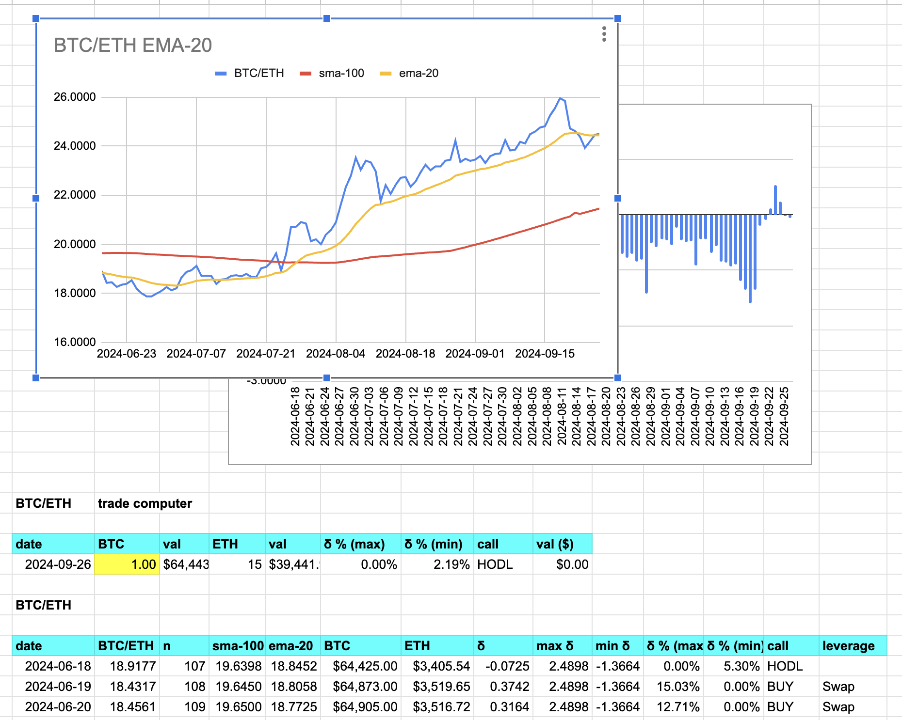

# Pivot Technologies, LLC.

Welcome.

1. What is pivot arbitrage? How does it differ from traditional arbitrage?
2. What is the pivot protocol ecosystem?
3. How do I do this thing?

## Pivot arbitrage

### First, what is traditional arbitrage?

Okay. First things first. Pivot arbitrage is not like traditional arbitrage
in its operation.

In traditional arbitrage, you trade $25k of $ETH by buying on one DEX or CEX
and selling on another all in the same transaction. 1% profit would be $250,
but traditional arbitrage seldom, if ever, reaches the 'heights' of 1% ROI.
0.10% to 0.25% ROI is the normal anticipated gain, which translates into
you risking $25k of $ETH for a possible $25 - $50 gain.

If the arbitrage goes wrong, you lose some, or all, of your $25k $ETH.

That's why there are contracts to do the entire buy-sell trades, across DEXen,
as one transaction, and they have bots to do this for you, so you can do
100s of these per day.

So: if the bot goes haywire, ... so, too, does your principal, as well.

Very ... 'fun.' Very exciting. Very, very, paltry returns.

People make a lot of money by handcuffing themselves to their keyboards in
this way.

If this is you, more power to you.

This, traditional arbitrage, is not me, however.

### What is pivot arbitrage?

Pivot arbitrage, on the other hand, is based upon this conceit: coins of value,
let's say $BTC and $ETH for this example, go up and go down, and, as coins of
value, they _do_ go back up after going down, and: they aren't up-only, either,
they come back down.

Now, most of the cryptouniverse of tokens are highly volatile, and also highly
in synch with $BTC's volatility. $BTC goes up, all of crypto go up. $BTC goes
down, all of crypto goes down ... hard, in fact.

But here's the thing: the cryptocurrency market is not efficient. There are
variabilities, token-to-token.

So, sticking with the BTC/ETH example, BTC goes up, ETH goes up. BTC goes down,
ETH goes down, but, observe this: not at the exact same time, sometimes, not
even close.

The _ratio_ of BTC/ETH is the blue line on the chart here.

