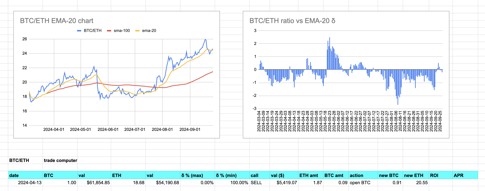

# Pivot Technologies, LLC.

[HWÆT](https://en.wiktionary.org/wiki/hw%C3%A6t)!

1. What is pivot arbitrage? How does it differ from traditional arbitrage and
from liquidity pools (LPs)?
2. What is the pivot protocol ecosystem?
3. How do I do this thing?

## Pivot arbitrage

### First, what is traditional arbitrage?

Okay. First things first. Pivot arbitrage is not like traditional arbitrage
in its operation.

In traditional arbitrage, you trade $25k of $ETH by buying on one DEX or CEX
and selling on another all in the same transaction. 1% profit would be $250,
but traditional arbitrage seldom, if ever, reaches the 'heights' of 1% ROI.
0.10% to 0.25% ROI is the normal anticipated gain, which translates into
you risking $25k of $ETH for a possible $25 - $50 gain.

If the arbitrage goes wrong, you lose some, or all, of your $25k $ETH.

That's why there are contracts to do the entire buy-sell trades, across DEXen,
as one transaction, and they have bots to do this for you, so you can do
100s of these per day.

So: if the bot goes haywire, ... so, too, does your principal, as well.

Very ... 'fun.' Very exciting. Very, very, paltry returns.

People make a lot of money by handcuffing themselves to their keyboards in
this way.

If this is you, more power to you.

This, traditional arbitrage, is not me, however.

### What is pivot arbitrage?

Pivot arbitrage, on the other hand, is based upon this conceit: coins of value,
let's say $BTC and $ETH for this example, go up and go down, and, as coins of
value, they _do_ go back up after going down, and: they aren't up-only, either,
they come back down.

Now, most of the cryptouniverse of tokens are highly volatile, and also highly
in synch with $BTC's volatility. $BTC goes up, all of crypto go up. $BTC goes
down, all of crypto goes down ... hard, in fact.

But here's the thing: the cryptocurrency market is not efficient. There are
variabilities, token-to-token.

So, sticking with the BTC/ETH example, BTC goes up, ETH goes up. BTC goes down,
ETH goes down, but, observe this: not at the exact same time, sometimes, not
even close.

The _ratio_ of BTC/ETH is the blue line on the chart here.

Notice in the above ratio (the blue line) there are peaks and valleys.

* on the peaks, $BTC's price is high, relative to $ETH, so you swap $BTC to
$ETH
* on the valleys, $BTC's price is low, relative to $ETH, so you swap $ETH to
$BTC

A _pivot_ *has* a principal asset, say, for example, $BTC, and a pivot asset,
which would be $ETH in this case.

A _pivot_ *is* two trades, the opening trade (say on 2024-06-28), where we 
trade the principal asset ($BTC, in this case) for $ETH, and the closing 
trade (say on 2024-08-09), where we trade the exact same amount of $ETH for 
$BTC.

More $BTC.

... much more $BTC.

As you recall, traditional arbitrage expects gains of 0.10% to 0.25% ROI.

Pivot arbitrage, on the other hand, sees gains between 10% to 40% ROI.

Let's prove this out – shall we? – by using the example from above. We're going
to walk through 2 pivots, one on $ETH as the principal asset, and one on $BTC
as the principal asset. We'll do the pivots using my technology, unexplained
for now, show that it works, and how it works via the opening and closing
pivot trades, then explain what's going on, mathematically, as we develop
the technologies used, in this whitepaper.

On y va.

### Scenario: Pivot arbitrage on 1 $BTC and 18.5 $ETH starting 2024-03-04

1. On 2024-03-07, open an $ETH-pivot by swapping 1.36 $ETH for 0.08 $BTC. 
Why? Because the BTC/ETH ratio is _below_ the EMA-20-line, indicating that 
$BTC is 'cheap,' ... relative to $ETH, that is.

2. On 2024-03-19, close the $ETH-pivot by swapping the 0.08 $BTC back, but now
we get 1.53 $ETH.

So, with a swap, then, later, a swap back, we've made 0.17 $ETH.

From 1 $BTC and 18.5 $ETH on 2024-03-04, we now have 1 $BTC and 18.67 $ETH on
2024-03-19.

Now, let's do a $BTC-pivot.

1. On 2024-04-13, we open a $BTC-pivot by swapping 0.09 $BTC for 1.87 $ETH.

2. On 2024-04-29, we close the $BTC-pivot by swapping back the 1.87 $ETH, but
for 0.094 $BTC now.

After two pivots, our initial positions of 1 $BTC and 18.5 $ETH are now 1.094
$BTC and 18.67 $ETH.

That is to say, by using pivot-arbitrage, we have grown _both_ our $BTC and
$ETH positions, _monotonically increasing, safely_ both sides of the 
pivot-pool.

### Pivot arbitrage vs Liquidity Pools (LPs)

We've covered how pivot arbitrage is fundamentally different from traditional
arbitrage, both in practice and in pacing. How, then, does pivot arbitrage
differ from supplying liquidity to LPs? After all, you're supplying both
$BTC and $ETH liquidity to the pivot arbitrage pool, just like you supply
the same liquidity to the ETH/BTC LP.

* Liquidity Pools

Liquidity pools serve a very useful function in the cryptocurrency ecosystem,
particularly for DEXen. You, the j-random investor, provide liquidity, and
the DEX uses to keep prices fair for swaps. If I'm trading $ETH for $BTC, the
DEX goes to the ETH/BTC LP and pulls the $BTC from those reserves for the
$ETH you provide to swap.

The deeper and stronger a liquidity pool, the easier swaps occur on these
exchanges.

So: Liquidity Pools Я good, ... for these exchanges, anyway.

Are they good for you?

Not really, if we're being honest (and honesty in trade makes everything better
for everybody), and that's why DEXen provide incentives for you to provide
liquidity. The incentive: "You provide tokens popular in swaps and we'll 
reward you with our protocol tokens."

Now, how do the protocol tokens do over time? If they don't have an intrinsic
value (and 'providing incentive' is not an intrisic value for a token), then
these tokens, sooner or later, fall to their real value, ... and usually
sooner if they're being printed to provide incentives.

That's one issue with LPs: they usually have artifical incentives to invest
into them.

The other problem for you, the investor, into LPs, is their very structure:

> xy = k

LPs, as automated by market makers (AMMs), usually are offerd as xy = k.

What does this formula mean?

It means if you provide liquidity to the ETH/BTC LP, you're providing
$ETH (x) and $BTC (y) to the pool (k).

So as the number of tokens of $ETH go up, what happens to your $BTC?

If the pool is constant (which 'k' means: 'konstant,' because we're German,
now, for some reason), it means your $BTC-count goes down.

Vice versa applies, as well, as $BTC-count goes up, $ETH-count goes down.

But that's the nature of investing in LPs, isn't it?

Sure it is, but that doesn't mean that's the only game in town. This is your
money, after all, right? Why not play a better game?

"What better game?" you ask.

Glad you asked.

* Pivot pools

An alternatives to liquidity pools that we offer is the pivot pool. Unlike
the xy = k formulation of how liquidity pools operate, pivot pools have the
following formulation:

> xt + yt = Pt

What does this formulation mean? and how does it differ from how Liquidity
pools work?

What this formulation means is that when you provide $ETH (x0) and 
$BTC (y0) to the pivot pool (P0) there are two significant
differences from how liquidity pools operate. The first, and most obvious,
difference is that the $ETH and $BTC provided are _additive_ to the pivot
pool, not _multiplicative_ as they are in the Liquidity pool. This means for
you, the investor that as the pivot pool grows over time (from P0 to
P1 to P2 and so on), _either_ your $ETH is growing _or_
your $BTC is growing, independent of each other, _or both_ are growing as the
pivot pool grows.

That's a significant difference from liquidity pools.

* In liquidity pools, x and y are _dependent_ variables where one asset's growth
inversely affects the other asset.
* In pivot pools, x and y are _independent_ so the growth of one does not
inversely impact the growth of the other asset at all, and, in fact, both
can be growing at the same time if pivot-positions are open for both assets
at the same time.

Investing into liquidity pools is very definitely a valid strategy and used
to great success by investors who have a clear aim with this instrument.

But.

But, by investing in an xy = k LP, you are, in effect, betting one asset
against the other in the LP. If both assets are assets of value and you want
to see the growth of both, LPs are not the most effective, and, in fact, are
always less efficient than if you simply hold both assets separately. It is
better for both assets for you to invest into the pivot protocol.

So, that is also why it's necessary for pivot pools only to have assets of
value in their pools. The success of these pools depend upon this.

How so?

If you have a pivot pool with, say, $LUNA (in the original Terra) and say, 
$PSI, which turned out to be a down-only asset, then the EMA-20 curve will 
show $LUNA is 'overpriced' as compared to $PSI. All the $LUNA eventually is 
drained to the down-only $PSI: you're left with all $PSI in a downward spiral 
as $LUNA rose from $5 to $120.

How do I know this? Because LPs have the same weakness: as $LUNA rose in
price, the LP rebalanced to less $LUNA to more $PSI. All my $LUNA was drained
to $PSI which, even with '1,500% APY' $PSI yields, became worthless against
the $LUNA originally invested into the LP.

Pivot pools protect against this by pivoting on assets of like- or 
similar-value. Therefore you have an $ETH+$BTC pivot pool. Why? Because both
$ETH and $BTC go up and down, but they have a history of recovering from
crashes multiple times: they've proved their resiliency.

## Pivot protocol ecosystem

### Components

The pivot protocol is composed of the following components:

1. The pivot pools
2. The echo pools
3. The treasury
4. The you, the investor

We well go over each component in turn.

### 1. The Pivot Pools

The pivot pools repose the pivot asset and the principal asset (shown here is
the BTC+ETH pivot pool). Here is where the magic happens, that is to say: where
opening and closing pivot transactions occur with the pivot and principal
assets, growing one, the other, or both assets.

The only way the investor (the you) can invest into any part of the protocol
is to use the protocol asset, which, for the pivot protocol is the 
[$UNDEAD token](https://www.undeadblocks.com/token-address), 

... which is due in thanks to a generous grant from 
[Wagyu games](https://www.wagyu.io/).

The pivot pools pay-out pivot arbitrage-gains to the investor (the you), its 
corresponding echo pool, to the treasury, and back to itself.

With each pivot, the pivot pool grows the protocol. All of it.

The pivot pool starts empty.

### 2. The Echo Pools

While pivot arbitrage is occuring in the pivot pools (1., above), at the same
time, there is pivot arbitrage occuring focused on protocol-growth in the
echo pools (here we have the BTC+ETH echo pool, which also includes the protocol
token, $UNDEAD).

In the echo pool, pivot arbitrage occures between the pivot and principal assets
(as 1., above), but pivots are also occuring between the protocol asset and the
pivot and principal assets.

Why?

This not only increases the principal and pivot assets in the pool, but also
increases the protocol asset.

As the protocol asset is the only way to invest into protocol, even for 
investments from the protocol, itself, the echo pool serves to grow the 
protocol's depth and strength by growing the protocol asset via pivot arbitrage.

The echo pools pay out to the investor (the you) and to the treasury.

The echo pool starts empty.

### 3. The Treasury ([_Norge_](https://en.wikipedia.org/wiki/Norway))

The treasury is the 'safe zone' for assets created and invested into the
protocol. No trading activity occurs in the treasury, but, instead, the
investor (the you) may invest into the treasury to receive pay-outs from the
treasury in two ways:

1. For each gain received from the pivot pools (1.) and echo pools (2.), a
percentage is paid-out to the investors.
2. Like for Norway's Oil Fund (officially named the
[Government Pension Fund of Norway](https://en.wikipedia.org/wiki/Government_Pension_Fund_of_Norway)),
a small annual percentage of the treasury is disbursed to investors.

The aim of the treasury, like the Norway Oil Fund, is to grow so large that
this 'small annual percentage disbursement' grows to be quite large over time,
and this is effected in two ways.

1. The small annual percentage disbursement, so that the liquidity grows large
without interruption from sticky fingers of people who want money now.
2. Investments into promising opportunities, both 
* _internally_ into new pivot pools, renewed pivot pools (like, say, if BTC+ETH 
becomes so popular that it hits its market cap and there is demand for more of 
the same), and new kinds of pivot, or other kinds of, pools, as technology 
develops; and,
* _externally_ if a bright-eyed, promising, energetic founder has the next 
killer idea (with a year's worth of transactions as a track-record to prove 
their pitch).

The latter will occur only under two conditions,.

1. A maximum of 10% of treasury funds is to be used for ventures at any time.
2. So that means that the treasury has to be large enough at the point for
investment opportunities to be considered.

Just as Wagyu Games saw an opportunity in the pivot protocol to make an
investment, incubating this protocol, the pivot protocol may invest into
promising new developments that push advancements in cryptocurrency and its use.

The treasury starts empty.

### 4. The investor (the you)

Hi, you! This is what makes the protocol work. 100% of the liquidity comes from 
the you, the investor.

How does this work?

## Investing into the Pivot Protocol

You, the investor, can invest your liquidity into the protocol in three ways:

1. Investing into the pivot pools
2. Investing into the echo pools
3. Investing into the treasury

Let's discuss each investment-approach in turn.

### Investing into the pivot pool

Let's say you invest 10,000 $UNDEAD tokens into the BTC+ETH pivot pool (1.,
above). The pivot protocol takes that exact amount of $UNDEAD tokens, 10,000
tokens, – _not_ from the treasury, but from its own reserves – and swaps those 
tokens, over time, to the pivot and principal assets of the pivot pool (so, the
protocol would swap 10,000 $UNDEAD to $ETH and $BTC tokens) and deposit those 
tokens into the pool. Say you are the first and only investor during the first 
few pivots, you would then receive 100% of the gains allocated to investors 
into to the pool.

Those gains you receive as yields: are they $UNDEAD tokens, like the yields
are paid in protocol tokens, as they are for other protocols?

No, my dear investor. No, they are not.

The yields from your invested $UNDEAD liquidity are paid out in the pivot pool
gains. That means that the gains on a $BTC-pivot, say, are paid out in $BTC,

Not paid in $UNDEAD. $BTC gains are paid in $BTC.

Correspondingly, the gains on an $ETH-pivot are paid on your $UNDEAD investment
in $ETH.

Not paid in $UNDEAD. $ETH gains are paid in $ETH.

Let that sink in.

Cool.

### Investing into the echo pool

Investing into an echo pool is the same as investing into a pivot pool, as an
echo pool is a pivot pool.

However, the aim of the echo pool is quite different. The aim for the pivot
pool is to grow the principal and pivot assets. The aim, however, for the
echo pool is to grow the protocol asset, so this kind of pool must be deemed
as _high risk_ as the returns and value depend heavily upon the protocol
token's value.

That said: this is a good investment for you, the investor, if your aim is to
grow your protocol token bag.

As before, you, the investor, invest $UNDEAD liquidity into the echo pool. The
protocol takes an equal number of $UNDEAD tokens, placing (e.g.): $ETH, $BTC, 
and $UNDEAD tokens (using the BTC+ETH echo pool for this example). The Pivot
Protocol then executes pivot arbitrage with these tokens, and for yields you get
in return (less) principal assets, (less) pivot assets, and (more) protocol
assets.

### Investing into the Treasury

Like with investing into the pivot pools and echo pools, you, the investor,
invest $UNDEAD tokens into the treasury. As the treasury grows from profits 
from pivots occuring in the pivot pools and echo pools, it disburses a 
percentage of this growth to the investors.

It also disburses an annualized percentage of the treasury's entire value to
investors. 

So, for example, if the treasury is composed of, say:

* 156 $BTC
* 1560 $ETH and
* 1,560,000 $UNDEAD

and it disbursed weekly, the a disbursement, _in total to all investors_, would
be:

* 0.09 $BTC
* 0.9 $ETH and
* 900 $UNDEAD

And so, if you had invested $UNDEAD comprising 10% of the treasury's 
investments, for example, then you would receive:

* 0.009 $BTC
* 0.09 $ETH and
* 90 $UNDEAD

as your disbursment.

Since the Treasury receives a percentage of all pivot arbitrage profits, the
yields from the Treasury you would receive would be comprised of a percentage
of all pivot and echo pool profits.

However, it must be said that your returns on your investment into the Treasury
are lower than investments into any specific pivot or echo pool.

Also, investing into the treasury could be characterized as 'boring' by some
investors, as all the Treasury does is just sit there, receiving then disbursing
profit from the active pivot pools.

### Investment summary

You, as the investor, may invest in

* none of the above types
* one of the above types – pivot pools, echo pools, or the treasurey
* some of the above types
* all of the above types of investment vehicles.

Your investment approach depends on your investment goals and tolerance to risk.

## Protocol Liquidity Flow

How does liquidity flow within the Pivot Protocol and why?

### Pivot pools

When a pivot pool completes pivot arbitrage (that is: opens a pivot with a swap
of the principal asset to the pivot asset _then_ closes that pivot with a swap
back), there's a gain of the principal asset, let's say, for example, the 
following pivot occurs:

1. 202a-bb-cc, open pivot: swap 1 $BTC for 18.5 $ETH
2. 202x-yy-zz, close pivot: swap 18.5 $ETH for 1.2 $BTC

The _gain_ from this pivot is 0.2 $BTC. This gain is distributed throughout the
protocol in the following manner (please refer to the diagram, above, for the
distribution-flow).

1. 10% of the gain (in this example, 0.02 $BTC), _in total_, is distributed to
_all_ investors. So, if your investment comprised 10% of the pool, your yield
would be 0.002 $BTC.

2. 10% of the gain (again, 0.02 $BTC) would go into the BTC+ETH echo pool for
pivot arbitrage there to grow the protocol.

3. 40% (e.g.: 0.08 $BTC) _remains_ in the BTC+ETH pivot pool, growing the pool 
and strengthening its pivots.

4. 40% of the gain (again, 0.08 $BTC) goes to the Treasury.

