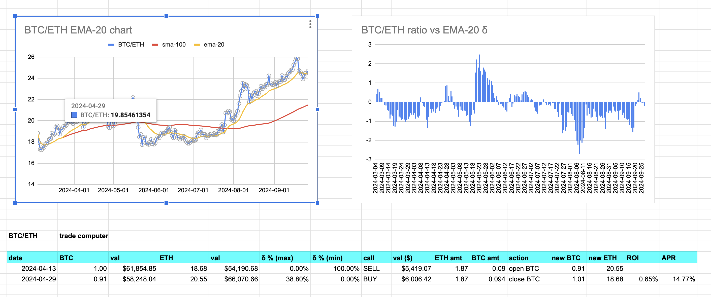

# Pivot Technologies, LLC.

Welcome.

1. What is pivot arbitrage? How does it differ from traditional arbitrage and
from liquidity pools (LPs)?
2. What is the pivot protocol ecosystem?
3. How do I do this thing?

## Pivot arbitrage

### First, what is traditional arbitrage?

Okay. First things first. Pivot arbitrage is not like traditional arbitrage
in its operation.

In traditional arbitrage, you trade $25k of $ETH by buying on one DEX or CEX
and selling on another all in the same transaction. 1% profit would be $250,
but traditional arbitrage seldom, if ever, reaches the 'heights' of 1% ROI.
0.10% to 0.25% ROI is the normal anticipated gain, which translates into
you risking $25k of $ETH for a possible $25 - $50 gain.

If the arbitrage goes wrong, you lose some, or all, of your $25k $ETH.

That's why there are contracts to do the entire buy-sell trades, across DEXen,
as one transaction, and they have bots to do this for you, so you can do
100s of these per day.

So: if the bot goes haywire, ... so, too, does your principal, as well.

Very ... 'fun.' Very exciting. Very, very, paltry returns.

People make a lot of money by handcuffing themselves to their keyboards in
this way.

If this is you, more power to you.

This, traditional arbitrage, is not me, however.

### What is pivot arbitrage?

Pivot arbitrage, on the other hand, is based upon this conceit: coins of value,
let's say $BTC and $ETH for this example, go up and go down, and, as coins of
value, they _do_ go back up after going down, and: they aren't up-only, either,
they come back down.

Now, most of the cryptouniverse of tokens are highly volatile, and also highly
in synch with $BTC's volatility. $BTC goes up, all of crypto go up. $BTC goes
down, all of crypto goes down ... hard, in fact.

But here's the thing: the cryptocurrency market is not efficient. There are
variabilities, token-to-token.

So, sticking with the BTC/ETH example, BTC goes up, ETH goes up. BTC goes down,
ETH goes down, but, observe this: not at the exact same time, sometimes, not
even close.

The _ratio_ of BTC/ETH is the blue line on the chart here.

Notice in the above ratio (the blue line) there are peaks and valleys.

* on the peaks, $BTC's price is high, relative to $ETH, so you swap $BTC to
$ETH
* on the valleys, $BTC's price is low, relative to $ETH, so you swap $ETH to
$BTC

A _pivot_ *has* a principal asset, say, for example, $BTC, and a pivot asset,
which would be $ETH in this case.

A _pivot_ *is* two trades, the opening trade (say on 2024-06-28), where we 
trade the principal asset ($BTC, in this case) for $ETH, and the closing 
trade (say on 2024-08-09), where we trade the exact same amount of $ETH for 
$BTC.

More $BTC.

... much more $BTC.

As you recall, traditional arbitrage expects gains of 0.10% to 0.25% ROI.

Pivot arbitrage, on the other hand, sees gains between 10% to 40% ROI.

Let's prove this out – shall we? – by using the example from above. We're going
to walk through 2 pivots, one on $ETH as the principal asset, and one on $BTC
as the principal asset. We'll do the pivots using my technology, unexplained
for now, show that it works, and how it works via the opening and closing
pivot trades, then explain what's going on, mathematically, as we develop
the technologies used, in this whitepaper.

On y va.

### Scenario: Pivot arbitrage on 1 $BTC and 18.5 $ETH starting 2024-03-04

1. On 2024-03-07, open an $ETH-pivot by swapping 1.36 $ETH for 0.08 $BTC. 
Why? Because the BTC/ETH ratio is _below_ the EMA-20-line, indicating that 
$BTC is 'cheap,' ... relative to $ETH, that is.

2. On 2024-03-19, close the $ETH-pivot by swapping the 0.08 $BTC back, but now
we get 1.53 $ETH.

So, with a swap, then, later, a swap back, we've made 0.17 $ETH.

From 1 $BTC and 18.5 $ETH on 2024-03-04, we now have 1 $BTC and 18.67 $ETH on
2024-03-19.

Now, let's do a $BTC-pivot.

1. On 2024-04-13, we open a $BTC-pivot by swapping 0.09 $BTC for 1.87 $ETH.

2. On 2024-04-29, we close the $BTC-pivot by swapping back the 1.87 $ETH, but
for 0.094 $BTC now.

After two pivots, our initial positions of 1 $BTC and 18.5 $ETH are now 1.094
$BTC and 18.67 $ETH.

That is to say, by using pivot-arbitrage, we have grown _both_ our $BTC and
$ETH positions, _monotonically increasing, safely_ both sides of the 
pivot-pool.

### Pivot arbitrage vs Liquidity Pools (LPs)

We've covered how pivot arbitrage is fundamentally different from traditional
arbitrage, both in practice and in pacing. How, then, does pivot arbitrage
differ from supplying liquidity to LPs? After all, you're supplying both
$BTC and $ETH liquidity to the pivot arbitrage pool, just like you supply
the same liquidity to the ETH/BTC LP.
