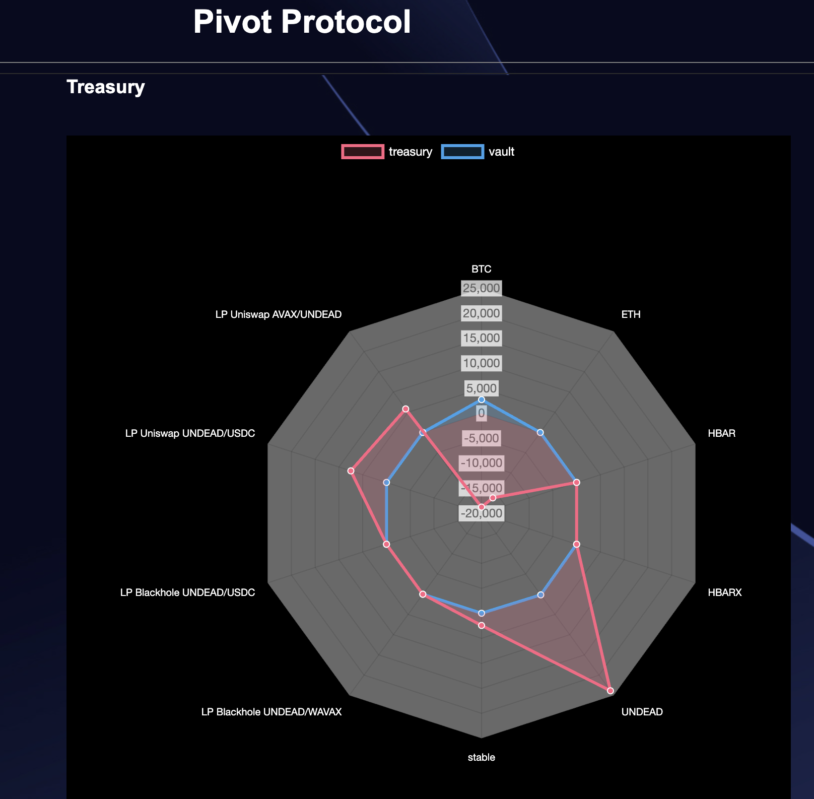
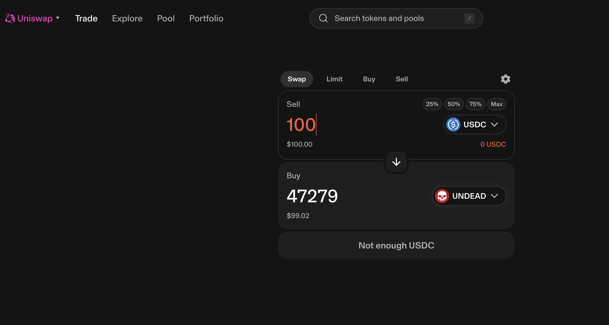
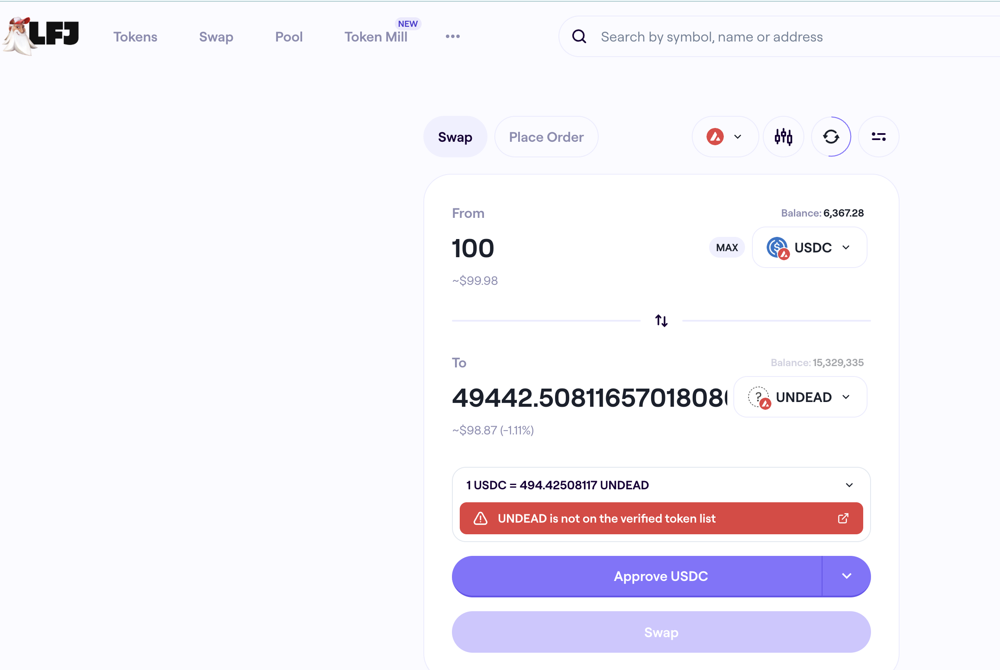
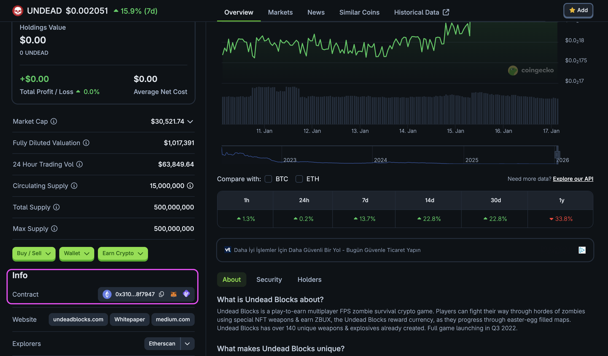
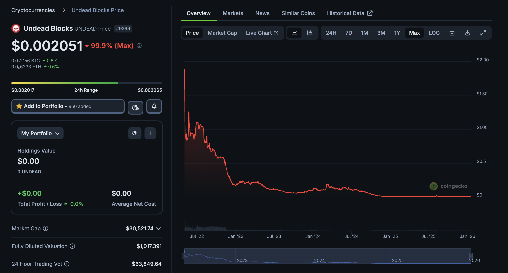
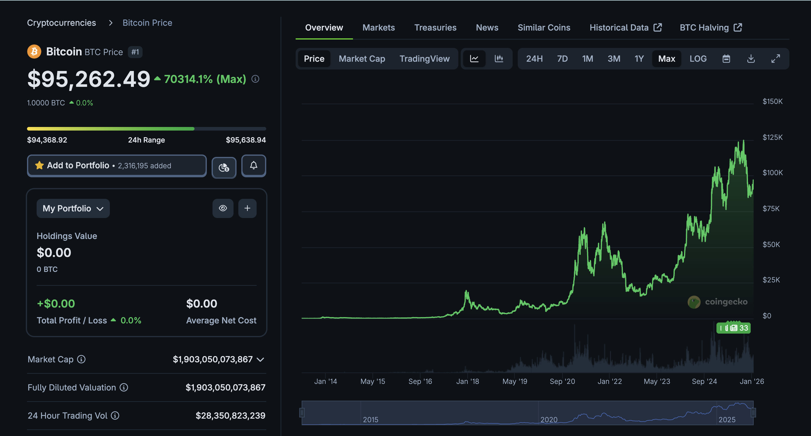
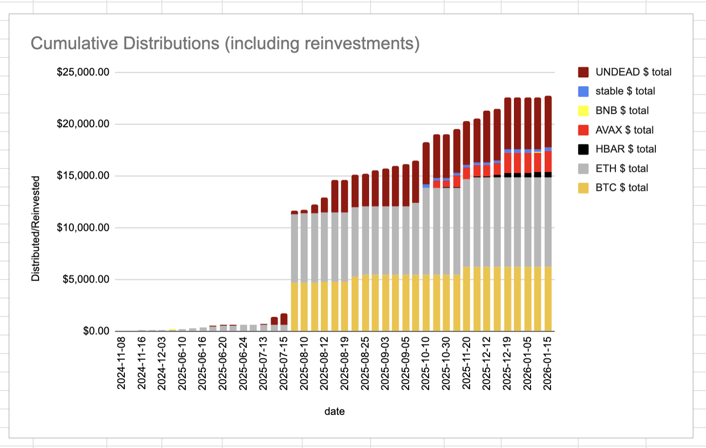
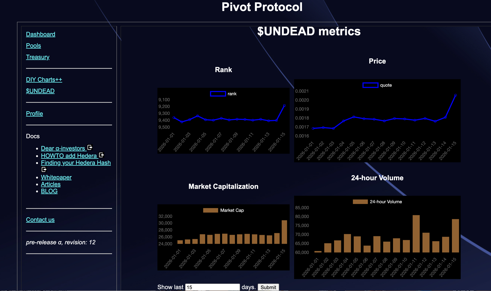
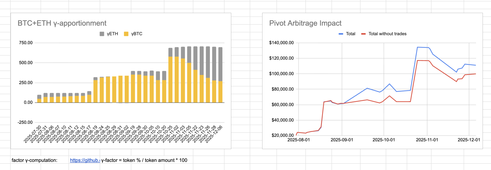

# 10 Reasons why NOT to buy $UNDEAD now

Oftentimes, when people talk about investing in cryptocurrency, they disclaim
with "#DYOR" / "Do your own research" ... which was a good admonishment, at 
first, but nowadays simply means: "eff off," meaning less "figure it out for
yourself" and meaning more "I can't be bothered to help you help you."

Let me help you help you with my own #DYOR that I have conducted as to why
NOT to buy $UNDEAD ... and ... (spoiler)

 ... why I'm stockpiling $UNDEAD, myself.

#YMMV #DYOR

10. "I don't know where they sell it?"

* [Uniswap](https://app.uniswap.org/swap) on Ethereum

or

* [LFJ](https://lfj.gg/avalanche/swap?inputCurrency=0xB97EF9Ef8734C71904D8002F8b6Bc66Dd9c48a6E&outputCurrency=0x5a3534720A4f29FA0dc53cE474Db88973A95f65C)
on Avalanche.

or, for non USA-residents, you can buy $UNDEAD from the centralized exchange
[gate.io](https://www.gate.com/).

9. "So much of crypto is a scam. How do I know I'm really buying $UNDEAD?"

* You can look up the contract address on 
[coingecko](https://www.coingecko.com/en/coins/undead-blocks)

8. "$UNDEAD is down-only."

* true-...ish. I first looked at $UNDEAD when it was $0.15 and now it's $0.002.
That's quite the fall! But, in crypto, as in life, it's not so much where the
token has been as to where it's going. 

## So where is $UNDEAD going?

Let's answer "where is $UNDEAD going?" by examining the company behind it
and the token's value.

7. "I don't know about the company backing $UNDEAD."

* [Wagyu games](https://https://wagyugames.com) has the game [Undead 
Blocks](https://www.undeadblocks.com/) which is live, in-production, and on
the blockchain. Wagyu recently hosted two consecutive tournaments attracting
hundreds of players to each tournament with place-winners earning 
thousands in crypto-rewards and NFTs. The game is up and running: how many 
games on the
blockchain can you say that? Also the company received a valuation of $45 
million from a top blockchain equity investor..

6. "Crypto is 'funny-money'. How is $UNDEAD useful?"

* A lot of crypto is printed with as much behind it as the USD, except even
worse than that, because at least the USD is inked on paper, where crypto 
doesn't even have that much going for it. To look at the value of crypto, you
have to find utility for it. No utility: no value.

* $UNDEAD's value is four-fold: 

(1) Like other crypto, it is a holder of value and a speculative asset: $UNDEAD
goes up, you make money. $UNDEAD goes down, you buy more and wait for it to
'goes up' again.

(2) In-game currency earnings can be exchanged for $Undead and used to upgrade 
NFT loadouts, add weapons and perks, and soon battle passes, increasing your 
survivability to earn more rewards.

(3) it can be staked to earn NFTs, ... also gaming assets

(4) it is the staking token for the Pivot Protocol by which you earn $BTC,
$ETH, $USDC, $AVAX, $HBAR, and $UNDEAD yields, based upon into which pivot pools
you stake.

(5) it will be used in the Undead Marketplace to buy game assets at a discount.

(6) it will be used as a reward in future tournaments, challenges, and the NFT 
Loadout Rental platform.

5. "I don't want my investment to be diluted out of existence!"

* Unlike some other crypto, $UNDEAD has a cap, not 'cap' as in 'market 
capitalization' (it does have a market cap, but that's not what I'm talking
about here), but 'cap' as in 'only 500 miliion tokens exist and the cleanest 
cap table with zero investors holding any tokens to dump at a later date.' 
Even the mighty $ETH is inflationary: they can always print more $ETH, $UNDEAD,
however, has built-in scarcity.

4. "I'm a BTC-maxi."

* There is certainly something to be said for the strategy of HODL'n BTC.
[I've had some things to say about that, 
myself](https://github.com/pivoteur/biz/blob/main/articles/pivot-arbitrage.md).
The thing is this: HODL $BTC is good, right? Wouldn't holding MORE $BTC be
better? By staking $UNDEAD into the BTC pivot pools on the [Pivot
Protocol](https://pivoteur.github.io/) you earn $BTC from pivot gains,
passively. Where do you earn $BTC from HODL'n $BTC? Secondly, you think
you are going to Michael Saylor your way into wealth? Here's something that
Michael Saylor says all the time, but people miss: "Sell something that loses
value for something that keeps value." He regularly issues $MSTR (that is:
sells $MSTR) to buy $BTC. Michael Saylor does pivot arbitrage: why don't you?
I do.

3. "I think the USD retains my value better, so I'm putting my money in the
bank."

* Really? Although there is an argument for this point. The USD is a 'down-only'
token, so the question arises, "Will holding USD increase your worth?" The 
answer to that is not only 'no,' but also the opposite: your worth decreases
over time, holding USD. "Will holding $UNDEAD increase your worth?" Holding?
Historically no, you also lose value over time, as $UNDEAD loses value. But

(1) what if $UNDEAD goes up as its utility use-case gains traction? and 

(2) Staking $UNDEAD your value depends on the value of the token, itself, of 
course, but you also get the benefit of harvesting yields of $BTC, $ETH, $USDC, 
$AVAX, $HBAR, and $UNDEAD.

* To date (2026-01-17), the Pivot Protocol has issued $25,000 in yields, ...
imagine the yields generated when we go into production on the blockchain!

2. "'DYOR'? How?"

* Fortunately, I've done some of my own research and shared my results, which
you see here, above, and I have also [published a set of
articles](https://github.com/pivoteur/biz/tree/main/articles) discussing $UNDEAD
and the Pivot Protocol.

* Further, if you wish to DYOR on $UNDEAD, I provide an interactive chart-tool
that shows various $UNDEAD metrics, located on the [Pivot Protocol's
$UNDEAD-tab](https://pivoteur.github.io/#). You can pose your own questions 
and run your own scenarios with these data.

1. "I don't know what pivot arbitrage is? Will I lose my investment?"

* Short answer: no, you won't lose your investment (usual caveats and 
disclaimers apply), in fact, pivot arbitrage grows your investment over time,
unlike other investment approaches, such as liquidity pools and HODL. Longer 
answer: I have two years of audited data that shows pivot arbitrage working in 
good markets and in bad ones. Longer-longer answer: you can read the [Pivot 
Protocol Whitepaper](https://github.com/pivoteur/biz/blob/main/README.md): it 
has a [section on pivot 
arbitrage](https://github.com/pivoteur/biz/blob/main/README.md#pivot-arbitrage).

