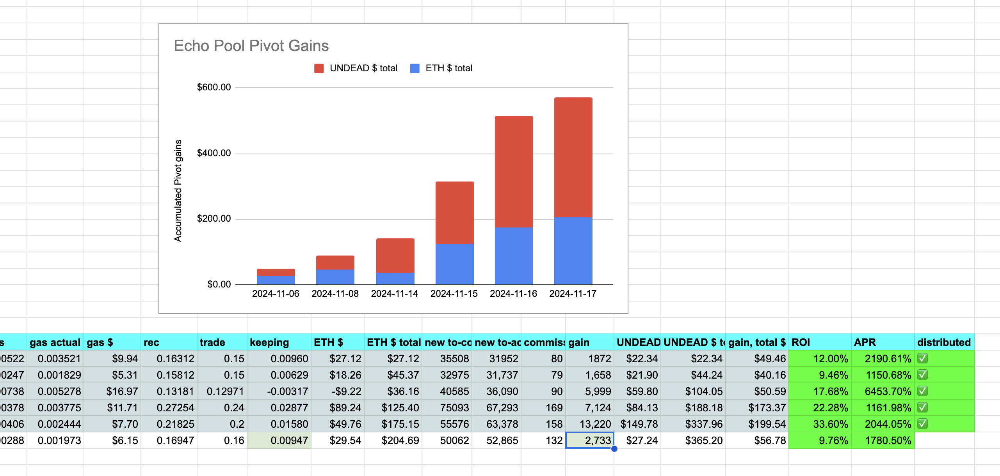
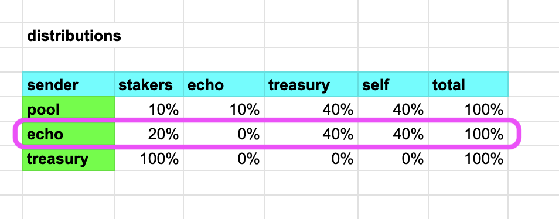
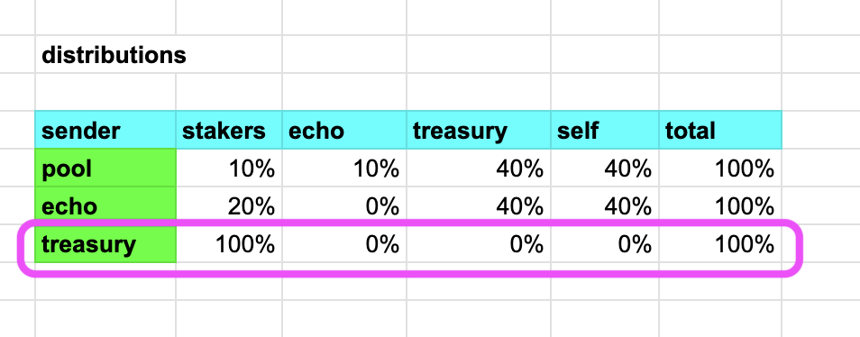
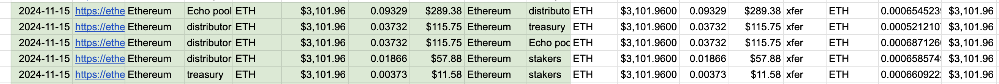
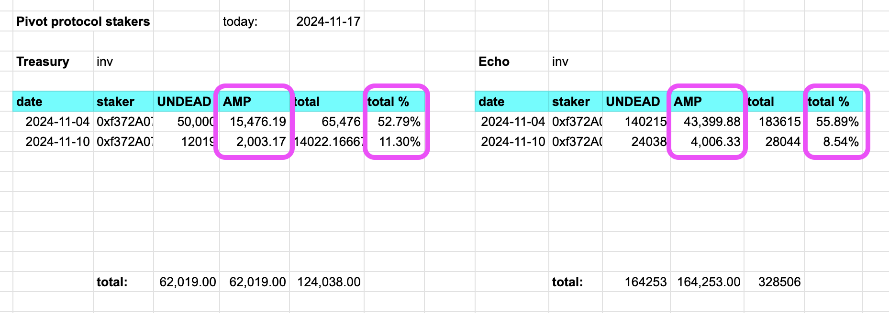
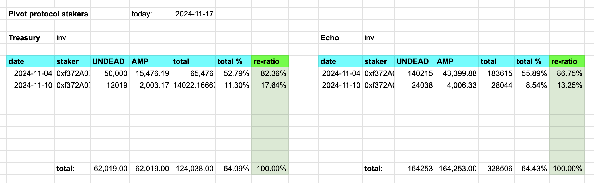

# Computing Pivot Distributions

> synopsis: Distributing pivot gains can be a rather complicated affair, as distributions from the pool-type, the treasury, and amplified returns to stakers must all be taken into consideration. Non-pre-computed distributions can entail 9 or more transactions. On Ethereum, with transaction fees going into the dollar-range – and multiples of that! – each transaction eats into the pivot gains, so, pre-computing distribution amounts and minimizing the number of distributions *a priori* becomes paramount.

## The Problem

Ethereum transaction fees.

## The solution

Pre-computation of distributions, eliminating 'call-back'-distributions

## The Problem, II

Pre-computing isn't easy.

## The Solution, II

This article.

## Context

Before we look at precomputing distributions, let's look at what distributions of pivot gains on the Pivot Protocol look like now, that is: not-pre-computed.

For context, distribution-flow is discussed in the 
[Pivot Protocol whitepaper](../README.md#protocol-liquidity-flow).

Let's take an example from today, 2024-11-17.

Close echo pivot generated the following gains:

* 2,733 $UNDEAD
* 0.00947 $ETH

### Consideration: transacting $UNDEAD costs *a lot* more

First, know that every non-$ETH transaction costs more gas, so, it is advantageous to convert to $ETH before we transfer any liquidity, ... BUT!

We have a pivot gain of (primarily:) $UNDEAD, so we want to keep the gain that *stays* in the Echo Pool as $UNDEAD.

## Distribution Flow

Let's take a distribution flow from the gains froman Echo pool pivot close.

> note: Echo pool gains distributions are different than pivot pool distributions.

1. <del>We have the gains from the above, we transfer 100% of those gains to the `distributor`-dapp.</del>

> please note (1): this is already complicated, because transferring $UNDEAD costs *much* more than transferring $ETH, so it makes sense to convert all $UNDEAD to $ETH before transferring liquidity.

> please note (2): *BUT* we want to keep the $UNDEAD gains that remain in the echo pool as $UNDEAD, because, after all, that's 
[the entire point of the echo pool](../README.md#2-the-echo-pools)

*sigh*

Let's try again, just doing distributions naïvely and d-mn the gas costs.

1. as before, but for realz, yo, this time.
2. The `distributor`-app looks up the distributions outbound, based upon the distribution source, ... *trans:* The `distributor` looks up the Echo pool distributions:

3. The `distributor` app apportions the gains and distributes, i.e.: 40% back to the echo pool, 40% to the treasury, and 20% to the stakers pool/app.

> n.b.: Echo pool distributions 20% to stakers; contrast that to the pivot pools, which distribute 10% to stakers and 10% to the Echo pool.

4. After *ALL* distributions from *ALL* pools are distributed, the treasury, upon receiving gains, distribute 10% of their gains back to the `distributor`-dapp, which looks up the distribution source distributions:

... which translates into simply sending all gains to the stakers.

So the treasury is 'smart,' in that it sends only 10% of all the gains that it receives for the day to the distributor, contrast to the pools which send *all* their gains to the distributor to manage redistribution.

Done? Not even close!

Because the `stakers`-dapp is also smart in that stakers receive an apportionment of the distribution based upon their time staked. This 'time staked' is manifest by amount of `AMP` (a virtual (non-)token) each staker has for each of their deposits.

You see that each deposit has an `AMP` amount computed for it. This computation is:

> *tokens staked* `* min(` *42 days*, *today - date staked* `) / 42`

This formula ensures the maximum amount of `AMP` is the amount of tokens staked, and that the `AMP`-amount grows over time, rewarding stakers' longevity.

You also see from the table, updated today, that the `total %` is less than 100%. What happens to the tokens sent to stakers that are not awarded to them?

Those tokens are sent back to their distribution sources.

What does mean pragmatically?

For this example, it means that all Echo pool distributions to stakers sum to 64.4%, so 35.6% of the distribution is returned to the Echo pool!

Same for the treasury: 64.1% goes to stakers, so 35.9% is returned to the treasury.

Two tables lead to 7 distributions out and 2 distributions back, not-pre-computed.

## Pre-compute distributions

Now, let's precompute the entire distribution-stream.

Before we do that, let's ask ourselves: is precomputation worth it?

Yes.

*(that was easy)*

* Distributions that are not precomputed are 9 in total.
* precomputed distributions: 3 (and precompution, which is free after encodification)

That's why i answered, simply, 'yes' before.

Recall the amounts gained:

* 2,733 $UNDEAD
* 0.00947 $ETH

How much stays in the Echo pool?

* 40% back from the distributor (1,093 $UNDEAD and 0.0038 $ETH)
* 20% to stakers, but 35.57% of that back from stakers (194 $UNDEAD and 0.0007 $ETH)

That means 

* 1,288 $UNDEAD and 0.0045 $ETH 

stays on the Echo pool, saving us 3 transactions right there.

That also means we have out of the original gains 1,445 $UNDEAD and 0.005 $ETH to distribute.

From that, we need to compute what goes to the treasury and what goes to stakers. Let's compute the treasury like we computed the rebate to the echo pool (above) and from those amounts, we'll determine how much goes to stakers.

* 40% to the treasury (1,093 $UNDEAD and 0.0038 $ETH)
* 10% of that goes to stakers, BUT 35.91% returns to the treasury, SO the treasury keeps 39 $UNDEAD and 0.0001 $ETH)

So we know exactly how much stays on the Echo pool; we know how much ends in the treasury:

* 1,132 $UNDEAD and 0.0039 $ETH

... saving us two more transactions.

So, now, with those amounts computed for their respective destinations, we now have what remains, which goes to stakers:

* 313 $UNDEAD and 0.0011 $ETH

Meaning a total of 1,445 $UNDEAD should be converted first to $ETH and that $ETH apportioned to the treasury and to stakers along with the above-mentioned $ETH gains so destined.

Are we done?

NUPE!

## Staker distributions

We're left with a conundrum. Now that we've precomputed redistributions, the apportionment to the stakers' pool has already been `AMP`-accommodated. This means 100% of the distribution to the stakers are accounted for and to be distributed to all stakers, but – the conundrum – distribution apportionments on the stakers' tables don't sum to 100%.

How do we so manage this?

Easily.

We recompute the stakers' apportionments based upon the re-realization that their apportionments sum to 100% with a re-ratio.

Pragmatically speaking, since, e.g. the stakers of the treasury apportionments sum to 64.09%, we re-ratio each apportioment, and that re-ratio-inalization sums to 100%, as you see. Same for the Echo pool and for each pivot pool.

# Conclusion

Due to the high costs of transactions on Ethereum, which eat into our pivot-gains, it behooves us to minimize the number of transactions on that blockchain. By precomputing how much of the gains go to each dapp in the protocol, we significantly cut costs, reducing 9 transactions to merely 3, all the while maintaining the absolute necessity of ensuring our stakers receive the exact yields they've earned by staking into our protocol.

The computations appear daunting at face-value, but when computed in a step-wise manner, reduce to simplicity, itself.
