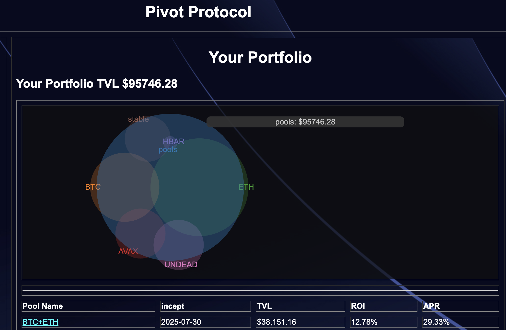
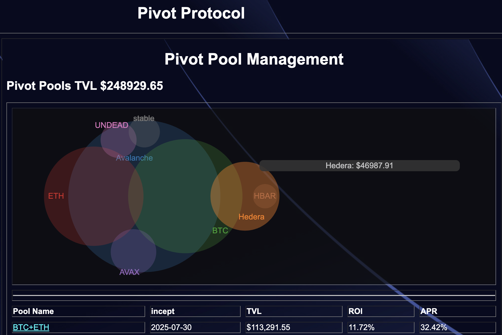

# The Pivot Protocol is now Multichain

> tl;dr: Pivot Protocol now has pivot pools on both Avalanche and Hedera.

In my last few posts I have been talking about migrating liquidity from the Avalanche blockchain to Hedera, as that is where the protocol will go live, end-of-year, 2025.

Up to now, all liquidity was represented generically, as 'pools,' as everything was on Avalanche.

Now, however, that I have been moving liquidity onto Hedera, and have established the BTC+ETH, BTC+HBAR, and the HBAR+USDC pivot pools, the 'pools'-designator is now too generic and not representative of liquidity across blockchains.

Why?

Although it would be nice to be able to trade, say, $BTC on Avalanche to, say, $USDC on Hedera, no such automated mechanism currently exists without incurring costs of both time and money to make that happen.

So, assets need to be distinguished by blockchain.

Enter the Pivot Protocol pre-release α, version 12!

The Pivot Protocol pools page (say *that* 5 times quickly!) now indicates blockchains and designates assets by blockchain. As you can see, 

more than $40k of the ~$250k of liquidity is now in Hedera.

By distinguishing assets by blockchain, we can now build automations that aggregate assets by blockchain, simplifying and streamlining workflow for pivot arbitrage, which will lead to more efficacious daily operations for the protocol.

-----

The [Pivot Protocol](https://pivoteur.github.io/#) is in pre-release α, version 12. We are looking to go into β release December, 2025, and releasing to production, end-of-year, 2025.
 
