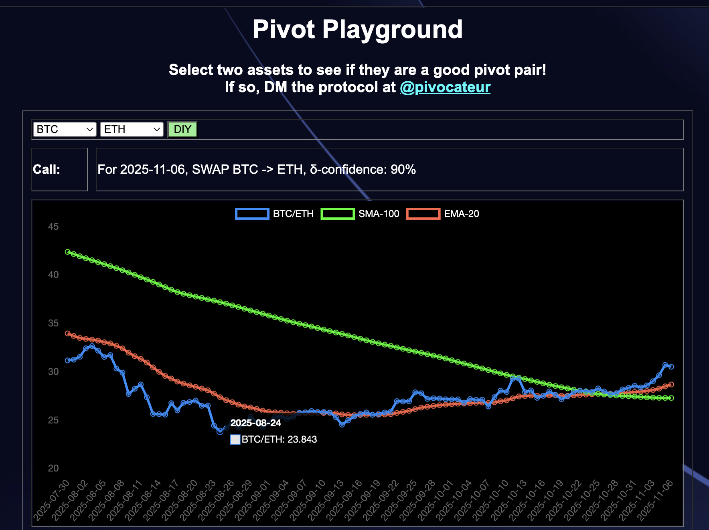
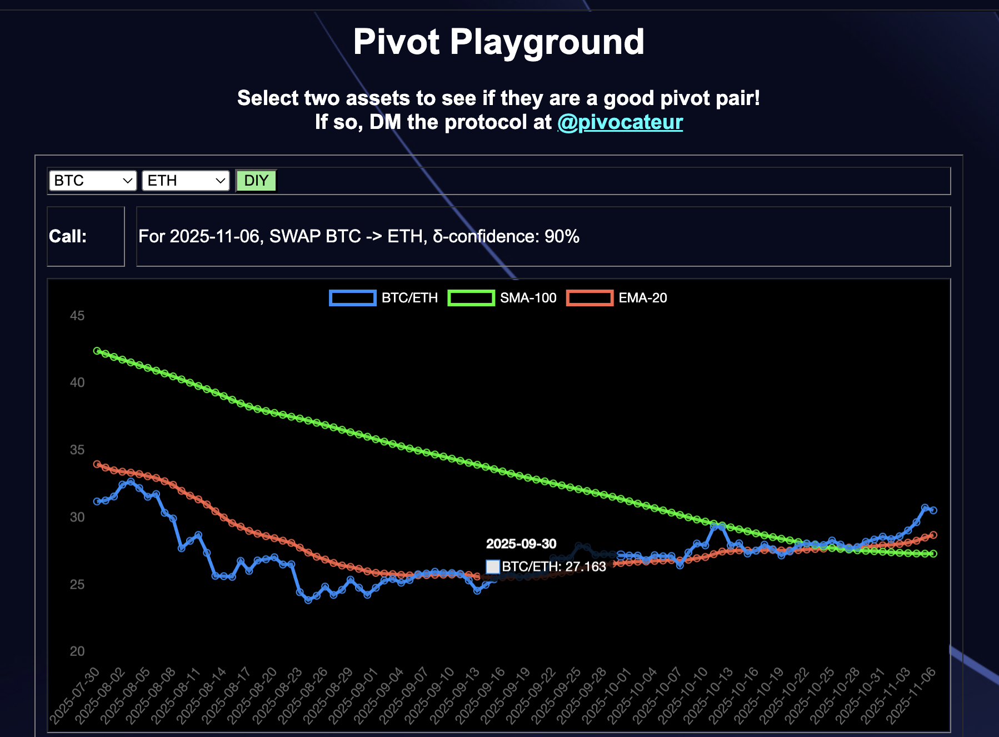

# "I'm Not Selling!"

## Pivot Arbitrage vs. well: everything else

Is "I'm Not Selling!" a good strategy?

Well, yes and no.

Let's defend the HODL-strategy (or the "I'm not selling!"-strategy).

I looked at $BTC back in November of 2013 when it was $200-per. WAY overpriced, obviously. But what if I had bought 5 $BTC back then and never sold?

For my $1,000 investment, my assets today would be worth $505,000.

That's a Return on Investment (ROI) of 50,000%, annualized to 4,200%.

That's not bad in anyone's book, I'd say.

But remember the Bitcoin-proverb:

> 1 $BTC is 1 $BTC.

At the end of the day, I started with 5 $BTC, and I ended up with 5 $BTC.

Can I do better than that? Or, 5 $BTC is the baseline.

Pivot arbitrage addresses that question.

But, first of all, what is pivot arbitrage?

## Pivot Arbitrage

### The Ratio for a BUY or SELL signal

Pivot Arbitrage is the investment tactic that pits, or pivots, one asset, say $BTC, against another, say $USDC (the USD-stable token) (sometimes).

What pivot arbitrage does is pits one asset against the other. When BTC/USDC-ratio is 'low' that indicates the price of $BTC is low, relative to $USDC, so we buy $BTC and sell $USDC. Conversely, when the BTC/USDC-ratio is 'high,' that shows that $BTC-price is high (relative to $USDC) and $USDC price is low, so we buy $USDC and sell $BTC.

### The Delta for how much to buy or to sell

So we have our BUY or SELL signal.

Now, how confident are we in that signal?

The difference between the ratio and the EMA-20 (Exponential Moving Average of
the ratio over a 20-day period) – or simply, the δ ('Delta') – gives a measure
of confidence in that call. The larger the δ, the more confident in the call I
am.

I have a working understanding of confidence in that I have two classes based 
upon the magnitude of the δ. δs below 20% I classify as 'meh,' meaning that the
call is too close to call, either way. δs above 20% I classify as strong support
for the BUY or SELL signal.

This measure of confidence gives me the, well: confidence to execute the trades
to open pivots and hedges boldly (in the case of a strong δ) or timidly.

## Hedges

I mentioned "hedges" in the last section.

I employ hedging against my own strategy, because the Markets have been 
consistent in throwing curveballs against any strategy tried against them. This 
strategy has been working well in both Bear and Bull markets, and then I put the
pivoted assets into yield-bearing money markets, so when the markets are flat, 
I'm earning interest against the assets.

## Close pivots

The above explains, generally, how I open pivots, one asset pivoting against the
other.

How do I close pivots?

Easy!

I look up how much I make if I trade back from the open pivot.

* If I make a 10% gain, or more, I close the pivot
* If I don't make a 10% gain or would lose, I keep the pivot open.

Hedges are pivots in the reverse direction, so the same rules apply.

How does this play out in the Markets? Let's walk through a real pivot.

### BTC+ETH pivot

1. On 2025-08-24, I opened a (virtual) ETH-on-BTC pivot, swapping 0.636 $ETH for
0.02659 $BTC, because the BTC/ETH ratio was below the (red) EMA-20-line, calling
for a $BTC BUY.

2. On 2025-09-30, the BTC/ETH ratio swung above the EMA-20 line, and a trade
of 0.02659 $BTC would give 0.73 $ETH, exceeding a 10% ROI, so [I execute that
swap](https://snowtrace.io/tx/0x4aeb8fe752dd52d5fb3f3a362cb735ce7c6cf6cc2fdc216f29deabe345373c70), closing the pivot.

Result:

* actual ROI: 14.70% / 145.04% APR projected 

Great! But: what happened, practically?

I started with 0.636 $ETH, pivoted to $BTC, then ended up with 0.73 $ETH.

Or: pivoting on $BTC I created more $ETH from the $ETH I pivoted.

