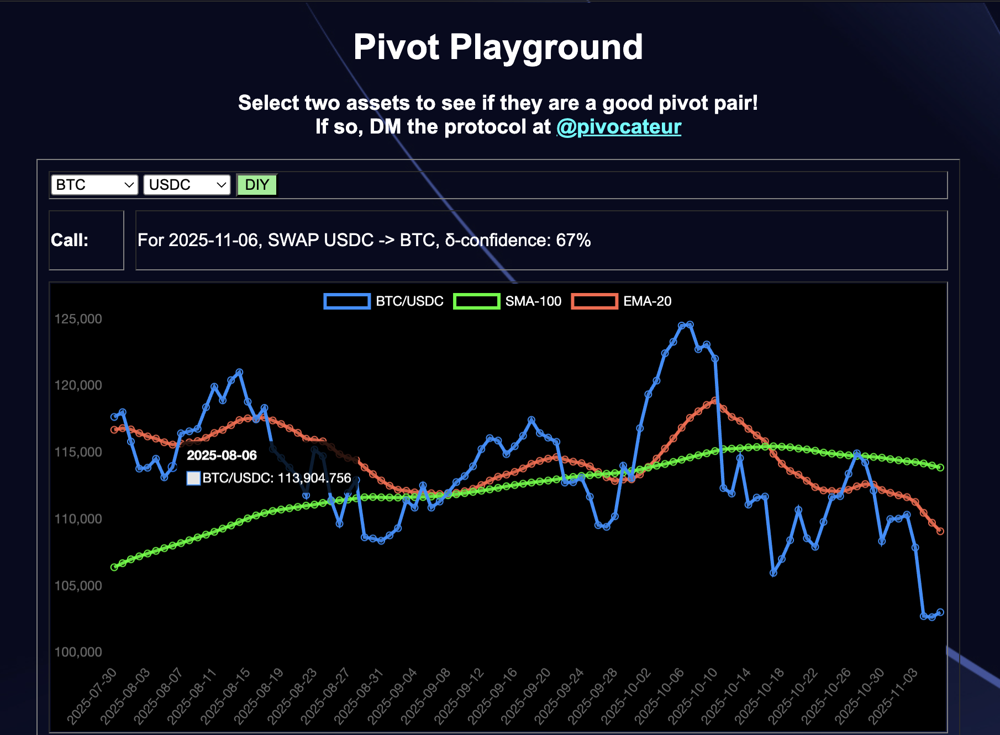
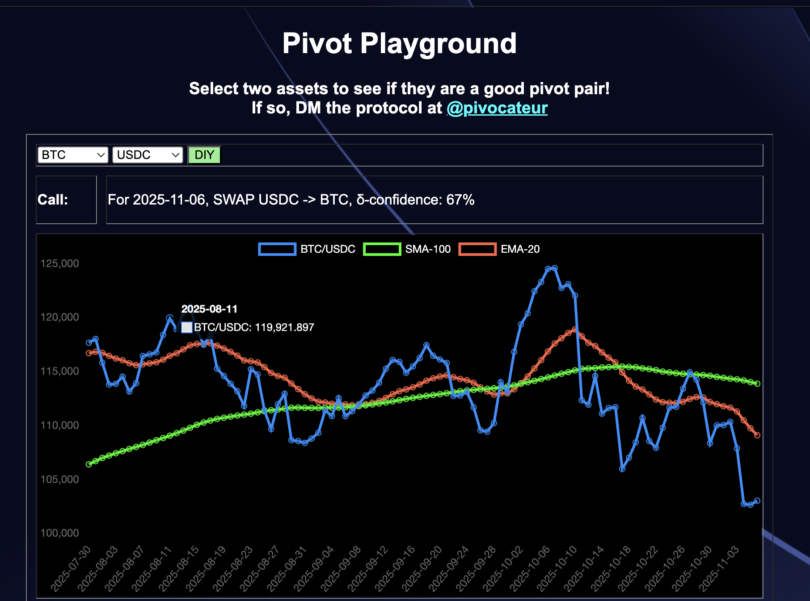
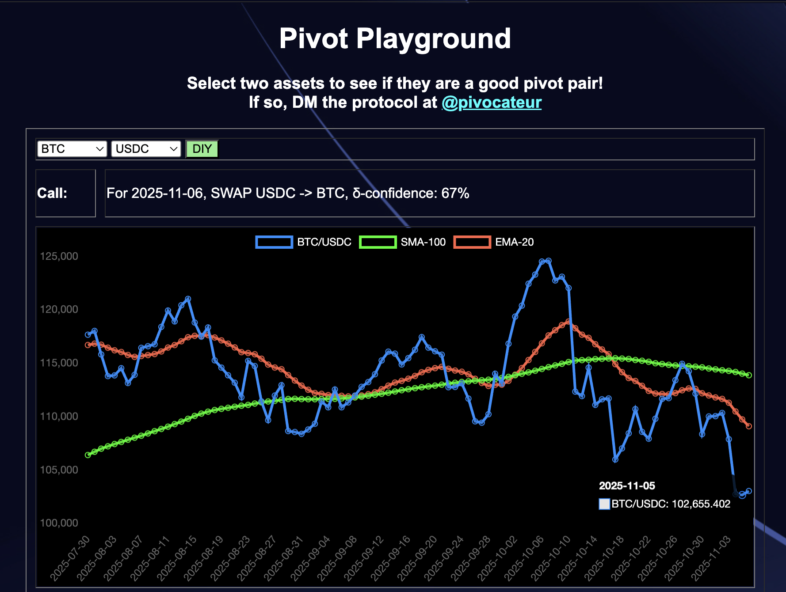

# "I'm Not Selling!"

## Pivot Arbitrage vs. well: everything else

Is "I'm Not Selling!" a good strategy?

Well, yes and no.

Let's defend the HODL-strategy (or the "I'm not selling!"-strategy).

I looked at $BTC back in November of 2013 when it was $200-per. WAY overpriced, obviously. But what if I had bought 5 $BTC back then and never sold?

For my $1,000 investment, my assets today would be worth $505,000.

That's a Return on Investment (ROI) of 50,000%, annualized to 4,200%.

That's not bad in anyone's book, I'd say.

But remember the Bitcoin-proverb:

> 1 $BTC is 1 $BTC.

At the end of the day, I started with 5 $BTC, and I ended up with 5 $BTC.

Can I do better than that? Or, 5 $BTC is the baseline.

Pivot arbitrage addresses that question.

But, first of all, what is pivot arbitrage?

## Pivot Arbitrage

### The Ratio for a BUY or SELL signal

Pivot Arbitrage is the investment tactic that pits, or pivots, one asset, say $BTC, against another, say $USDC (the USD-stable token) (sometimes).

What pivot arbitrage does is pits one asset against the other. When BTC/USDC-ratio is 'low' that indicates the price of $BTC is low, relative to $USDC, so we buy $BTC and sell $USDC. Conversely, when the BTC/USDC-ratio is 'high,' that shows that $BTC-price is high (relative to $USDC) and $USDC price is low, so we buy $USDC and sell $BTC.

### The Delta for how much to buy or to sell

So we have our BUY or SELL signal.

Now, how confident are we in that signal?

The difference between the ratio and the EMA-20 (Exponential Moving Average of
the ratio over a 20-day period) – or simply, the δ ('Delta') – gives a measure
of confidence in that call. The larger the δ, the more confident in the call I
am.

I have a working understanding of confidence in that I have two classes based 
upon the magnitude of the δ. δs below 20% I classify as 'meh,' meaning that the
call is too close to call, either way. δs above 20% I classify as strong support
for the BUY or SELL signal.

This measure of confidence gives me the, well: confidence to execute the trades
to open pivots and hedges boldly (in the case of a strong δ) or timidly.

## Hedges

I mentioned "hedges" in the last section.

I employ hedging against my own strategy, because the Markets have been 
consistent in throwing curveballs against any strategy tried against them. This 
strategy has been working well in both Bear and Bull markets, and then I put the
pivoted assets into yield-bearing money markets, so when the markets are flat, 
I'm earning interest against the assets.

## Close pivots

The above explains, generally, how I open pivots, one asset pivoting against the
other.

How do I close pivots?

Easy!

I look up how much I make if I trade back from the open pivot.

* If I make a 10% gain, or more, I close the pivot
* If I don't make a 10% gain or would lose, I keep the pivot open.

Hedges are pivots in the reverse direction, so the same rules apply.

How does this play out in the Markets? Let's walk through a real pivot.

### BTC+ETH pivot

1. On 2025-08-24, I opened a (virtual) ETH-on-BTC pivot, swapping 0.636 $ETH for
0.02659 $BTC, because the BTC/ETH ratio was below the (red) EMA-20-line, calling
for a $BTC BUY.

2. On 2025-09-30, the BTC/ETH ratio swung above the EMA-20 line, and a trade
of 0.02659 $BTC would give 0.73 $ETH, exceeding a 10% ROI, so [I execute that
swap](https://snowtrace.io/tx/0x4aeb8fe752dd52d5fb3f3a362cb735ce7c6cf6cc2fdc216f29deabe345373c70), closing the pivot.

Result:

* actual ROI: 14.70% / 145.04% APR projected 

Great! But: what happened, practically?

I started with 0.636 $ETH, pivoted to $BTC, then ended up with 0.73 $ETH.

Or: pivoting on $BTC I created more $ETH from the $ETH I pivoted.

## Exit Strategy/Reinvestment

So, we made a gain from a pivot. Great!

Or did we?

As the SEC has declared for some cryptocurrency, they are not securities, so
they don't secure your liquidity.

So what does secure your liquidity?

One approach: an exit strategy.

I've learned over time that, just as one DCA ('dollar cost average') the way
into a position to ride its gains, one should also DCA out of position to reap
the benefits of those gains. But when to exit?

The close pivot, itself, provides a perfect time to DCA gains out of a position.

Take the above pivot: a 0.0935 $ETH-gain from a 0.636 position means, in effect,
that that 0.0935 $ETH is 'free money.'

### Inflation

* So, do I exit with all the gain?

Sure, that's one strategy. The downside to that approach is that your pivot pool
does not grow over time. But inflation grows over time, as these last four years
have very visibly demonstrated to us.

Not reinvesting into the pivot pools shrink their efficacy over time.

### Burn the house down

* Then do I reinvest everything, going all-in?

This appoarch is tempting, especially seeing the gains. So why not add more fuel
to the fire and let it all burn?

You see how I answered my question with the question, itself?

More than once, a well-established token, or even blockchain, has shut down or
hit an absolute low from which it doesn't recover. Your high-ride turns to ash
when the blockchain, itself, goes down in flames.

Terra. Harmony. Phatom Opera.

These are blockchains that crashed so hard, the devs straight-up gave up on 
them.

$BTC. $USDC.

These are tokens that crashed so hard, people and institutions lost millions and
more in positions.

So, that's a reason to DCA out of a position: safety.

### The Middle Ground

Then, there's the reason that this is my livelyhood. I have no income other than
this, so I'm using pivot arbitrage to generate income from principal assets.

How much income?

I've computed my monthly expenses, so I have a monthly target. How do I meet 
that target.

For now, I'm exiting with 80% of the pivot-gains and reinvesting 20% of the 
gains. As living situations change and the pivot pools change, I'll adjust these
amounts reinvested and exited.

I also leave this up to the investors. Currently, the [Pivot 
Protocol](https://pivoteur.github.io/#) is in pre-release α-state, so all
investments are manual. That said, I give the option to investors to reinvest
their yields, take them as dividends, or do both as a percentage reinvested.

When the protocol goes live, there will be an option for an investor to 
reinvest their dividends automatically, which will be the default. They can 
change the reinvestment option at any time. If they instead choose to receive
dividends, then the standard mechanic for harvesting yields will be theirs to
exercise.

Now that we've explained pivot arbitrage – what it is and the mechanics of it –
let's return to the original question.

## "I'm not selling!"

In the Bitcoin-community, there is the rallying cry of "HODL!" – originally a
typo, now cooped to mean "HODL On for Dear Life!" – that is: no matter what the
price-movement of $BTC, don't sell! HODL! HODL On for Dear Life!

That certainly is a valid straegy for a token that always goes up (verses 
what? in this case, verses the USD).

To show the HODL-strategy, I first looked at $BTC back in November of 2013 when
it was trading a $200-per (so expensive!). Let's say I buy 5 $BTC and HODL.

For my $1,000 investment, my assets today would be worth $505,000. 

That's a Return on Investment (ROI) of 50,000%, annualized to 4,200%.

That's not bad in anyone's book, I'd say.

All investment strategies have their plusses and minus, and the HODL-strategy
has a weakness in that it doesn not take advantage of $BTC's own price-movement.

Because unlike what was stated before, $BTC is not an up-only asset.

The HODL strategy is not perfect.

What is a perfect strategy?

I'm not going to answer that question, because I hold that strategies can be
improved over time.

What is a better strategy?

Here we go.

### Pivot Arbitrage

So, how do we take advantage of price-movement of an asset. That's where pivot 
arbitrage comes in.

The way pivot arbitrage works is to pivot the principal asset (say, $BTC) 
against the pivot asset (say, $USDC) when the price of the principal asset
is high, relative to the pivot asset, then, when market conditions reverse a 
day, a week, a month, a year later, we close the pivot with a trade the other
way.

Simple enough idea. How does this approach bear out in practice.

Let's look at an example from the [Pivot 
Protocol](https://pivoteur.github.io/#)'s arbitrage history.

### A BTC-on-USDC pivot example

* On 2025-08-06 and 2025-08-11, I opened two BTC-on-USDC pivots (one an 
[hedge](https://snowtrace.io/tx/0x88b9f33b8f96c8b7d65295c361f39c980abf35501b2851d36f6b8df91aa41daa),
the other a [pivot](https://snowtrace.io/tx/0xb617d6dc5c94439693ddd8b358712a5364f8af60424685f5d6ea052b6b2d9a1e)).

Then what happened? The $BTC-crash.

* On 2025-11-05, I closed those two pivots (and others) for gains of
actual ROI: 14.70% / 145.04% APR projected.

More specifically, I pivoted

* 0.025189 $BTC -> $USDC -> 0.028962 $BTC
* or: $387.17 gain on 4 pivots totalling $2,996.22

So, instead of HODL'n my (and the investors') $BTC, I pivoted the $BTC *away*
to $USDC, of all things, anticipating an eventual dip ($BTC does dip from time
to time) (shocker!), then, when that dip did occur, I swapped back from $USDC,
buying $BTC at a discount from what I sold it at.

In essence, pivot arbitrage allowed me to 'create' 0.029 $BTC from 0.025 $BTC.

If I had simple HODL'd, I'd have my 0.025 $BTC, ... which is nice, but having
more $BTC is nicer.

> note: Pivot Arbitrage is not, and never was, a 'backtested theory.' These are 
actual transactions, recorded on the (Avalanche) Blockchain.

-----

The [Pivot Protocol](https://pivoteur.github.io/#) is currently in
pre-release α. β release is targeted for end-of-month, November, 2025.
Production go-live is scheduled for end-of-year, 2025.

