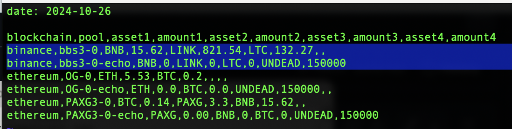

# Setting up the Pivot Protocol pools

## Allocating assets and configuring dApps

> *Synopsis*: setting up the Pivot protocol is as easy as Lotus 1-2-3!
>
> ... most of you are too young to have seen Lotus 1-2-3 in action, or to have 
used it yourselves, ... aren't you.

# Selecting and funding the Treasury, pivot-pools, and echo-pools

Let's scrap everything and BUIDL pools based on a budget of 5M $UNDEAD tokens (~ $90k today).

How would I start?

* Obviously the OG, BTC/ETH
* We've demonstrated success with BTC+PAXG+BNB, ... I wish there were a perfect blockchain that has liquidity for all three (Ethereum is weak with both PAXG and BNB, and Binance doesn't even have PAXG) ... osmosis?
* BNB+LTC+LINK on binance

Those're three pivot pools with good intra-oscillatory characteristics, funded at 1.5M $UNDEAD each, or 4.5M $UNDEAD total, DCA'd on the daily with `./otto`.

Next, each pivot pool needs an echo pool funded with 1/10 the $UNDEAD of the corresponding pivot pool, 150K $UNDEAD each, or 450K $UNDEAD total

Then there's the treasury, funded with the remaining undead: 50k $UNDEAD.

5M $UNDEAD: allocated to the treasury, pivot-pools, and echo-pools from the Pivot Protocol reserves.

Recall, the Pivot Protocol funds 30% of a pool and Wagyu funds 20% of a pool as incept funds (which means 1M for each pivot pool, 100k for each echo pool, 33k for the treasury comes from wagyu). Yields are paid to investors.

# Configuring dApps

How do we set this up for `./dawn`? Contrary to what may be believed, `./dawn` does not operate on spreadsheets, so setting up is a simple task: I compute the apportionments of each token of each pool, and put that into the protocol assets file which `./dawn` reads to compute trade-amounts.

> Note that I added two pools, a BNB+LINK+LTC pivot- and echo-pool, with just
two lines of configuration. That's how easy it is to set up pools for the
Pivot Protocol.

Then, I reconfigure `./dawn` with a new `min_swap`-amount in light of the
smaller pools being ananlyzed. I suppose I could have `./dawn` compute a
pool's size and dynamically adjust the minimum, but for now I like retaining
that control, as more than just a pool's size informs a `min_swap` default
value ... transaction fees also play a significant role here, as well.

After updating some calls to library functions, I have a new version of 
`./dawn`:

> Note that not only does `./dawn` compute swaps for the new pool (there are 
no swaps today), but it also handles an entirely newly-added blockchain with
quiet dignity and grace.

We can now do daily reports with these newly-established pools.
