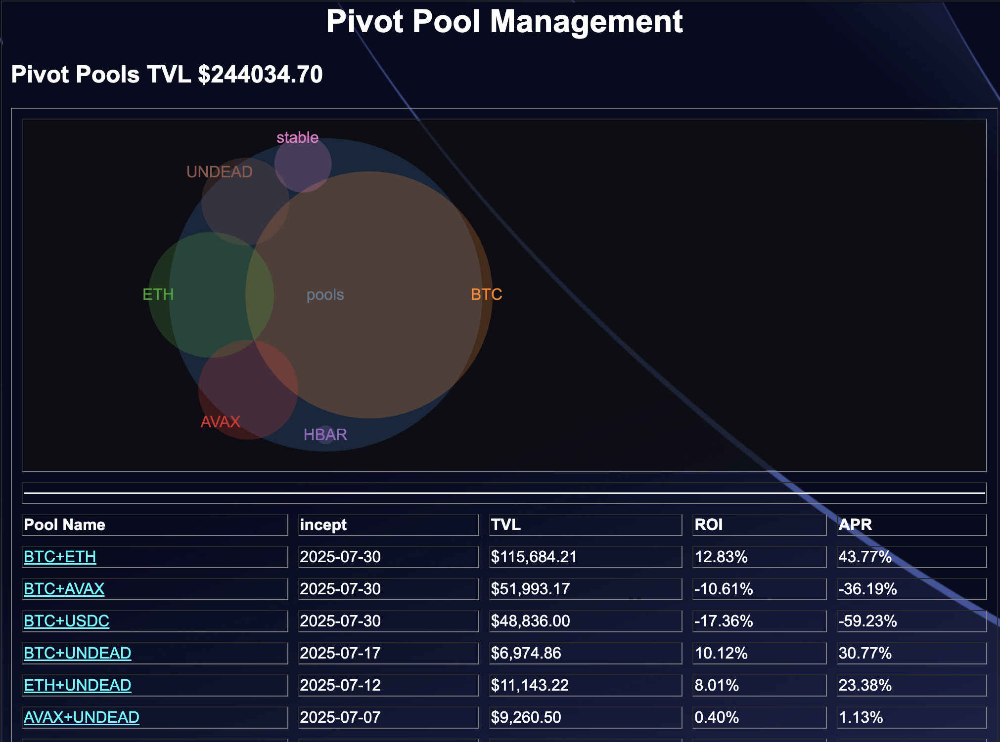
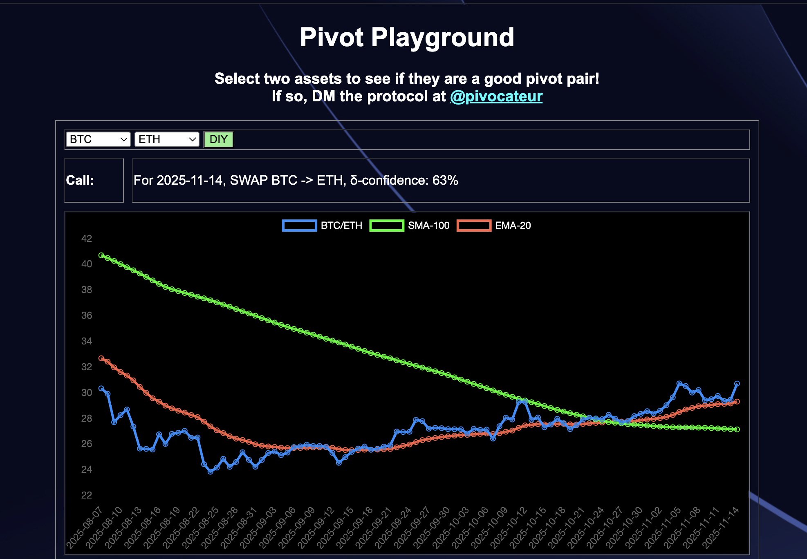
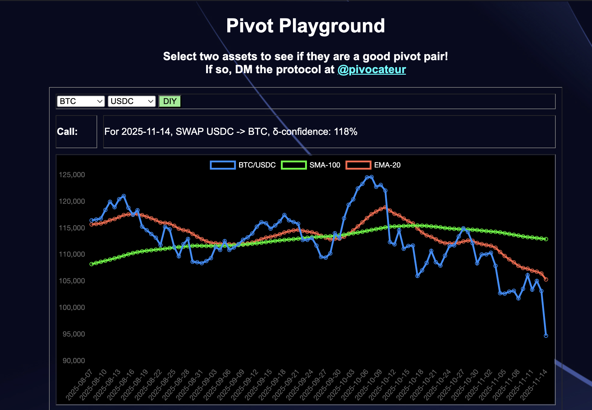

# Pivot Arbitrage: the Silver Bullet to Cryptocurrency Investing?

tl;dr: yes, but different pivot pools have different risk/reward characteristics

So.

There's been some fun stuff going on in the markets these past couple of weeks,
eh? $BTC / Bitcoin has 'crashed' to below $100k-per and people are losing their
shirts and losing their minds in and out of the markets.

These huge losses are also affecting us pivot arbiteurs, but we're not losing
our shirts, nor our minds: in fact, when the markets tank, we not only take
profits on the short-side, but we also retrench and build strength on the
weakened assets in the pivot pools. No time to buy $BTC (and other pivot-assets)
like when they are at their low-points.

As I've pointed out in other articles, the stable pivot pools capitalize well
on huge spikes or dips in the marketplace: selling when the assets are 
overpriced and buying with the assets dip to underpriced values. Great!

This being said ('this' being a love-letter to the stable pivot pool), note 
the return on investment (ROI): -17%.

When an asset like $BTC goes up and up and up steadily, the stable pivot pool 
doesn't capture gains until there's a spike. So, even thought pivot arbitrage 
is the 'Silver Bullet' to cryptocurrency in many ways (buying the dip, dollar 
cost averaging, asset (amount) growth, exit strategy), each pivot pool, 
individually, has its own characteristics and will appeal to different tastes. 
What are these characteristics?

* BTC+ETH pivot pool: grow blue chips but low volatility (so can appear 'slow')

* stable pivot pools: capture gains and protect against principal asset loss, but underperforms the markets against just the principal asset only.

* protocol pivot pools (e.g. AVAX or HBAR or UNDEAD pivot pools): high 
volatility, high risk, high return.

So, yes, pivot pools do well against other strategies in the cryptocurrency 
domain – particularly if the strategy is "panic sell" or "FOMO buy" which seems 
to dominate the markets – but within pivot arbitrage each pool has its own 
plusses and minuses and does well in some market conditions against the other 
pools or does worse against the other pools in other market conditions. YMMV. 
DYOR.

-----

The [Pivot Protocol](https://pivoteur.github.io/#) is in pre-release α. Contact
me to discuss opportunities to invest into pivot arbitrage.
