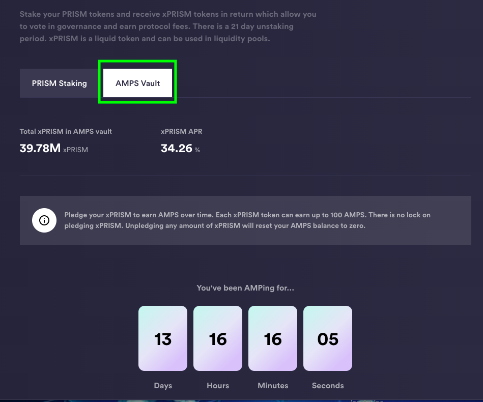
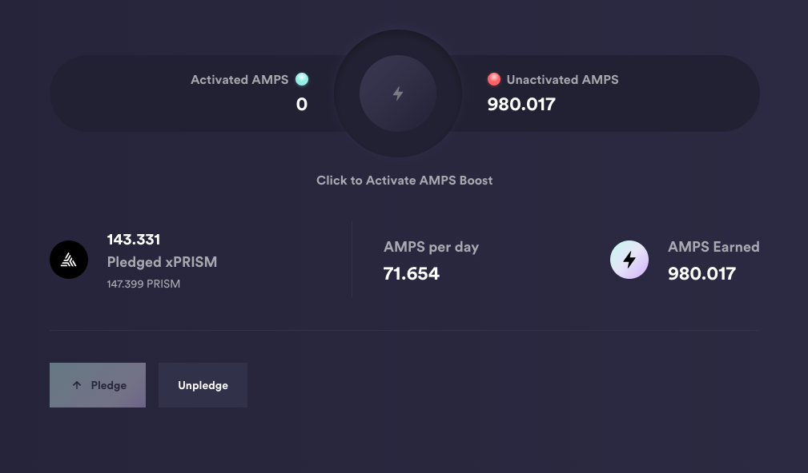

# Attracting and Keeping liquidity

## Staking/locking vs. amping

<blockquote>
Synopsis: the problem that protocols face is

1. attracting liquidity; and, the bigger problem:
2. keeping liquidity

This article looks at two standard approaches to attracting and keeping 
liquidity and proposes a solution beneficial both to stakers and to the
protocol.
</blockquote>

Okay! You're a brand-spanking new validator, or you've just launched a protocol,
and you need investors to *shut up and show you DA MONAY!*

Great, and you get a few trusting souls to fork over their hard-earned crypto,
or ill-begotten crypto, if they invest in shid coins and NFTs; *mach nicht*

> *ed:* this is the author hating on the players, ... and the game

because they see that when they stake with you, it puts their earnings to work,
generating yields from the liquidity they supply.

If you've seen protocols launch, or been the protocol that launches, you 
invariably see some stakers intent on gaming they system, by staking just
before a vote on governance, or staking just before an airdrop, then destaking
right away.

You thought you had liquidity, but, suddenly, you don't.

This can have serious consequences when the protocol invests that liquidity
so as to deliver the promised yields, only to have that liquidity vanish, 
requiring the protocol to liquidate its own assets to cover the withdrawal.

This has sunk more than a few ships on the Blockaverse sea.

So, how do protocols imbue invested liquidity with stability.

# The Standard Model &trade;

The standard approach to stabilizing staked liquidity for protocols is to
lock the staked tokens for a certain time. On Terra and CØSMOS, your staked 
tokens are locked 21-24 days. On Harmony, it was 7 days.

Some protocols incentivize locking of liquidity, ... recall that the Astroport
protocol had incentivized locking tiers of up to one year, with tiered rewards
of $ASTRO, depending on the amount of time you selected to lock your liquidity.

## Win-lose

Although locking staked liquidity provided stability to protocols, so they 
could reinvest that liquidity to deliver on the promised yields, it provided
no advantage to the investor, and, eventually, hurt the locked token and the
entire ecosystem.

Remember the Terra-crash? Many were the investor who had locked $1,000s in
liquidity only to see their entire stake's value evaporate, and, as their
liquidity was locked, they could do nothing but watch.

This was not an isolated incident. Investors locking protocol tokens for
3 months, 6 months, or a year, only to watch their protocol token's price fall 
by 50% per month (hello, there, Polter, formerly Geist) have no incentive to 
(in)vest their $POLTER gains, given the liquidity they lock provides yields of
3% to 6% *per annum*.

If I make $10 in a year on $300 invested, but that $300 invested dries up to
$150 in one month, and the token's price continues that downward spiral, then
I have no incentive to lock my tokens with the protocol, and every incentive
to swap the protocol token to a token of value or to exit the position with a 
swap to a stable.

* locking benefits the protocol, not the investor, and incentives are paltry
compared to future unknown price-variability.

# An Alternative

An alternative to locking tokens is (somehow) to weigh time invested as a
multiplier of liquidity staked.

There are at least two approaches for this alternative:

1. *LSD / 'Liquid Staking Derivatives'* where LSD tokens are provided in
exchange for tokens staked. The prime mover here has been Lido Finance, with
Stader and Eris protocol being notable contributors to this field.

2. *AMP / 'Amplifying tokens'* where amp-tokens are accumulated alongside
the staked tokens. AMP tokens, generally, are both valuless and virtual or '
synthetic (A notable exception *was* the $sbfGMX amp-tokens of the GMX protocol:
they were valuless, but were actually fungeable tokens on the blockchain),
providing a liquidity-multiplier to staked tokens.

The former (LSDs) are the most popular approach, but require daily computations
updating the exchange rate, factoring in yields and slashed validators, ...
for most protocols, this is too much maintenance-work to manage a simple
and straightforward need.

So let's examine the latter.

$AMP was made fameous on the Prism protocol. 

When you staked $PRISM, you 
received $AMP over time which could be applied to multiply (fractionally) your 
$PRISM yield returns.

The longer you staked your $PRISM, and the more $PRISM you staked, the more
$AMP you accumulated over time.

Great!

Now you had to select the $AMP to apply as a multiplier manually, but that
was a Prism protocol-thing.

# Pivot Protocol Hybrid Approach

Why not both lock and amplify?

Why not, indeed!

## Locking: a short and sweet lock

The problem with locking is that long locks (rightly) scare away investors.

The benefit of locks is that the liquidity is locked: there for the protocol.

I propose we lock the liquidity for 1 week / 7 days: the lock is not too
painful to scare away investors and also provides the needed stability
to commit to investing the liquidity, as that can be done on the same day, or
on the next day, of when the liquidity is staked.

## Amplifying

At the same time, once the liquidity is invested, we start a daily assignment
of $AMP (virtual) tokens to the investor's staked (in this case) $UNDEAD
liquidity.

What does amplification mean for the Pivot Protocol?

Investors get a total of 10% of the pivot pools they invest into (same for
the Treasury). Let's reconfigure this so that on day 1 of their investment,
they get 5% of their investment, and, over a period of 6 weeks (42 days),
1/42nd $AMP (virtual) token is minted for each $UNDEAD token they invest, up
to a maximum of 1 $AMP token for each $UNDEAD token.

* If 10,000 $UNDEAD tokens are invested, after 42 days, a maximum of 10,000 $AMP
tokens are added to the investment.

Now, the investor's investment *ALWAYS* get 5% of the pivot pool's gains, but
their investment is now calculated thusly:

* # $UNDEAD tokens + # $AMP tokens = # invested tokens

In this way, after 6 weeks, an investor is now making the full 10% of the gains
from pivots because of the $AMP tokens multiplying the returns for that 
investor.

If the investor withdraws $UNDEAD tokens (after the 7-day lock) from a pivot 
pool or from the treasury into which they've invested, then an
equal number of $AMP tokens are burned from their investment.

(An investor will have a minimum of 0 $AMP tokens ... we won't burn more
$AMP tokens than what they have).

## Benefits

* The short lock locks in stability for a week, ... most investors will just
leave their investment there, as the habit has formed that their tokens now
'belong to' / 'are invested into' the protocol.
* Minting $AMP incentivizes investors who want to stay with the protocol and
see their gains grow, week after week, and, at the same time, do not penalize
investors who want to withdraw their liquidity for whatever reason.
* Where do the unamped assets go? Right back into the pivot pool or treasury,
strengthening the protocol.

## Costs

* Computing $AMP mints is one more thing to do on the daily, however, the
computation is straightforward.
* Computing yields now requires knowing a wallet's $UNDEAD invested amount as 
well as $AMP minted for that investment, entailing additional storage, 
maintenance, and computational costs, ... but you can sum two numbers, right?

# Conclusion

Locking or amping staked liquidity? The standard approach has been locking,
but the high-variability of cryptocurrency has scared investors away from
long locks. Amping staked assets is a sweet alternative, but doesn't provide
assured stability to protocol, like locking does.

By combining both with a reasonable approach, a short lock and amping staked
assets incentivize investors to keep their assets in the protocol without
penalizing them too harshly with the too far oft-promised awards that fail
to materialize due to emerging situations that investors have seen far too
many times.

Let's incentivize investors' trust and faithfulness with a short lock and an
amp'd investment over time.

