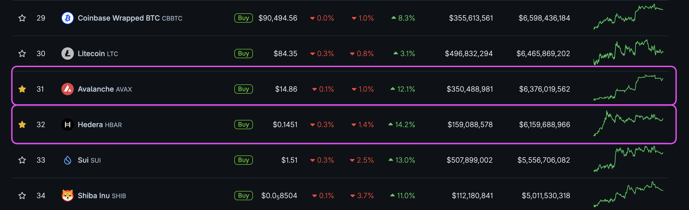
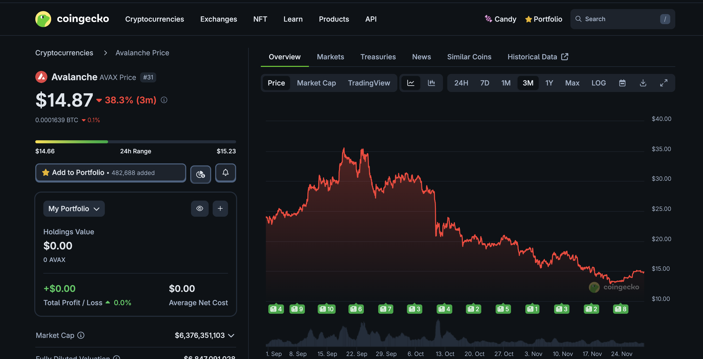
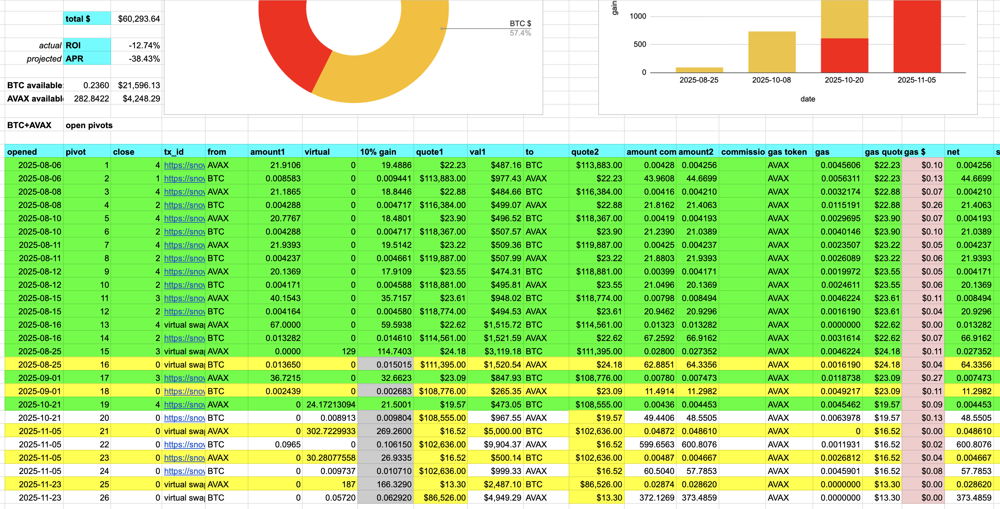
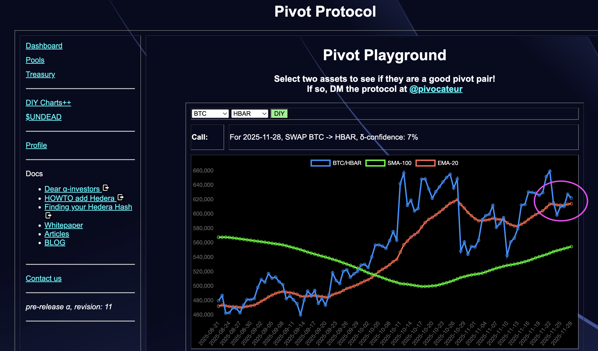

# Same, but Different.

> tl;dr: How to move assets with very different characteristics seamlessly across disparate blockchains

I've been gradually transitioning liquidity for the Pivot Protocol from one 
blockchain, Avalanche, to another: Hedera, two very different blockchains.

How does that work?

Well, for things that translate 1-to-1, the transition isn't that hard to 
figure out. Case-in-point: I now have 4 pivots, equivalent to $20k, from the 
BTC+ETH pivot pool moved from Avalanche, established now on Hedera. BTC and ETH 
are the same across chains. A similar 
transition will occur for the BTC+USDC pivot pool, as USDC, the USD 
cryptocurrency, is practically universal.

I ran into an interesting problem last night, however, when I examined the 
pivots for the BTC+AVAX pivot pool. AVAX, being the protocol-token for the 
Avalanche blockchain, has no equivalent (or, more accurately: no liquidity), 
on the Hedera blockchain. AVAX and HBAR (the Hedera protocol-token) are 
nothing alike.

That's one problem. The next problem is that the existing BTC+AVAX pivot pool 
is preexisting with entrenched open pivots. 

To close those pivots now would 
incur a loss, and, given what's stated above, I can't 'lateral' those open 
pivots to their new home on Hedera.

## The Solution

The approach I'm taking is a gradual transition. If you look at the present 
ratios for BTC+AVAX and BTC+HBAR, ...

... you see that they are similar, that is:
'meh,' meaning that a pivot I open now for either start at the same place on 
their respective charts.

My plan of attack for this transition is to open new pivots on Hedera and 
to sunset the BTC+AVAX pivot pool as I close the open pivots on Avalanche, 
gradually moving liquidity from one blockchain to the other with minimal 
impact. As the liquidity moves, the investors' apportionments also transition 
from the old to the new pivot pool.

-----

The [Pivot Protocol](https://pivoteur.github.io/#) is in pre-release α, it 
will be moving to a β release in December, 2025, and in production on Hedera 
end-of-year, 2025.
