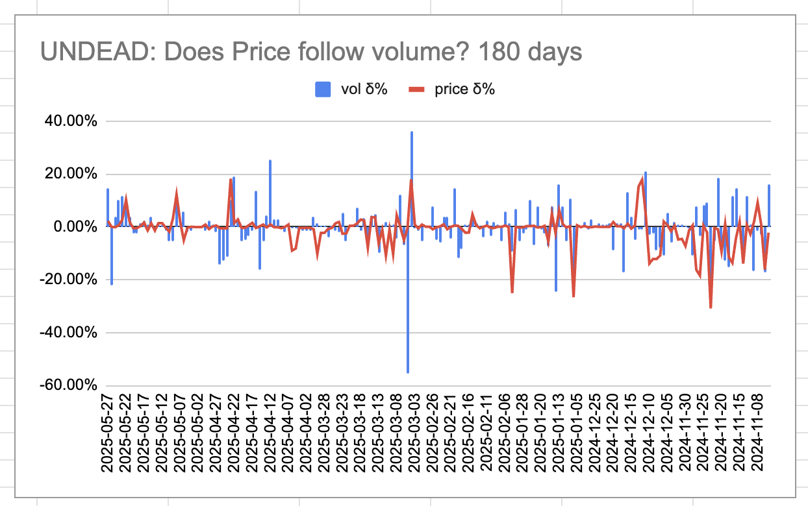
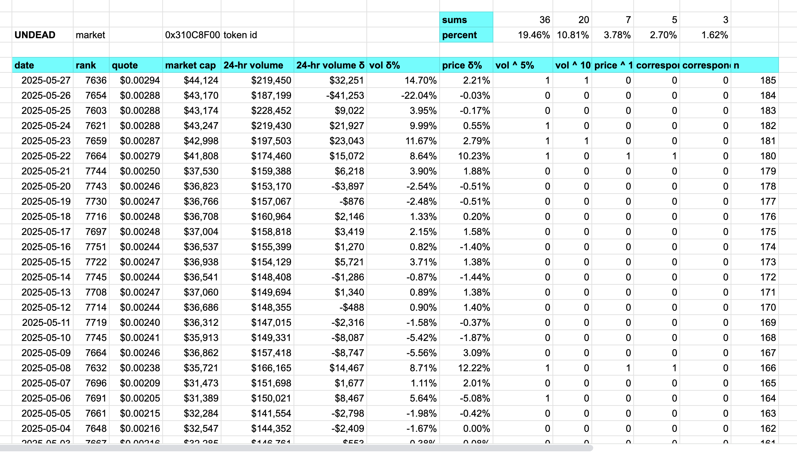
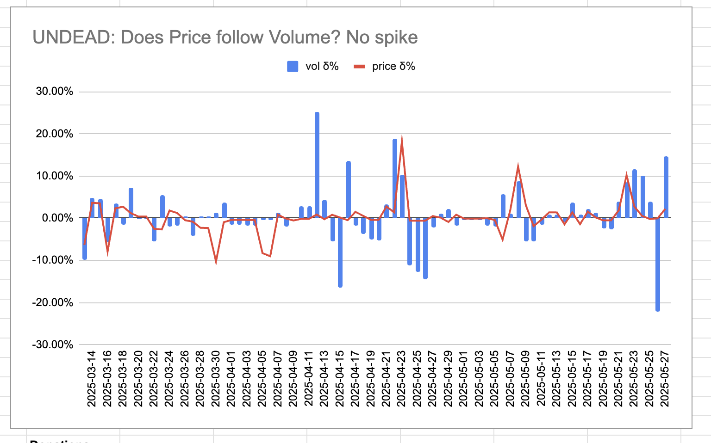
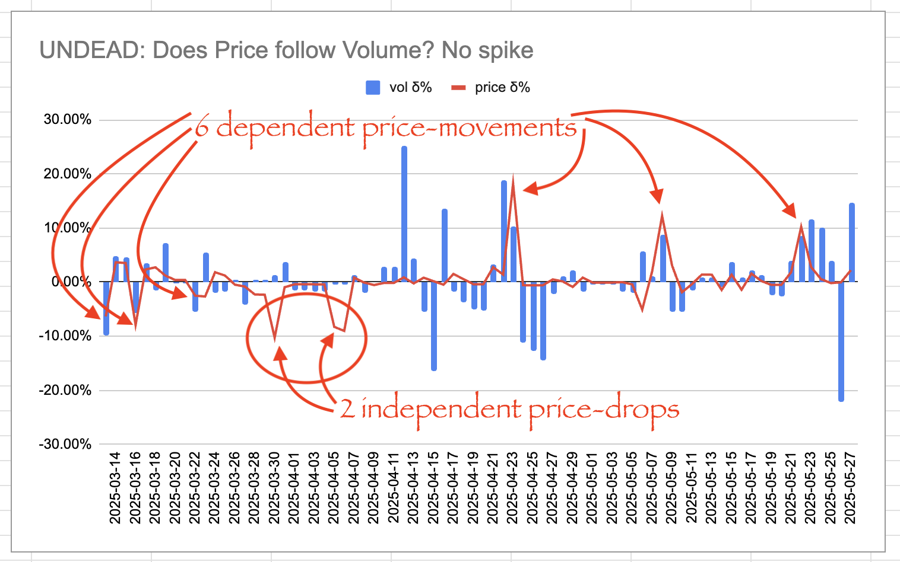

# $UNDEAD: a case study.

## Does $UNDEAD price follow volume?

* Study-period: 185 days
* days volδ ^ 5%: 36 / 19.46%
* days volδ ^ 10%: 20 / 10.81%
* price δ ^ 10%: 7 / 3.78%
* correspondence volδ ^ 5% <-> price δ ^10%: 5 / 2.70%
* correspondence volδ ^ 10% <-> price δ ^10%: 3 / 1.62%

## What does this chart tell us?

It's hard to say, as there is this huge volume spike smack-dab in the middle of the period. Let's eliminate that spike by shortening the period.

Does price follow volume?

Yes-...ish. When volume spikes, so does price, except the two price-drops.

Data collated from [coingecko](https://www.coingecko.com/en/coins/undead-blocks).
