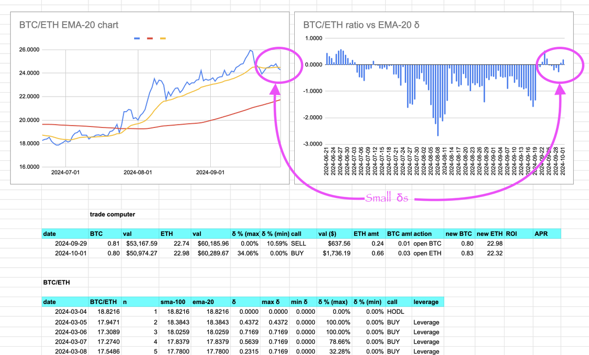
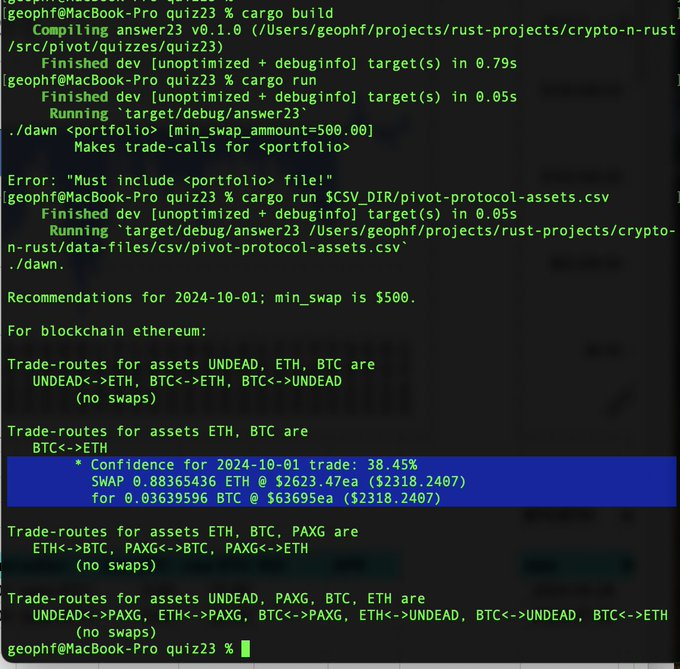
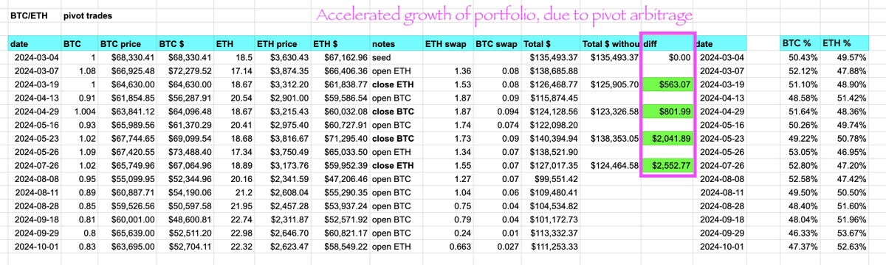
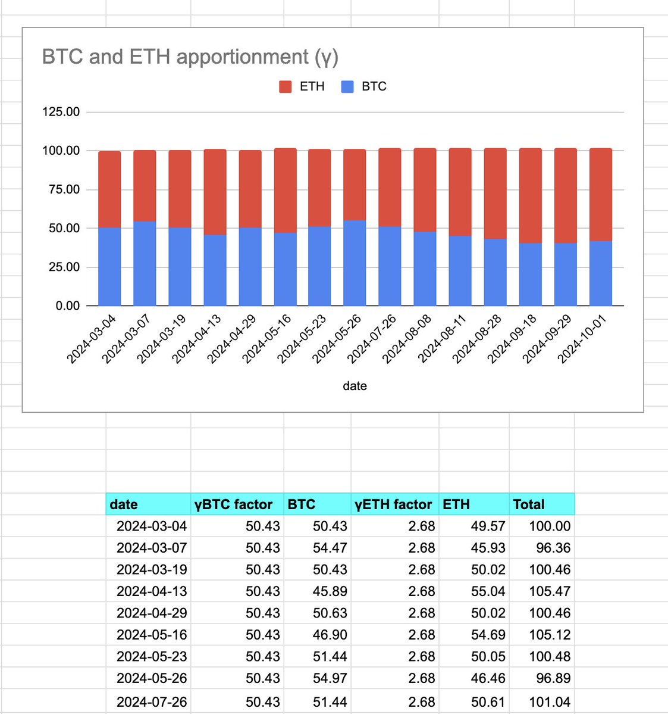

2024-10-01: ./dawn recommends an ETH-swap on the ETH/BTC pivot pool. The swap now includes a confidence measure (δ).

If you've been following along [./dawn's recommendations](../../09/29), you may ask: "geophf, why is this trade an 'open ETH'-pivot as opposed to a 'close BTC'-pivot?"

That's a good and fair question.

Let's look again at the charts and the outcomes.

You see that the charts have been very 'dull' as of late, and the δs have been tiny recently. If we were to close the $BTC-pivot, we would do so at a loss: 

* 0.24 $ETH -> 0.0096 $BTC on @Uniswap, from an original 0.01 $BTC swap.

Trading at a loss: me no likey, as the whole point of pivot arbitrage is to increase the principal asset, not to decrease it.

Is this a bad thing?

Look at the chart again. 

You see a preponderance toward $BTC growth over $ETH, so, instead of closing the $BTC-pivot, we open an $ETH-pivot and ride the $BTC burgeoning growth all the way up!

With pivot arbitrage, we win. We just have to be smart and measured in our trading.

What does "smart and measured" mean, programatically?

* It means we record each trade (measured)
* It means a close trade shows growth, or we don't do it (smart)
* It means the opportunity is still there, so we DO open the opposite pivot to take advantage of the trend (smart).

Pivot arbitrage bears out over simply HODL'n the assets or providing liquidity into an (xy=k) LP.

At each close-pivot, you see our overall portfolio-value has grown, and grown increasingly (that is: accelerated growth), over a portfolio that does not execute pivot arbitrage.

Now, how do we measure, accurately, the apportionment of each token in a pivot-portfolio, independent of token-price or of number of tokens? That is done by calculating each token's γ (apportionment factor), ...

... but that is a conversation for another day. 😎
