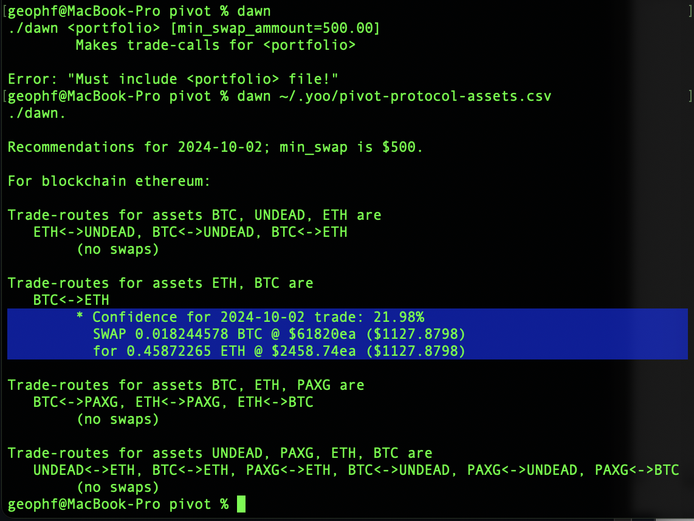
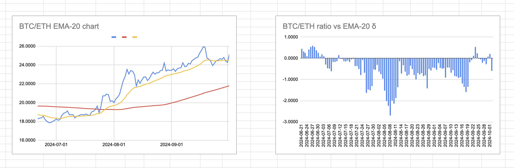
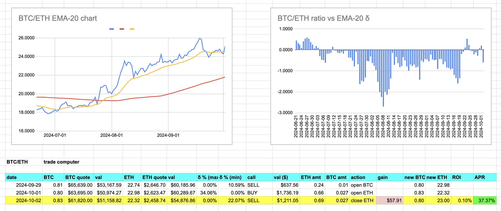
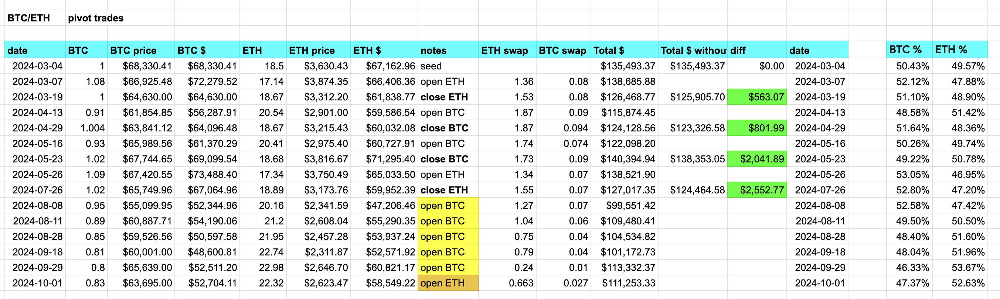
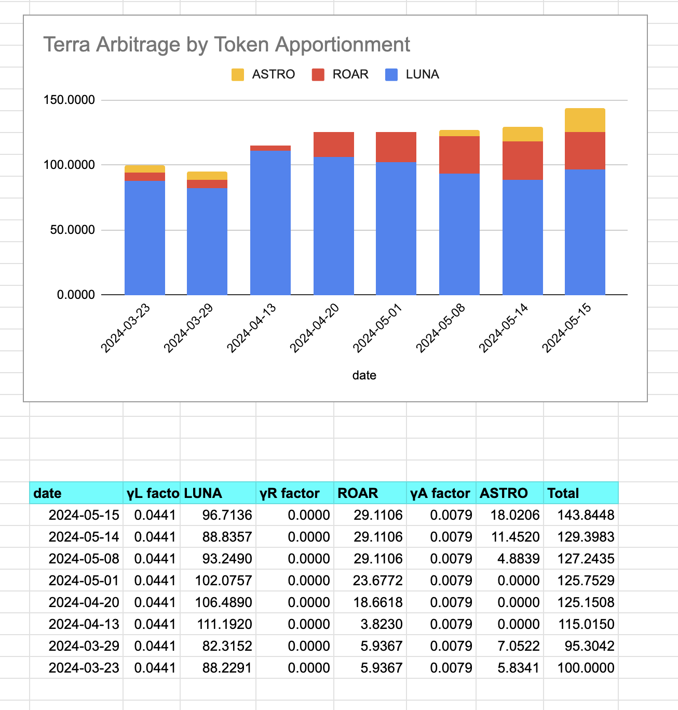

2024-10-02: ./dawn recommends BTC -> ETH trade, but ... [pensée incoming] ...

The thing is: I was right, yesterday, to open an $ETH-pivot, for, as I suspected (which is different that 'as I predicted'), the burgeoning $BTC-growth-vs-$ETH-trend continues.

I COULD close the $ETH-pivot today for a $57.91 profit, which is 37.37% APR.

BEAT THAT! 🎉

But... 🤔

BUT! If you look at $ETH's opening pivot-trade, it was for $1,500. $57 profit is a 0.1% ROI. Even if it is 37% APR, I think I can do better by sitting on my hands, ...LITERALLY (*sits on hands) and allowing the $BTC trend to continue burgeoning, getting, I HOPE, a much better ROI

I say 'I HOPE' but it's more than an 'I HOPE' as I have 5 open $BTC-pivots AND the most recent open $ETH-pivot.

Either way – BTC/ETH ratio up OR down – I'm now hedged for success.

(self-critique: maybe that last open pivot with only 0.01 $BTC was miniscule, but there it is.) 🙄

2. I've been developing pivot arbitrage over the last couple of years and have tracked pivot arbitrage, formally, for a year now.

3-4 pivots grew my portfolio by 50%, friends.

You don't need to trade a lot
to be profitable with pivot arbitrage: 
you need to trade smart.

So that's the benefit of holding off on this close $ETH-pivot trade.

What's the cost?

The markets go flat, forever, and I've lost this ~$60 gain.

It comes down to trading too oftenly vs. trading not oftenly enough.

'oftenly' is a word. Deal.

* too often, and you're trading to show activity, but sacrificing gains as transaction fees pile up.
* not often enough, and you're too timid, deferring profit-taking for too long.

How do I get this right? Experience and measures.

Experience, because when I started I was making $10 trades every day, just to get this thing GOING! Then later, trading much less frequently showed much bigger gains.

Being busy for its own sake is counterproductive.

There are more-experienced traders out there who have killer success but are now broke. They hit, but they miss. Why?

Measures.

Measure and improve. Lather, rinse, repeat.

By measuring results, you know what trades work and which don't, then you can build experience: informed.

SO!

WHEREAS the ROI on the close $ETH pivot is 0.1%, I'll hold off for a better ratio later.

WHEREAS I have 5 open $BTC pivots, I won't open another one at only 22.07% δ-confidence.

The. End.
