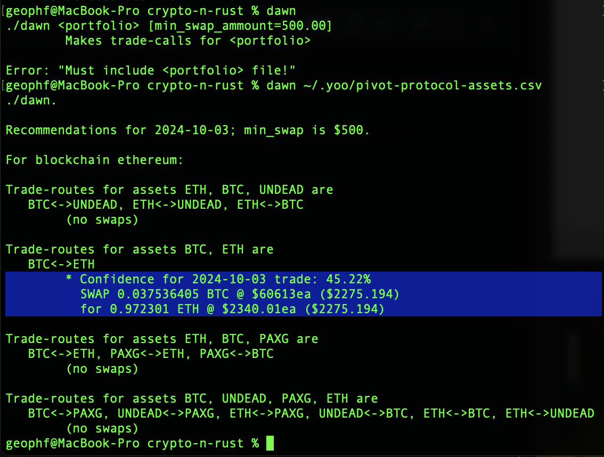
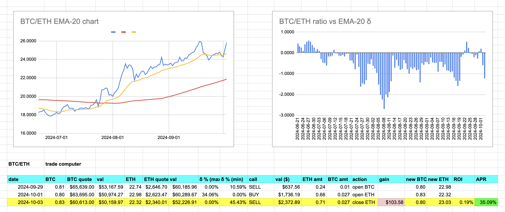

2024-10-03: ./dawn recommends swapping $BTC for $ETH, δ-confidence 45%

Even though δ is higher today, nothing changes. The ROI is still below 10%.

This calls for more automation. We have ./dawn to make the calls: we need
`./dusk` to okay those calls against prior trades.

ALTHOUGH! a fair question is "Why do you need `./dusk` at all? When EMA-20 is high (relative to BTC/ETH ratio), swap $BTC for $ETH. When EMA-20 is low, swap $ETH for $BTC!"

This is an entirely fair, valid, and simpler approach than `./dusk`.

What `./dusk` does give me is a measurement for every single pivot. The free-for-all approach give measures for portfolio health and growth overall but not at the granularity of each pivot.

So: the downside of `./dusk` is that it requires I sit down and do the work: write the parsers, write the logic, write the reports. But it closes a pivot with the exact amount that opened the pivot.

So: free-form trading, or fine-control pivots with `./dusk`? I need to know that each and every pivot works, every time. 

* *UPSHOT:* I'm writing `./dusk`. 😎
