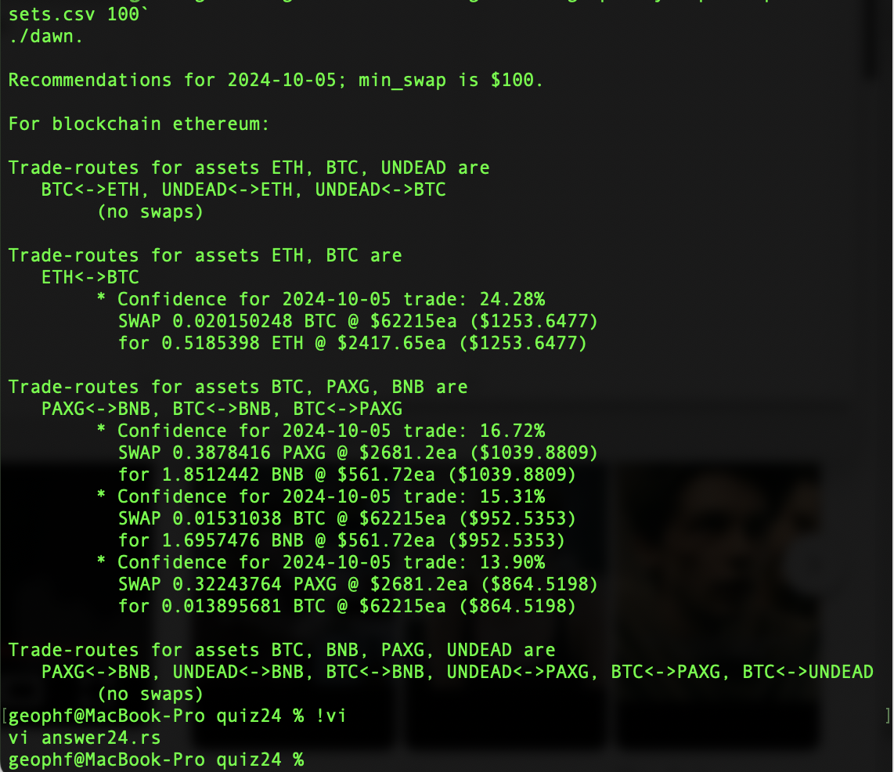
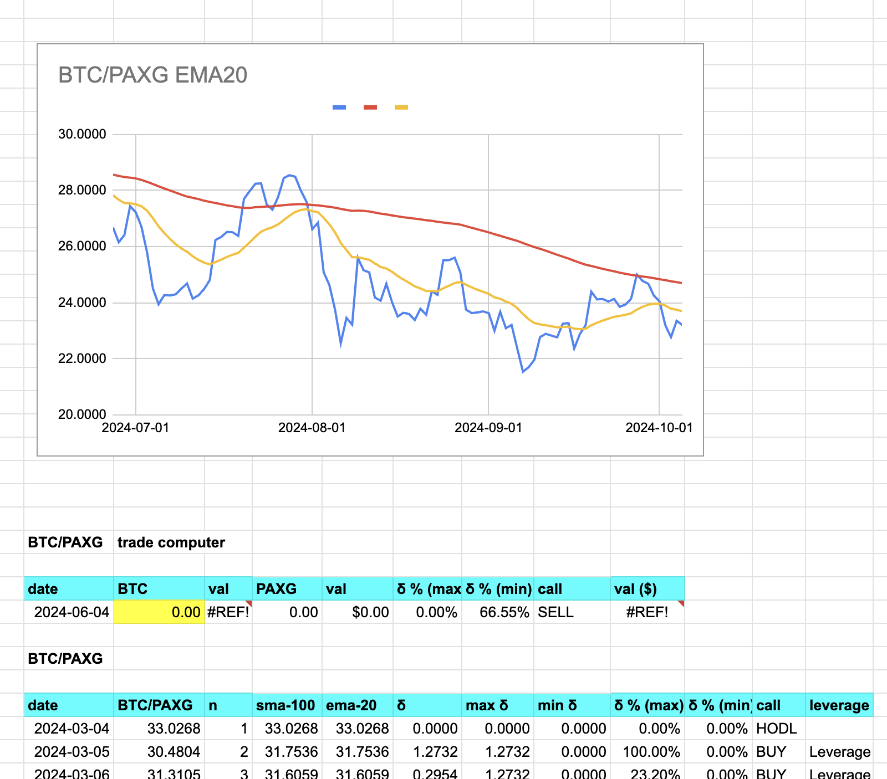
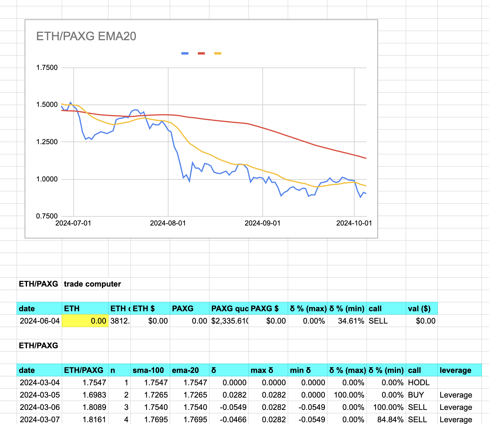
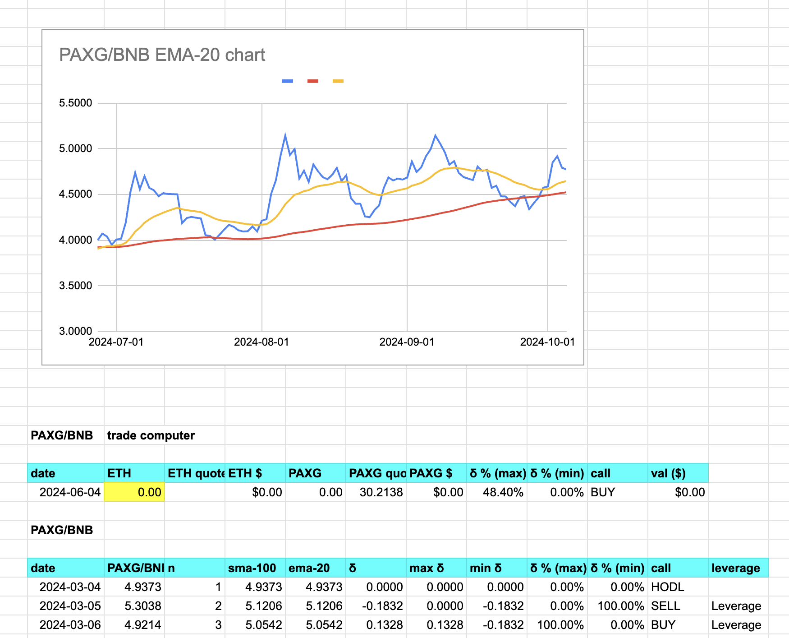
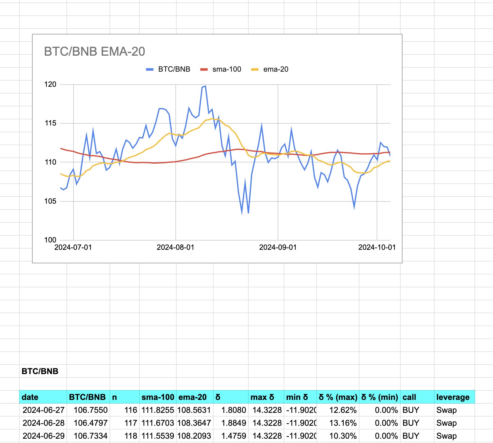

2024-10-05: ./dawn BTC -> ETH swap called. 

Also, rebalanced the experimental $PAXG pool to be $BTC + $PAXG + $BNB. $BNB replaces $ETH, as $ETH does not oscillate well against $PAXG ($BNB does). 

I had originally thought PAXG+BTC+ETH would work as a triary pool, but ETH is not performing well here. What does "performing well" mean? If you look at the oscillations, BTC and BNB have good oscillations against each other and against PAXG, but ETH+PAXG oscillations are nearly one-sided, so not good for pivot arbitrage.

So, for PAXG, I'm thinking a triple-pool of PAXG+BTC+BNB strikes a nice and interesting balance for all three tokens.
