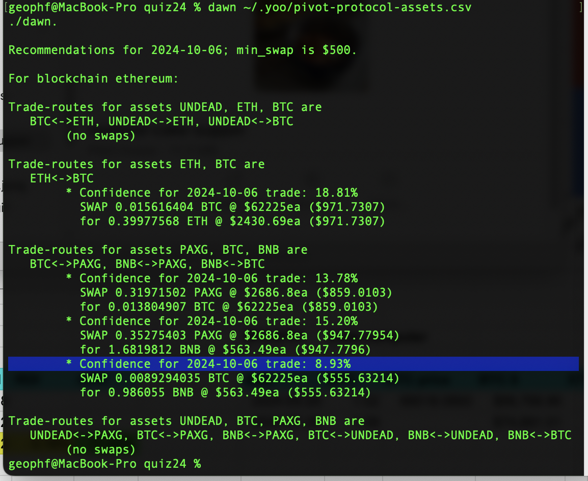
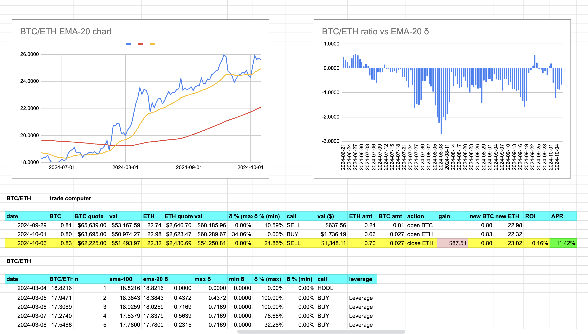
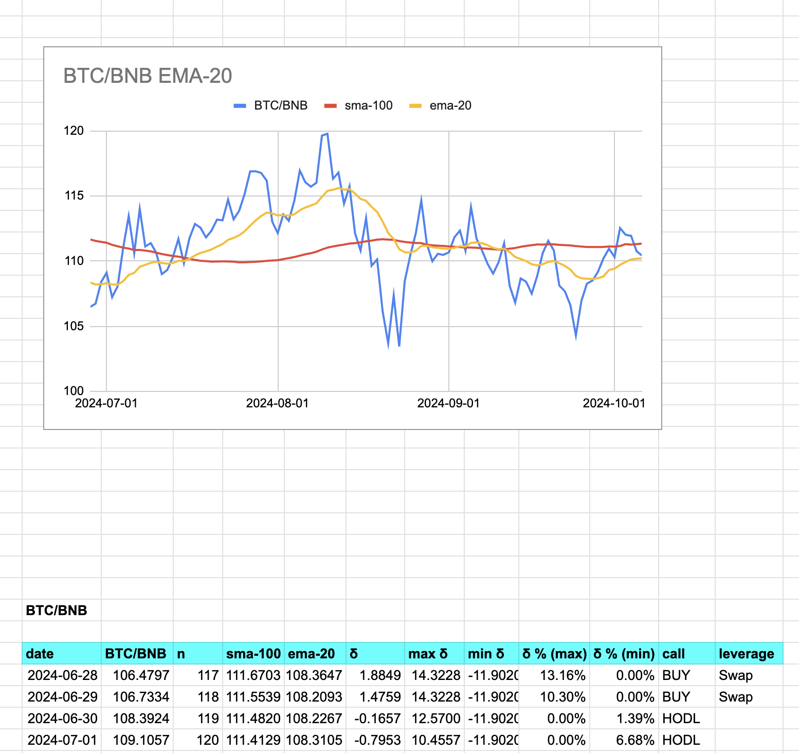
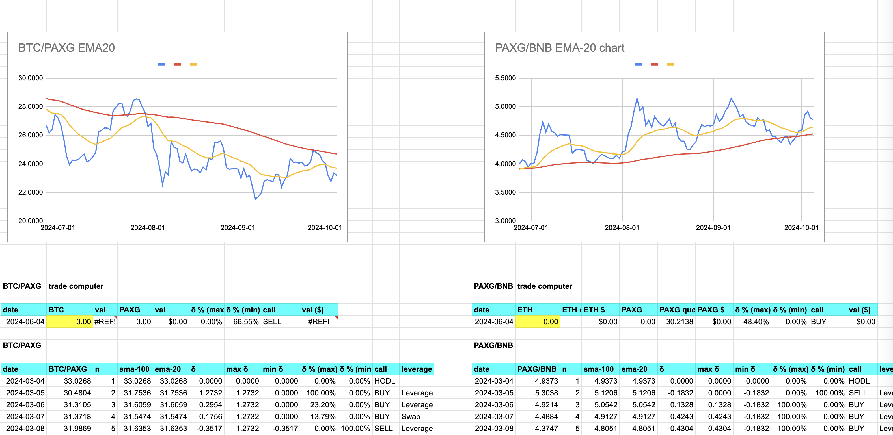

2024-10-06: ./dawn makes active recommendations around BTC/ETH and BTC/PAXG/BNB. Something to look at is that even though the trade is viable (> $500), the δ% isn't (< 10% – highlighted). That's an upgrade I need to incorporate into ./dawn.

You'll also note the SELL recommendation (BTC -> ETH), which, with the context of open BTC pivots is unnecessary. A close ETH pivot at ROI of 0.16% is too small. ./dusk, when deployed, would veto ./dawn's recommendation.

So,

item,work,status,level of effort
1,./dawn state output,in progress,modification
2,./dusk,planned,new dApp
