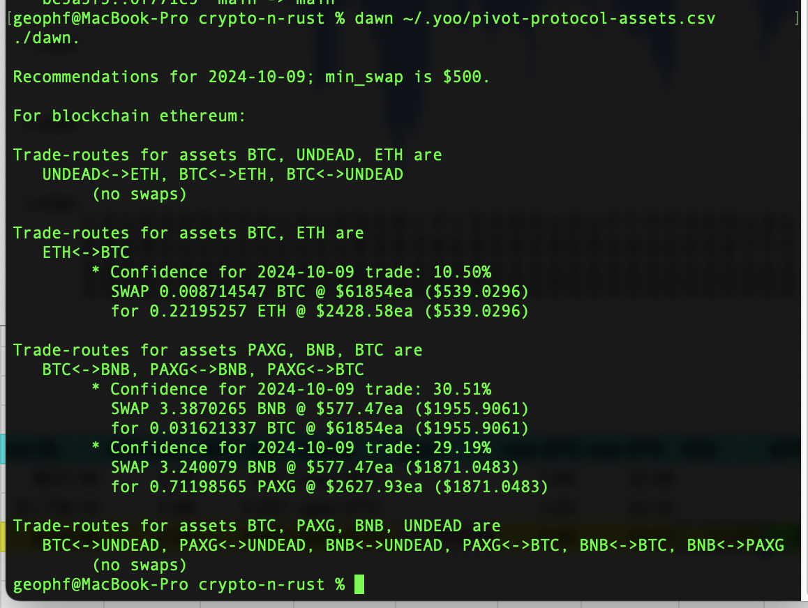
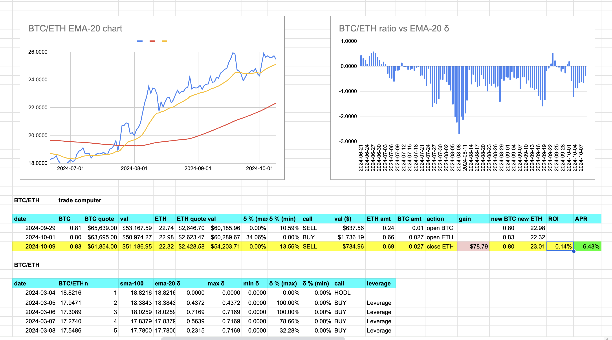
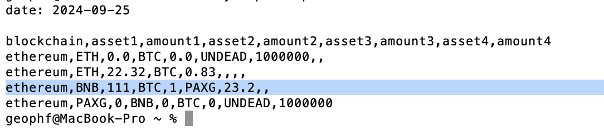
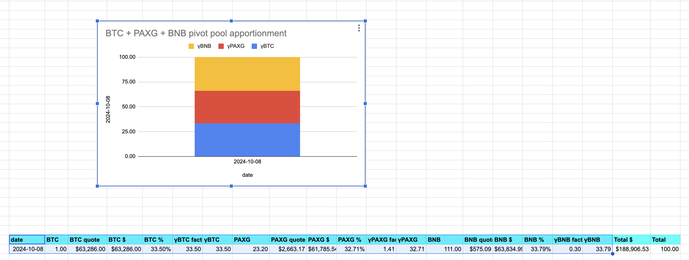

2024-10-09: ./dawn recommends a SELL (swap BTC -> ETH), but ./dusk, when implemented will reject this recommendation as ROI is below 10%.

Okay, you also see recommendations for the $PAXG pivot pool, but before we address those trades, let's walk through establishing a new pivot pool. I set the initial amounts off of $BTC-ratios and put them into my "database" (a CSV-file). 

You see I have 1 $BTC and an equal (dollar amount) of $PAXG and $BNB (as $BNB has good oscillatory characteristics against both $BTC and $PAXG).

BTC + PAXG + BNB pivot pool established with γ-apportionments calculated for each token in the pool.

Calculating the γ-factor is layered, so I'm writing an article about that. 
