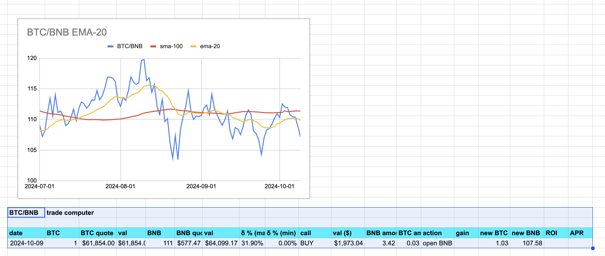
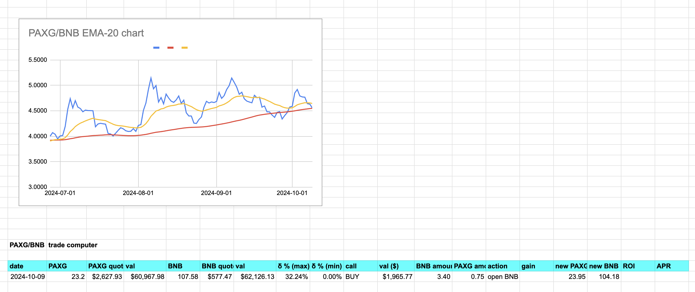
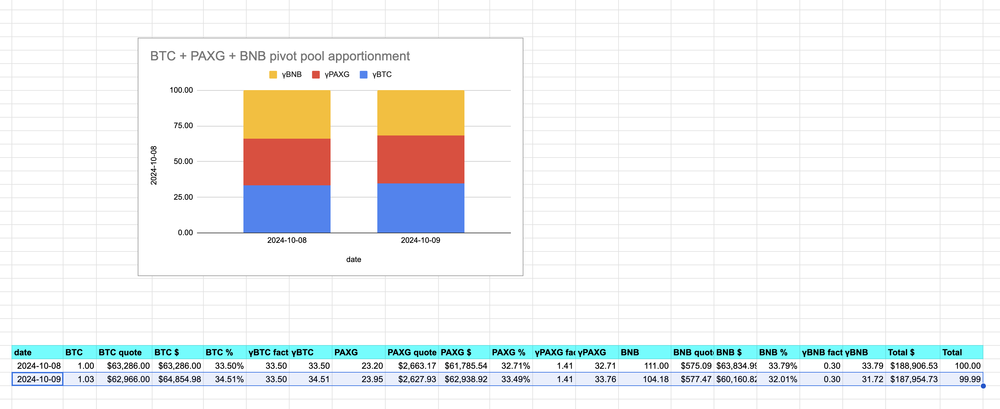

2024-10-09: ./dawn recommends a SELL (swap BTC -> ETH), but ./dusk, when implemented will reject this recommendation as ROI is below 10%.

Okay, you also see recommendations for the $PAXG pivot pool, but before we address those trades, let's walk through establishing a new pivot pool. I set the initial amounts off of $BTC-ratios and put them into my "database" (a CSV-file). 

You see I have 1 $BTC and an equal (dollar amount) of $PAXG and $BNB (as $BNB has good oscillatory characteristics against both $BTC and $PAXG).

BTC + PAXG + BNB pivot pool established with γ-apportionments calculated for each token in the pool.

Calculating the γ-factor is layered, so I'm writing an article about that. 

Back to ./dawn, specifically the $PAXG pivot pool. First trade recommended is to open a $BNB pivot (pivot against $BTC).

./dawn also recommends opening a $BNB pivot against $PAXG 

* hm, side note: a two-token pivot pool what your principal asset and what your pivot asset are obvious with the statement "open BNB" but in a three-asset pivot pool, the pivot asset has to be specified "open BNB pivot on PAXG"

Handling 3-token pivot pools manually, I'd just look up the previous trades manually to determine the pivot asset, but that now needs to be explicated on the open pivot trade and handled programmatically on the close pivot trade.

I make both open BNB pivot trades, which affects amounts of BTC, PAXG, and BNB in the PAXG pivot pool. The γ-factors are frozen when calculated (i.e.: they are frozen on the establishment of the pool). The new token-amounts, factored by their γs, give us the new PAXG pool apportionment.

The. End. ... for today.
