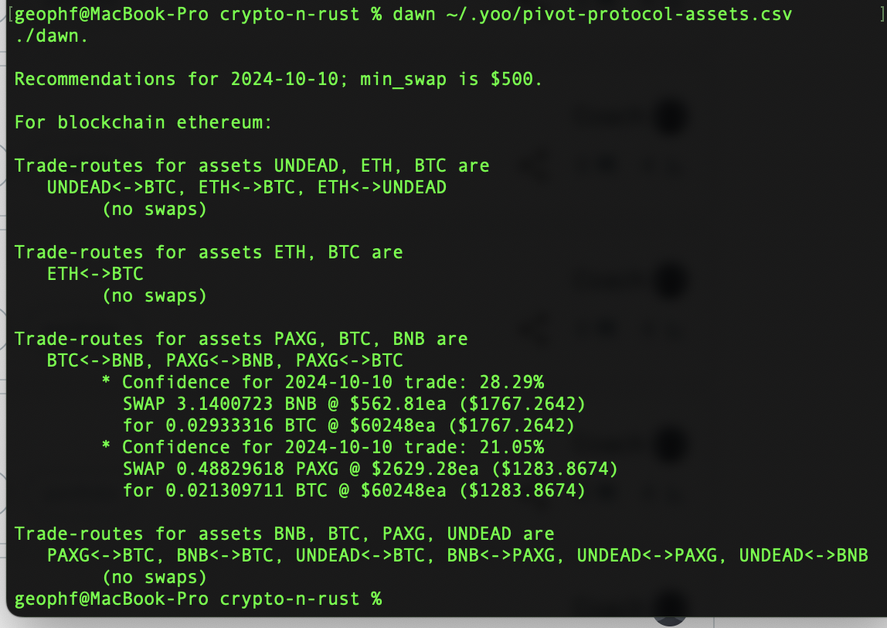
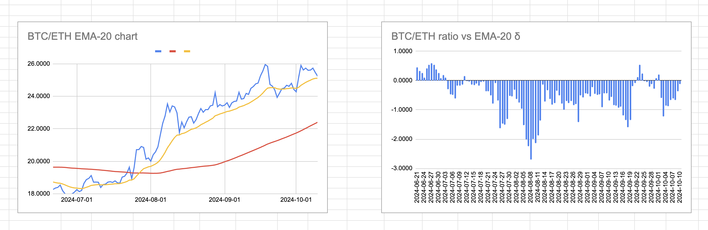
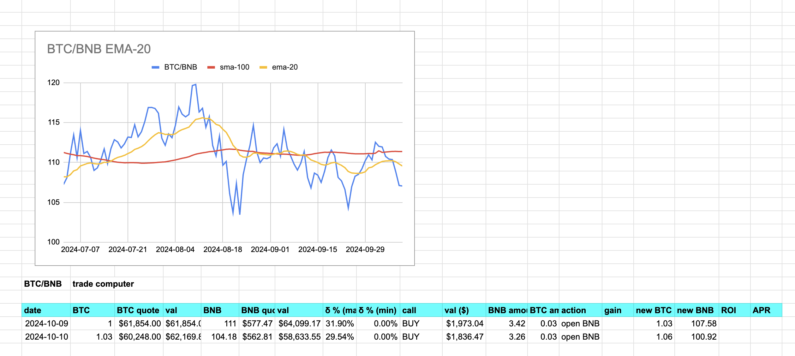
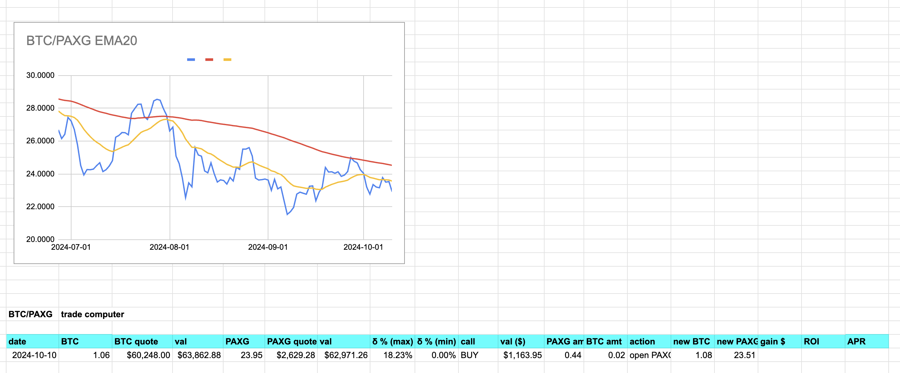

2024-10-10: ./dawn recommends no BTC/ETH swap. The charts bear this out. 

For PAXG pivot pool, first, ./dawn recommends BNB -> BTC swap, so I open a second BNB pivot on BTC position.

second, ./dawn recommends PAXG -> BTC swap, so I open the first open PAXG pivot on BTC position.

The $PAXG pivot pool at the conclusion of these trades. 

You see we're still really balanced betwen the three assets, but we've only just started.
