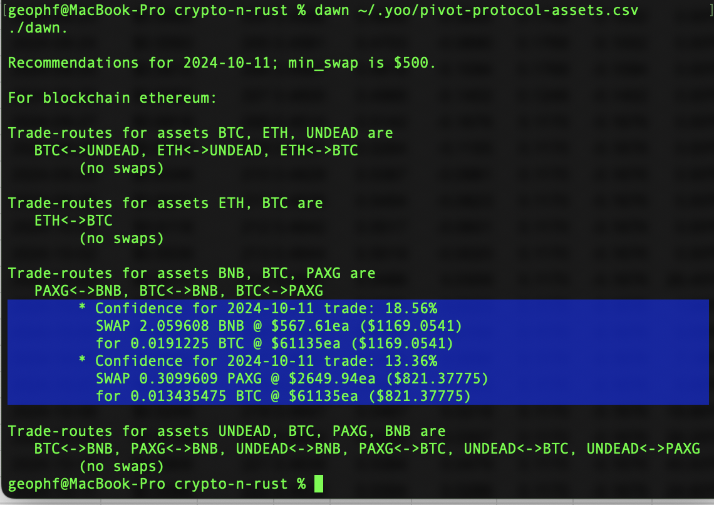
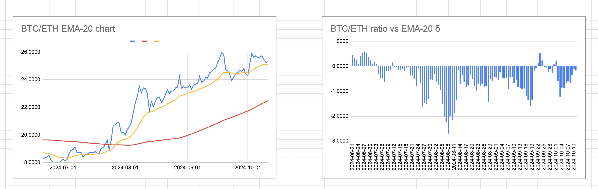
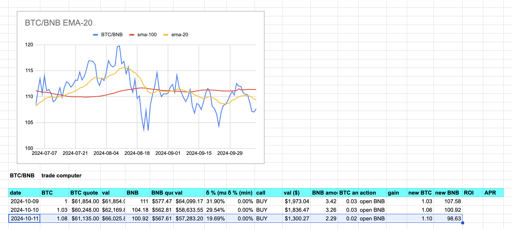
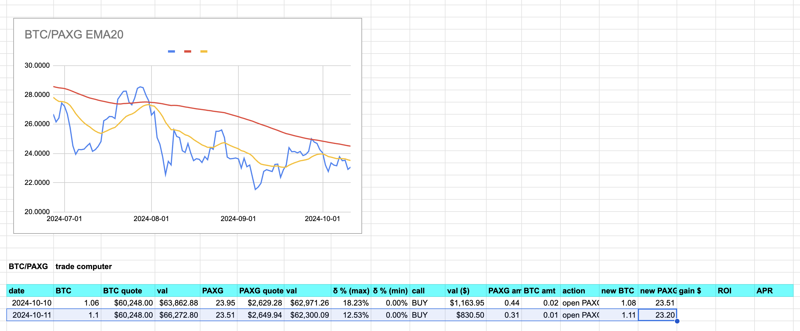
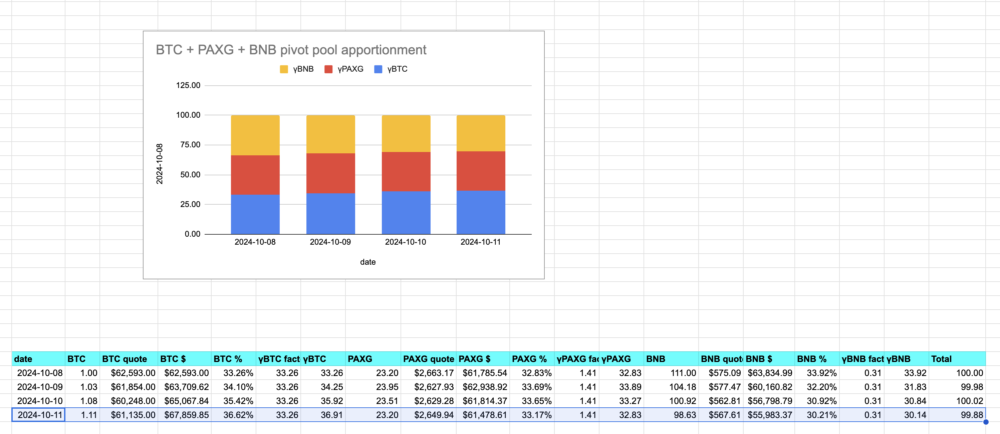

# BTC/ETH pivot pool

2024-10-11 ./dawn has no BTC/ETH swap recommendation. 

The BTC/ETH chart confirm this.

# PAXG pivot pool

Now, let's look at the PAXG pivot pool. The first recommendation is to open another BNB on BTC pivot, so I do that.

Second, ./dawn recommends swapping PAXG for BTC to open a PAXG on BTC pivot. I do that.

This brings the PAXG pivot pool to this. Closing pivots, when that occurs, will start to change the balance of this pool. 

