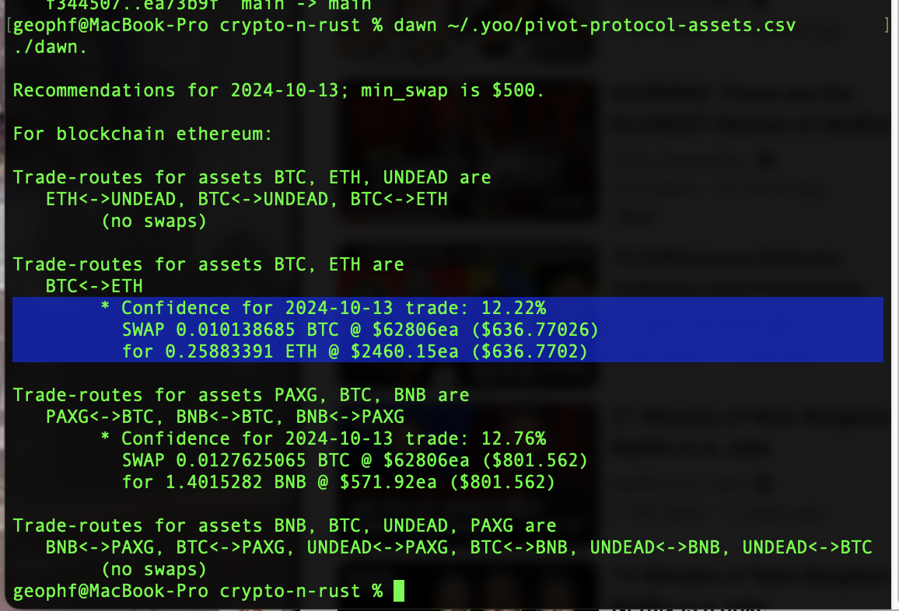
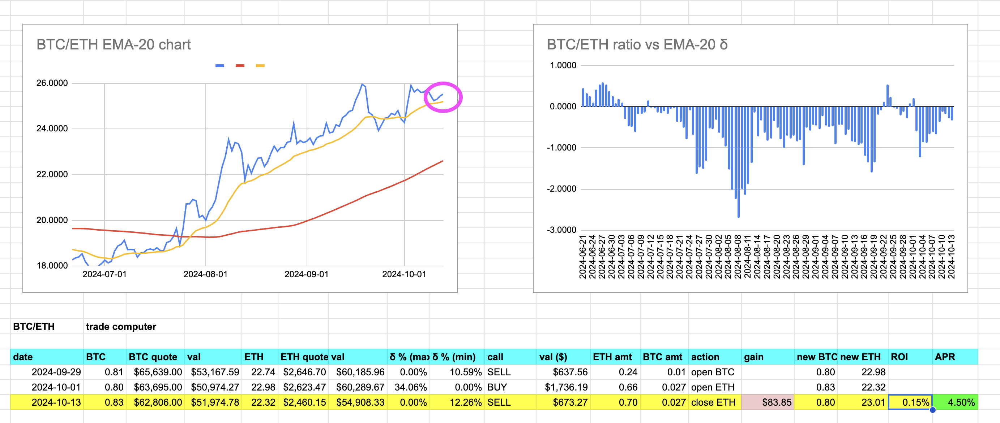
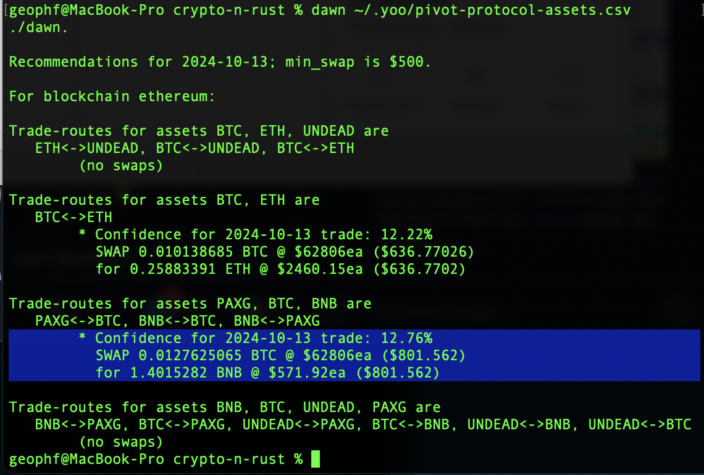
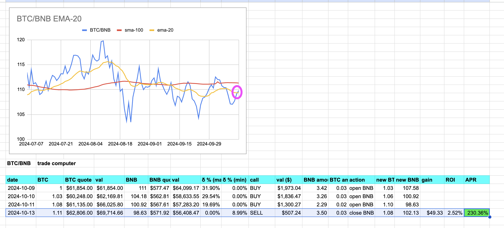

# BTC/ETH

2024-10-13: first for BTC/ETH, ./dawn recommends a BTC -> ETH swap, 

...but the ROI and δ is TINY! So: ./dusk would say no-go.

# PAXG

Second, ./dawn recommends a swap back from BTC to BNB. This is an interesting case, as the APR is 230%, and that's nothing to sneeze at, but the ROI, at 2%, is way below 10%, so ./dusk would VETO a 230% APR gain (of $50, or 0.1 $BNB gained).

Why? "When not to pivot": looking at the chart, the δ is so tiny, even at around 10%, that the EMA-20-line is nearly indistinguishable from the BTC/BNB ratio, itself. We COULD make $50 of $BNB today, but that entails an opportunity cost. Experience bears out that waiting for a larger δ (another day) is much more profitable than cashing in a a slight gain today.

