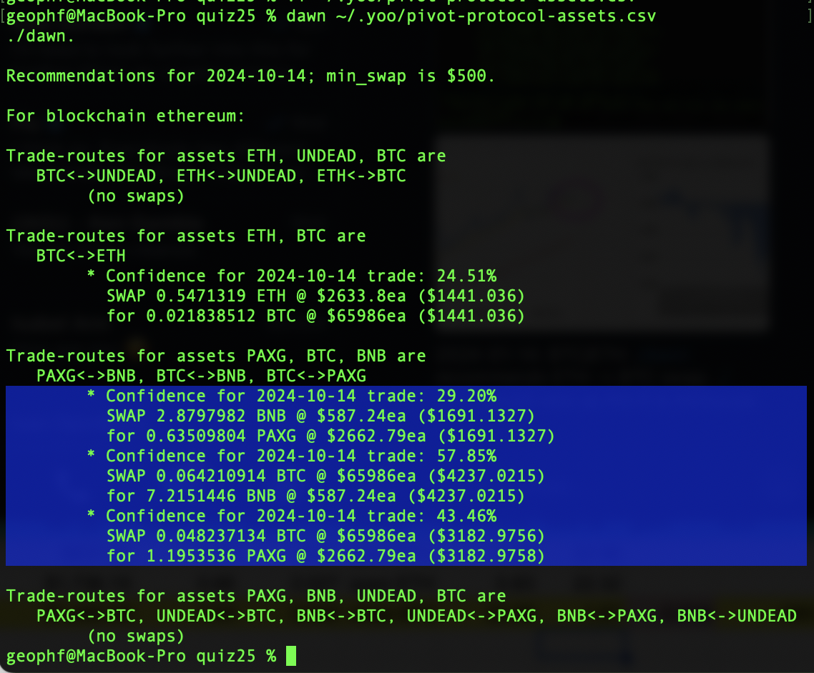

# BTC/ETH pivot pool

2024-01-14: BTC/ETH ./dawn recommends ETH -> BTC swap. ./dusk would veto as the δ is miniscule.

# PAXG pivot pool

For the PAXG pivot pool, ./dawn has 3 recommended swaps. 

Let's look at each in turn.

For the PAXG pivot pool, ./dawn's first recommendation is a BNB -> PAXG swap. 

This would be the first BNB on PAXG pivot, so: yes. We open that pivot. 

The second call BTC -> BNB is instructive, as it could close an open BNB on BTC pivot.

Now, any BNB on BTC pivot closed would give an ROI below 10% (even though the APRs are hot!), so we're not going to close the pivot, but WHICH pivot would you close, and why, given the metrics shown?

Answer: the 2024-10-10 open pivot would be the one that would be closed. 

Even though it returns less $BNB than the 2024-10-09 open pivot, the ROI for the 2024-10-10 is higher (less $BNB was originally swapped, yielding more $BNB returned)

So, we're not going to close a pivot, ... should we open one? Yes. Why? The is the first open BTC on BNB pivot, so we're laying the groundwork for our PAXG pivot pool.

Opening pivots create volume which strengthen liquidity. Open pivots set up eventual close pivots. Closing pivots create volume and lock in gains.

Thirdly, for the final ./dawn recommendation on the PAXG pivot pool, there's BTC -> PAXG. This could close one of the two open PAXG on BTC pivots. So: same routine. As there's no ROI above 10% we don't close one of the open pivots.

Again. We don't close a pivot. Do we open one? Yes. Why? This is the first open BTC on PAXG pivot.

After the above trades are executed, this is our PAXG pivot pool. It's still well-balanced (which means nothing) but the trades, albeit not close-pivot trades, are having a positive impact on the pool.

The trades having a positive impact on the pool is not relevant, however, as they are not close-pivot trades. Close-pivot trades monotonically increase pool value. So, when we have close-pivot trades, then we'll see positive change to the pool.
