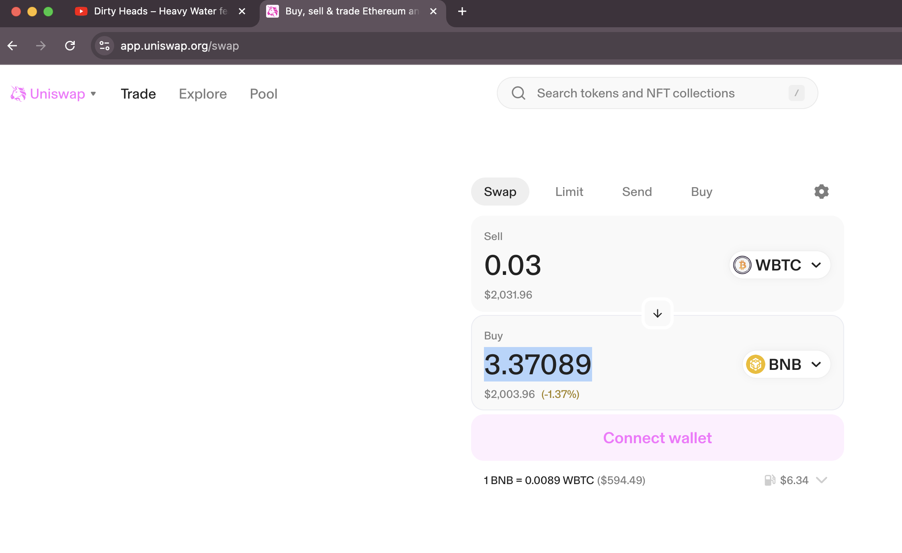
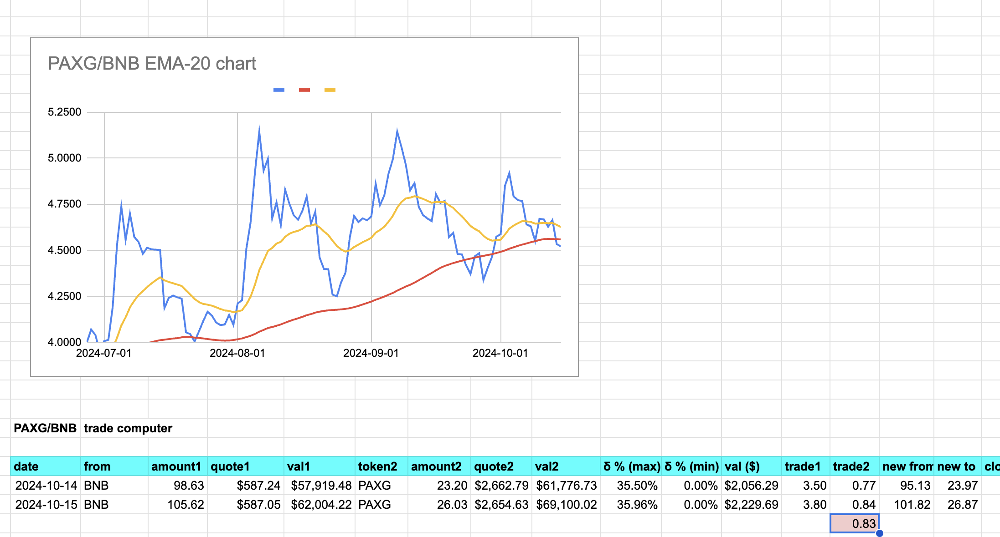
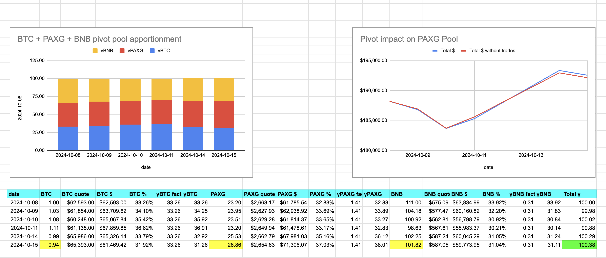

2024-10-15 (yesterday) ./dawn recommendations. This is a day late here. I've been upgrading infrastructure, particularly pool-names (as there may be multiples of the same in a blockchain) and reportage. Both these upgrades clarify and simplify interfaces between services.

# BTC+ETH pivot pool

./dawn recommends no swap. The charts confirm this.

# PAXG pivot pool

For the PAXG pivot pool, ./dawn has 3 swap-recommendations. 

Let's take a look at each in turn.

## BTC -> PAXG

<strike>First, ./dawn recommends swapping BTC for PAXG. ./dusk examines the open positions (in pink), determines no closes, then determines if we should open a new position (in green). Answer: yes. ./dusk then updates the PAXG pool data-store.</strike>

So, I deleted the previous PAXG pivot on BTC message (just now), where I decided against a pivot because the ROIs weren't there. HOWEVER, going directly to uniswap I see two, very important, things.

1. The first thing, the small 0.01 BTC swap gives WAY LESS PAXG than calculated. 

2. The second thing, the 2x 0.02 BTC swap give MORE PAXG than calculated.

We'll need a 'simulated swap' function for a go-no-go execution on a call.

(this really pisses me off that uniswap gives such a wide divergence on BTC -> PAXG swaps, depending on the amount of BTC swapped) 

(why are their AMMs not better for protecting against these divergent spreads?)

Back on point, because the larger swap give MORE PAXG, the ROI goes above 10%, so we swap. ./dusk then updates the data-store and reports the pool's apportionments.

## BTC -> BNB

The second swap ./dawn recommends is BTC -> BNB on the PAXG pivot pool. 

./dusk computes below 10% ROI (pink), so we don't close a pivot, but we do open a new BTC on BNB pivot (green row; n.b.: slippage on uniswap). 

./dusk then updates the data-store for the PAXG pivot pool.

## BNB -> PAXG

The third swap is BNB -> PAXG. This is an open pivot, so I do that. Note that there is slippage on uniswap, but the slippage is small this time. 

# Distribution of Pivot Gains

Not quite done. As we have closed a pivot, we now distribute the pivot-gains to, well: everywhere. And who shall handle the distributions? The Distributor, of course!

## Pivot pool distributions

How do distributions work?

1. ./dusk computes the pivot-gain for reportage AND sends the gain to the Distributor as a pivot-gain transaction
2. The distributor distributes to the investors, the echo pool, the treasury and the pivot pool. Distribution amounts are retrieved from configuration.

Now WHY do I send gains to the Distributor from the pivot-pool, only to send a percentage BACK to the pivot-pool?

Auditing.

This captures pivot gains of the pool on the blockchain as a transaction.

## Treasury distribution

Distributions aren't done for today. Why? The treasury received a distribution. A percentage of the gains sent to treasury are sent to the investor, so:

1. treasury sends a percentage of the gains to Distributor as a treasury-gain transaction
2. Distributor distributes these gains to investors (100% as per the whitepaper). https://github.com/pivoteur/biz/blob/main/README.md#investing-into-the-treasury 

It's important to note here that there are multiple pivot-pools at the get-go (and the echo pools, too!), so the treasury does ONE distribution per day AFTER all the pivot and echo pools distribute their gains (if any).

So, for ONE pivot-gain in the pivot-pool, you see there are SEVEN transactions that the Distributor manages.

FROM these transactions, a simple blockchain query shows WHICH tokens ($PAXG in this case) and HOW MUCH is distributed to INVESTORS!

This is important: investor gains. 

So, we're done with distribution, but you see a distribution to the echo pool, this brings up 1) the echo pool funding and 2) a Swapper that gradually converts reserve liquidity to pool assets.

But that's a conversation for another day.

# Reports

We finish out today by running the reports on all pivot-pools, echo-pools, the treasury, and the protocol 24h-volumes and update the protocol page.

Today's entry: 720 words, 17 images/reports.
