2024-10-16. Yesterday. AGAIN! ... MAYBE I'll even get to today's report, if'n I apply myself and work hard! 😅️️️️️️

# BTC+ETH pivot pool

BTC+ETH ./dawn recommend BTC -> ETH. 

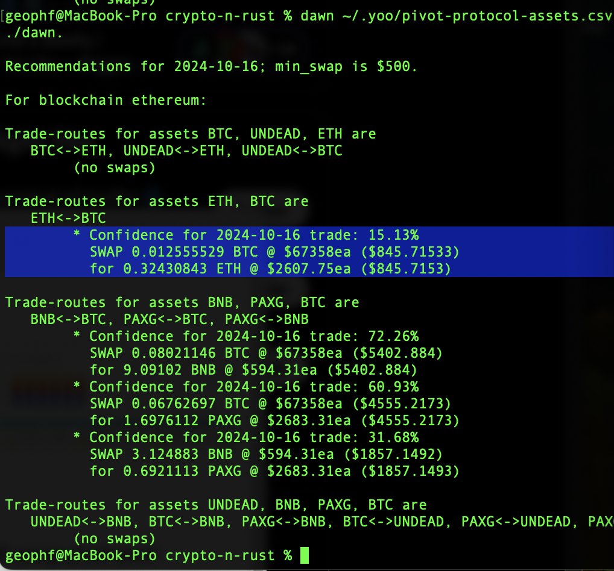

From the red you see closing a pivot is eh at less than 10% ROI. ./dusk would then veto a close pivot-move. So we open a new BTC on ETH pivot. 

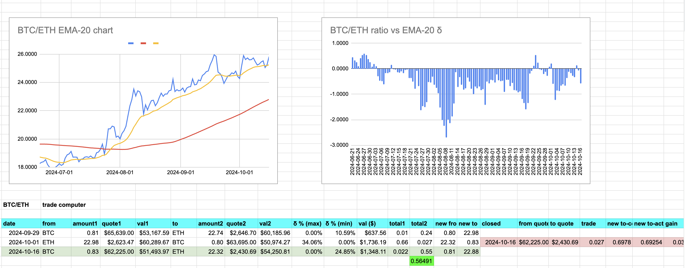

You see that we even have a slightly better trade on the BTC -> ETH swap on @Uniswap (green).

# PAXG pivot pool

./dawn had three recommended swaps for the PAXG pool. Let's look at each in turn.

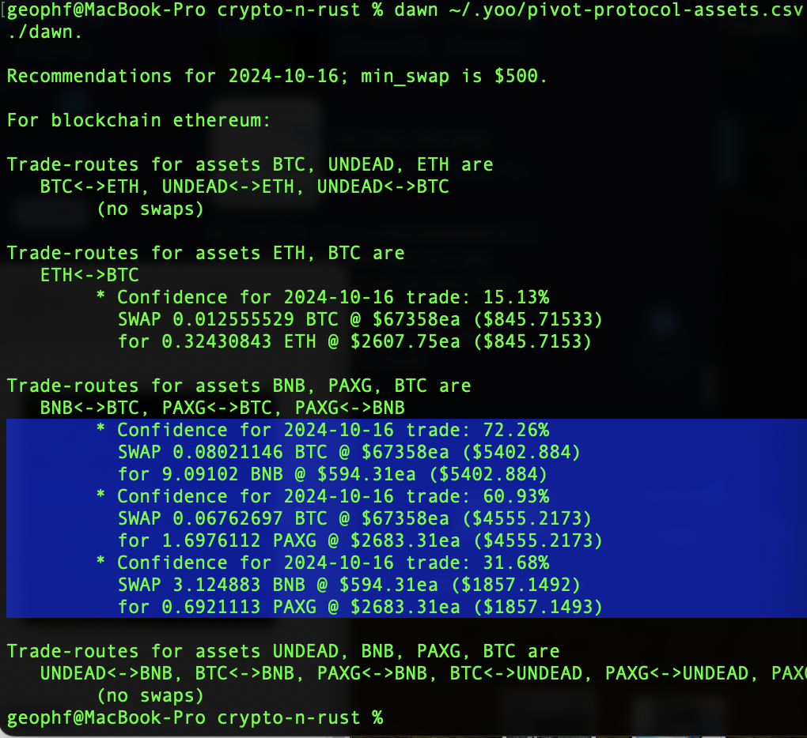

The PAXG pool is happening! Maybe we should co-launch with this pool? A thought.

## BTC -> BNB

First swap, ./dawn recommends BTC -> BNB. The red shows no good close-pivot, so we open a new BTC on BNB pivot. 

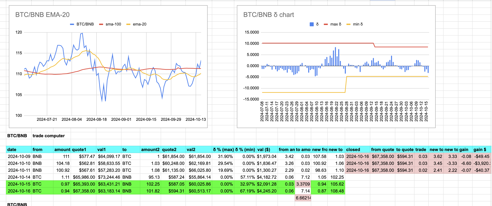

You see slippage on uniswap is 0.5 $BNB. ick.

## BTC -> PAXG

Second, ./dawn recommends BTC -> PAXG. This is interesting. For a close pivot (the open pivot was small at $800 traded), the actual swap is 0.1 $PAXG off, or ~ 30% slippage??? so closing the pivot is bad, but then when I open the pivot with 0.06 $BTC, it gives me MORE $PAXG for the swap on uniswap, so ... thank you?

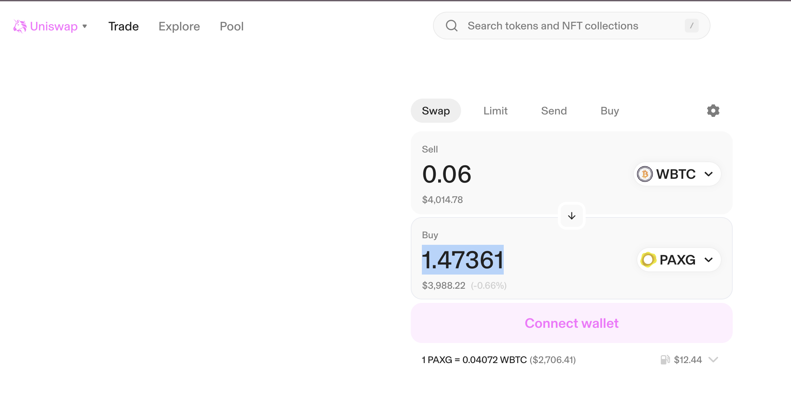
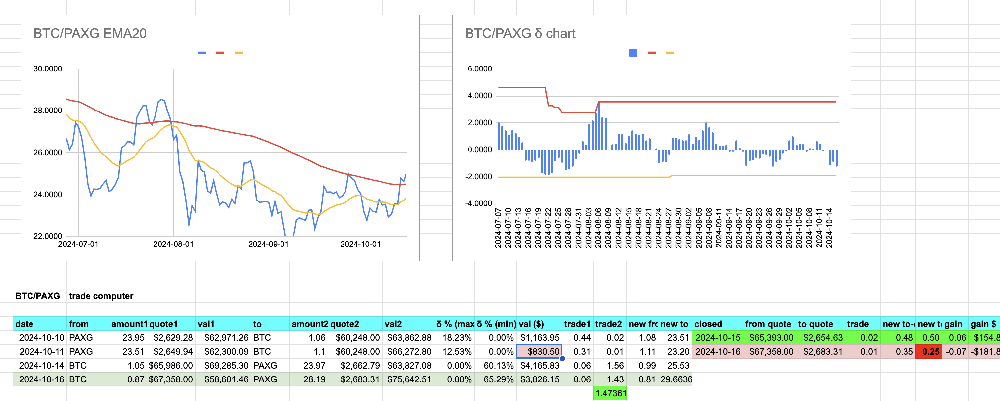

No pivots were closed on 2024-10-16, so that just leaves the reports, ...

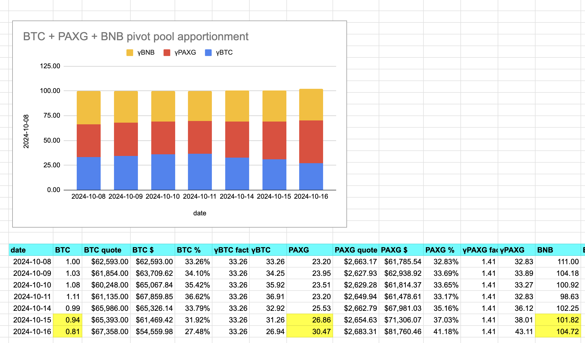
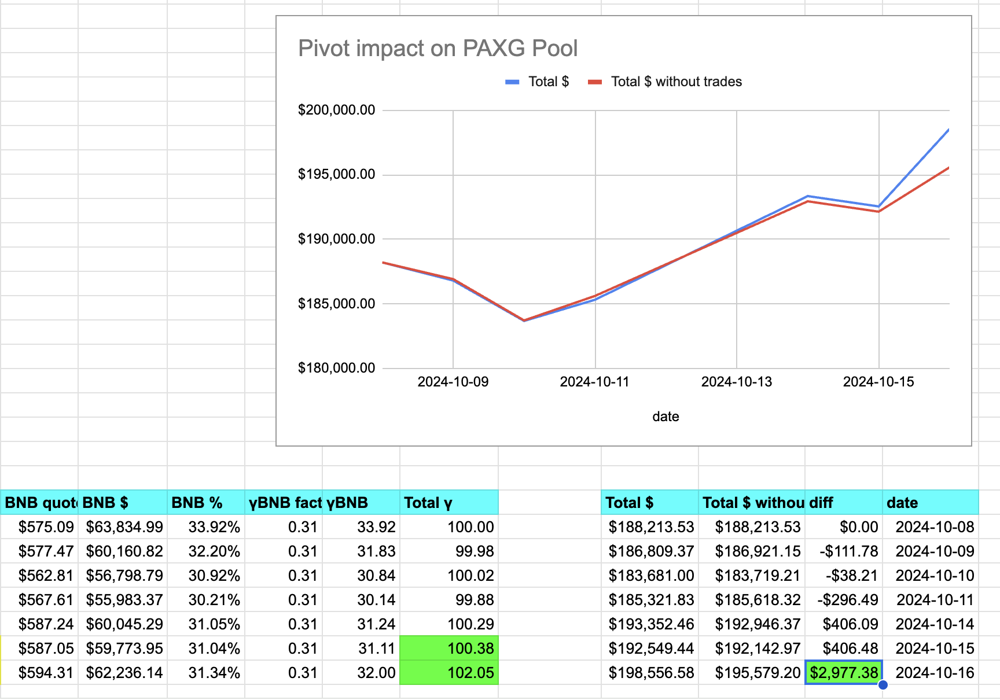

and HOLY PROFIT! BATMAN! if we had been trading for realz, yo we would be UP A NET $3,000! That's an ROI: 1.5% and a 70% APR that we gained from pivots on the PAXG pool, folks! 😱

The BTC+ETH pool's results aren't as rosey, with a net -$1,300 so far. But that is easily explanable with the SIX open BTC pivots.

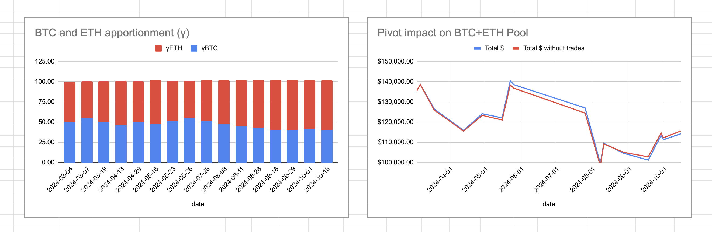
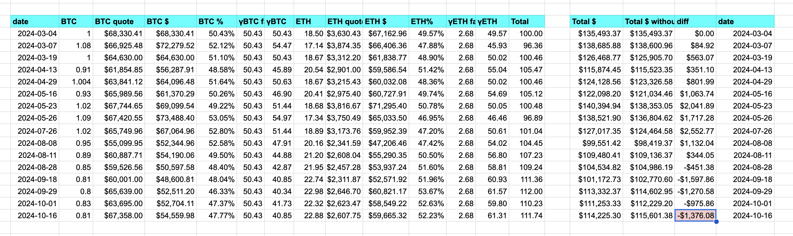
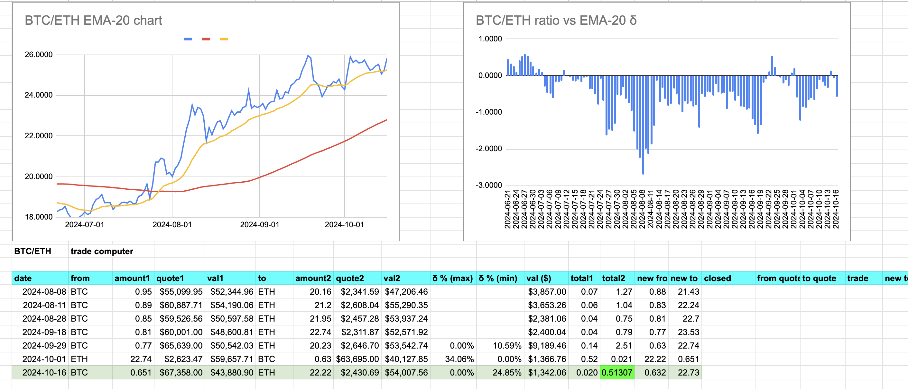

The last ninety days has seen a very favorable $BTC run vis-à-vis $ETH. When the curve flips, this pool will close pivots and become profitable again.

Overall, with both the BTC+ETH and the PAXG pivot pools, we are net up $1,700, and that's a very nice net up to be.
