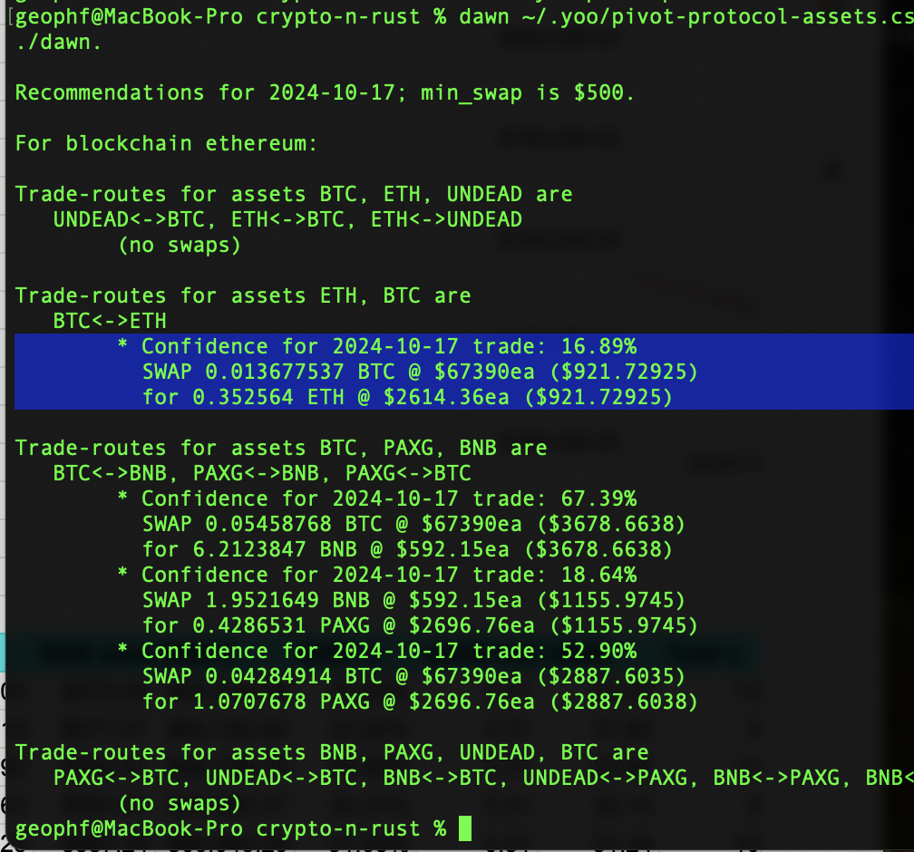
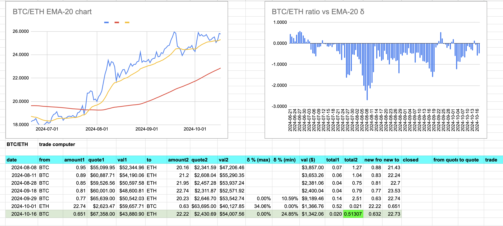
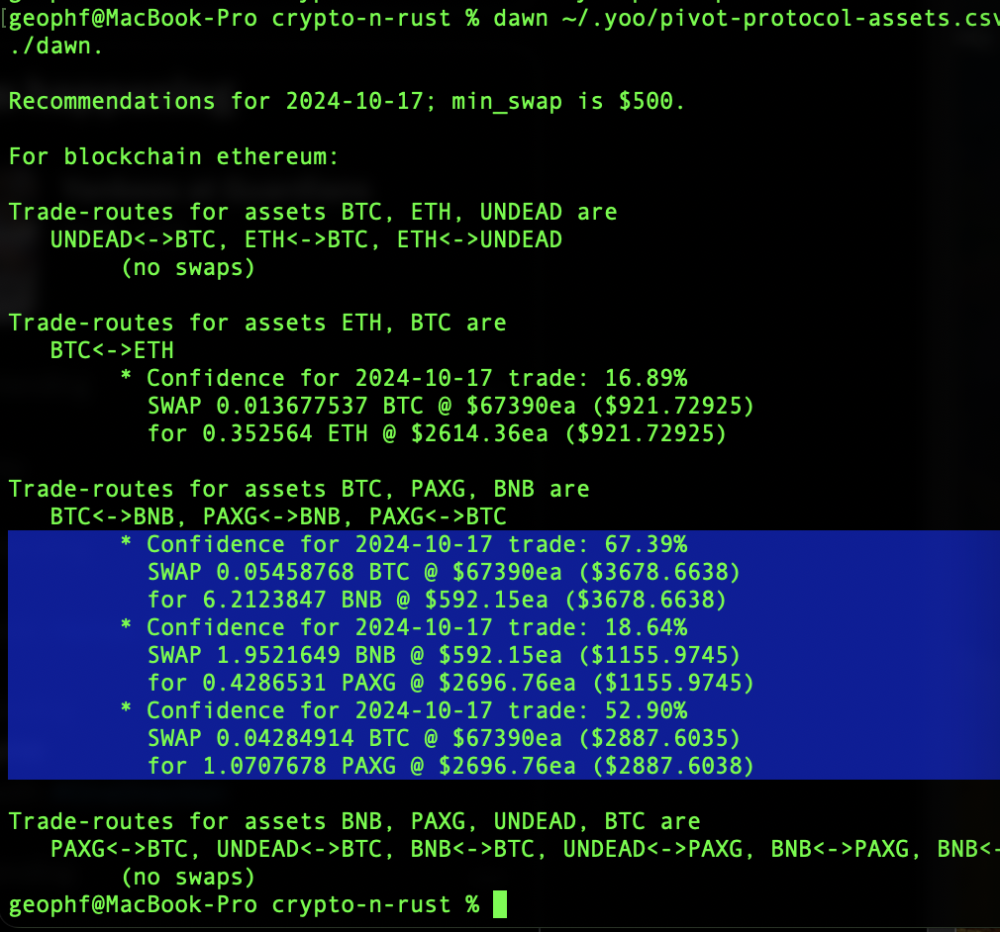
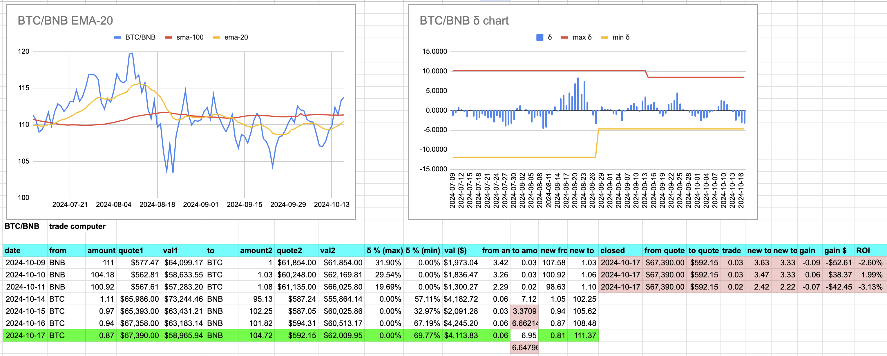
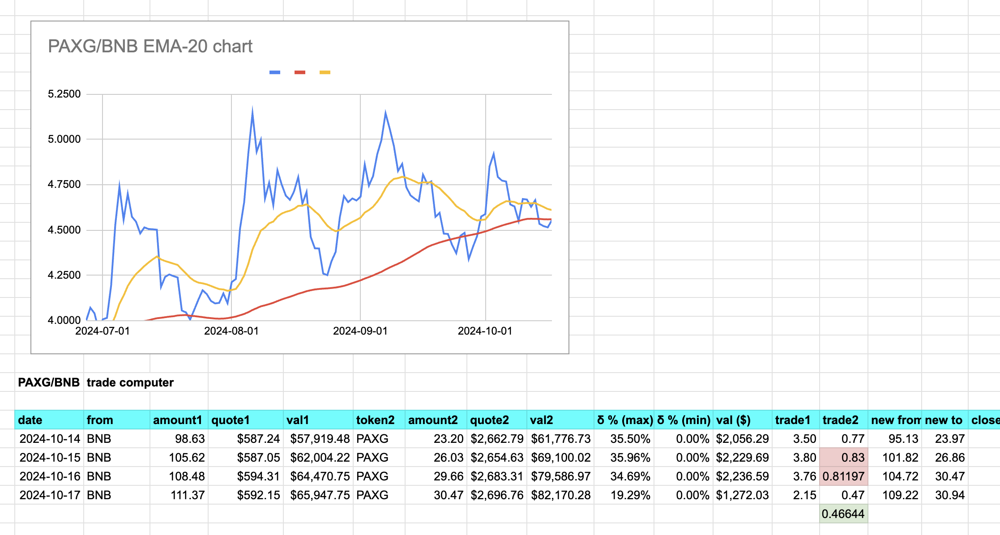
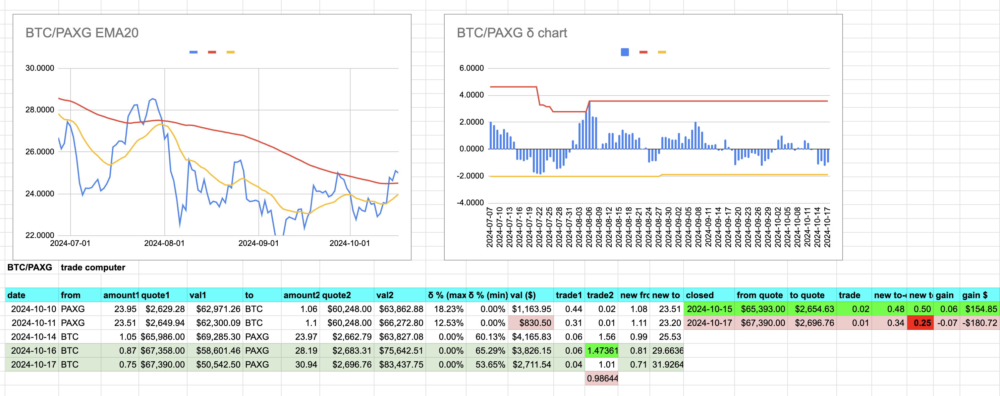
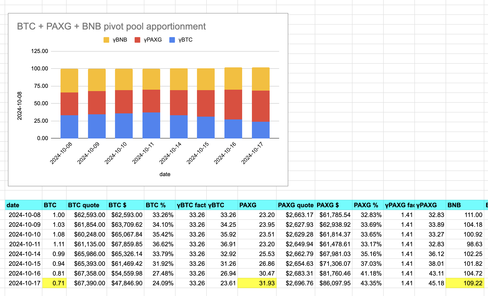

./dawn recommendations for 2024-10-17, ... which is today. 🎉

# BTC+ETH pivot pool

For BTC+ETH, ./dawn recommends a BTC -> ETH swap. 

We have 6 open BTC pivots already, so we chill (translation: ./dusk vetoes: seeing the 6 open pivots with at least one pivot with similar characteristics to one that would be opened today).

# PAXG pivot pool

For the PAXG pivot pool, ./dawn again recommends the merry-go-round of trades. 

Let's examine each in turn.

## BTC -> BNB

First, ./dawn recommends BTC -> BNB. 

None of the close pivots (red) are above 10% ROI so we open a 4th BTC on BNB pivot (green).

## BNB -> PAXG

Second, ./dawn recommends BNB -> PAXG, so we open a new BNB on PAXG pivot. The uniswap is equivalent to my calculated swap this time. Nice!

## BTC -> PAXG

Third, ./dawn recommends BTC -> PAXG. Again, the close is net negative with the uniswap slippage (red; so: trades now need to be above $1k for fair uniswap-trades), so we open a BTC on PAXG pivot (green).

## `./dawn min_swap` now $1,000.00

Done. ✅ I've modified ./dawn's min_swap to default to $1000.00, no longer recommending trades less than that amount.

As there are no close-pivots, we simply run the reports. PAXG pivot pool still doing swimmingly. BTC+ETH pivot pool unchanged. 

