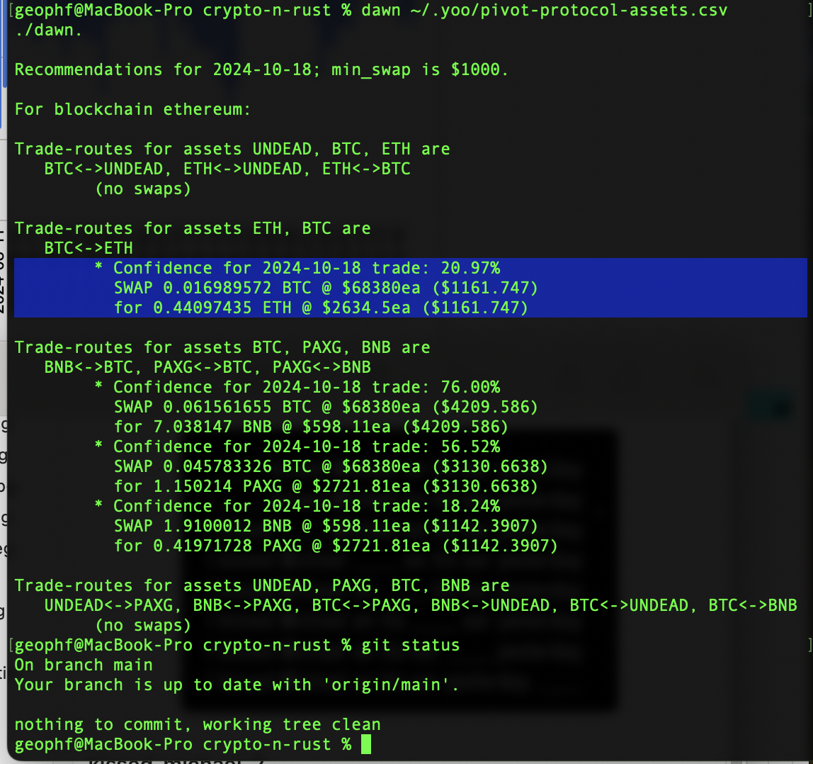
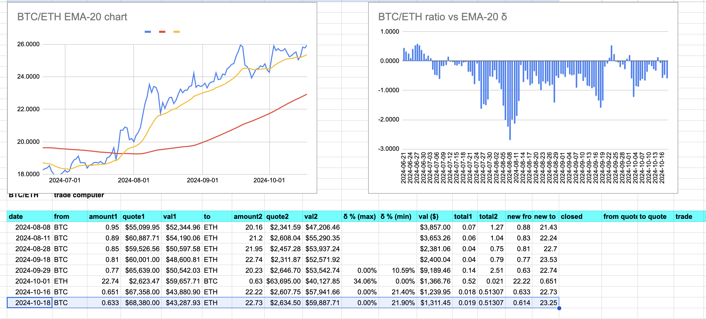
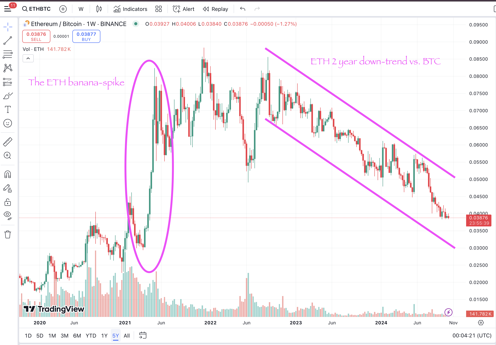
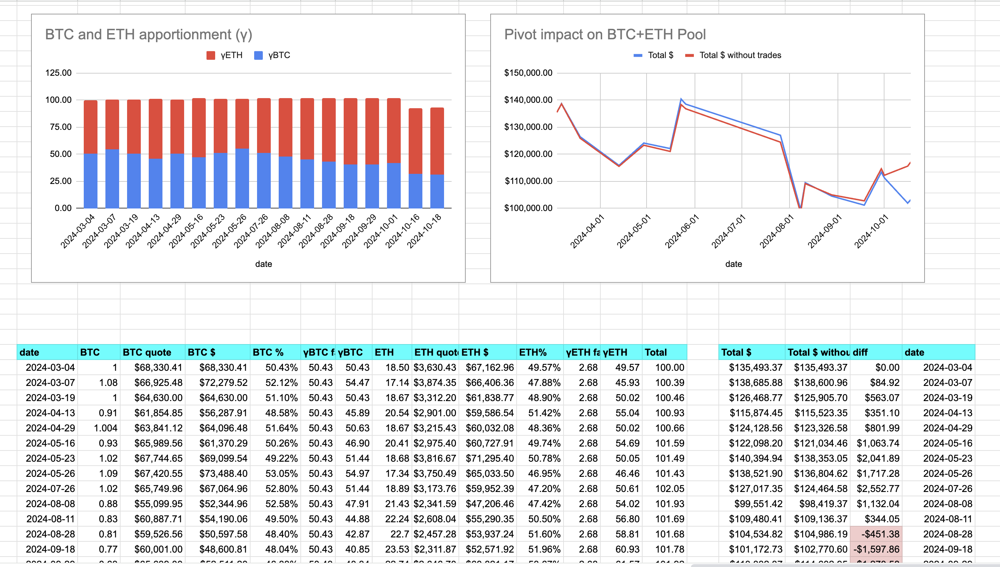
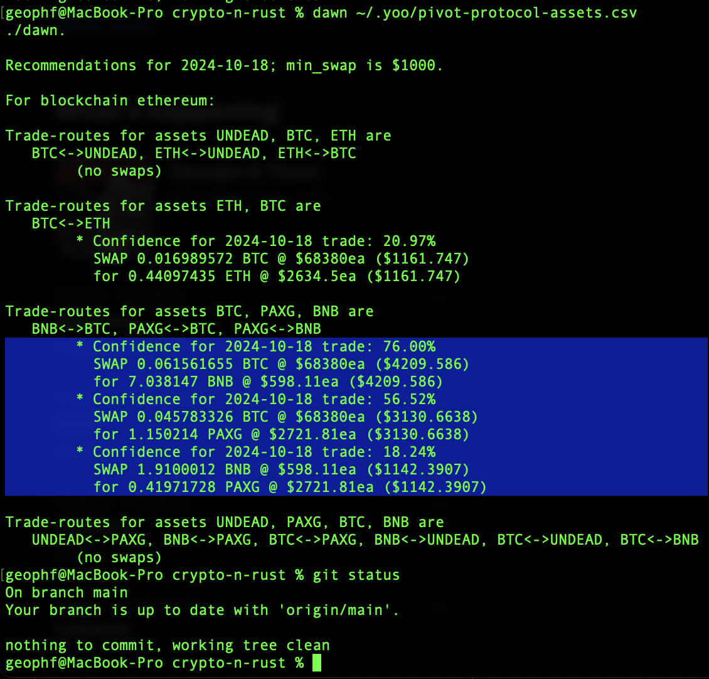
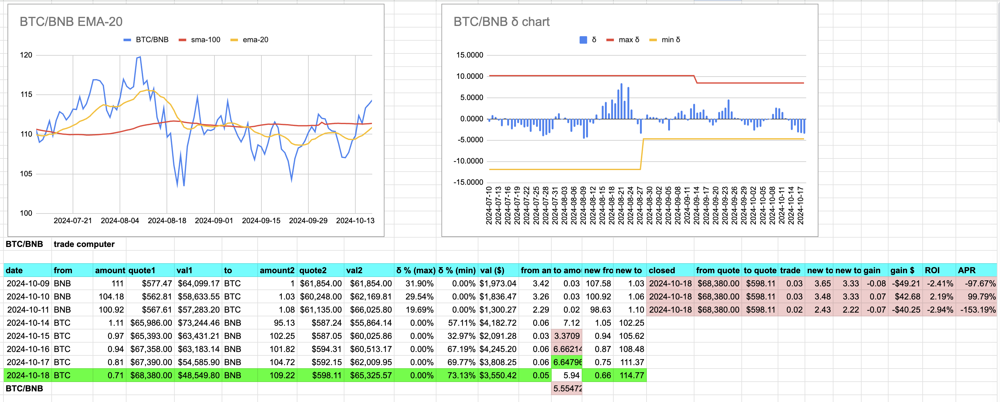
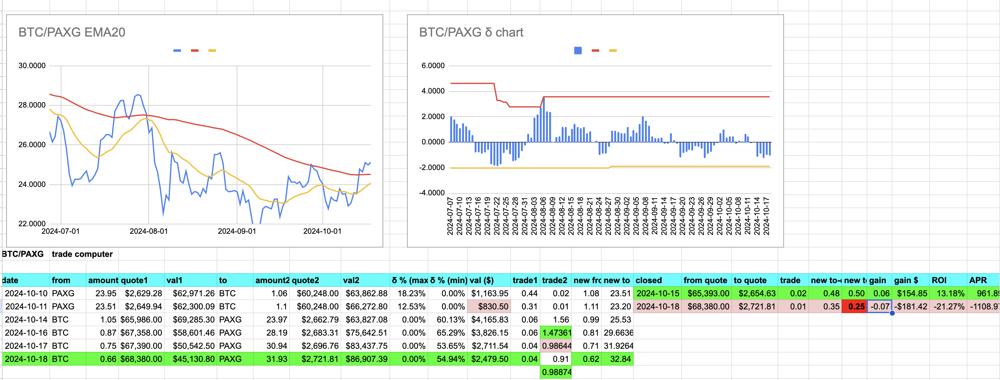
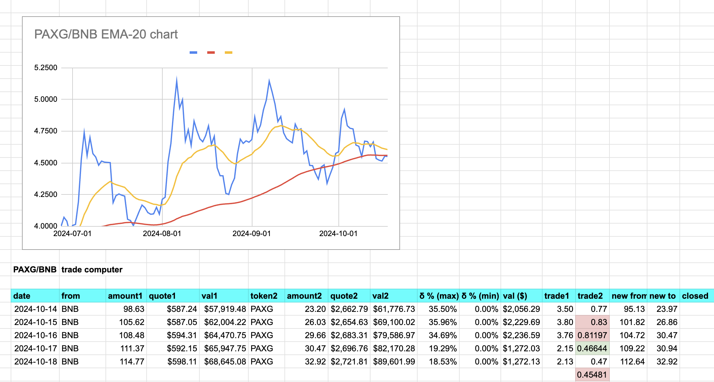
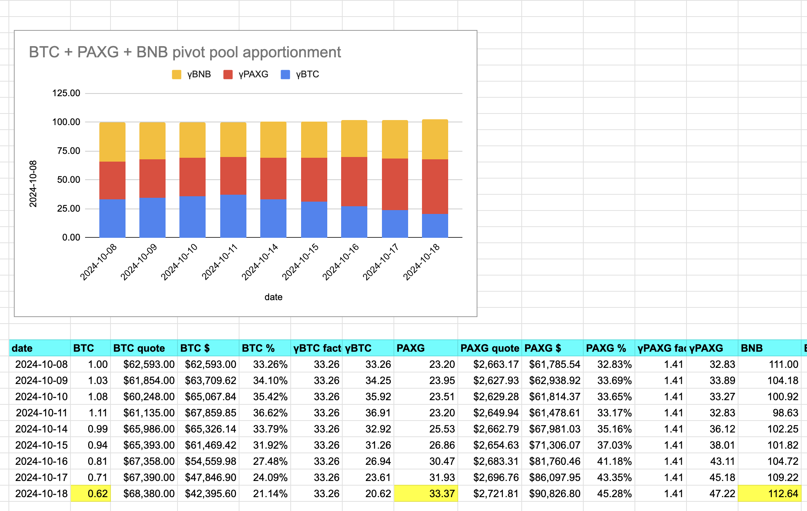
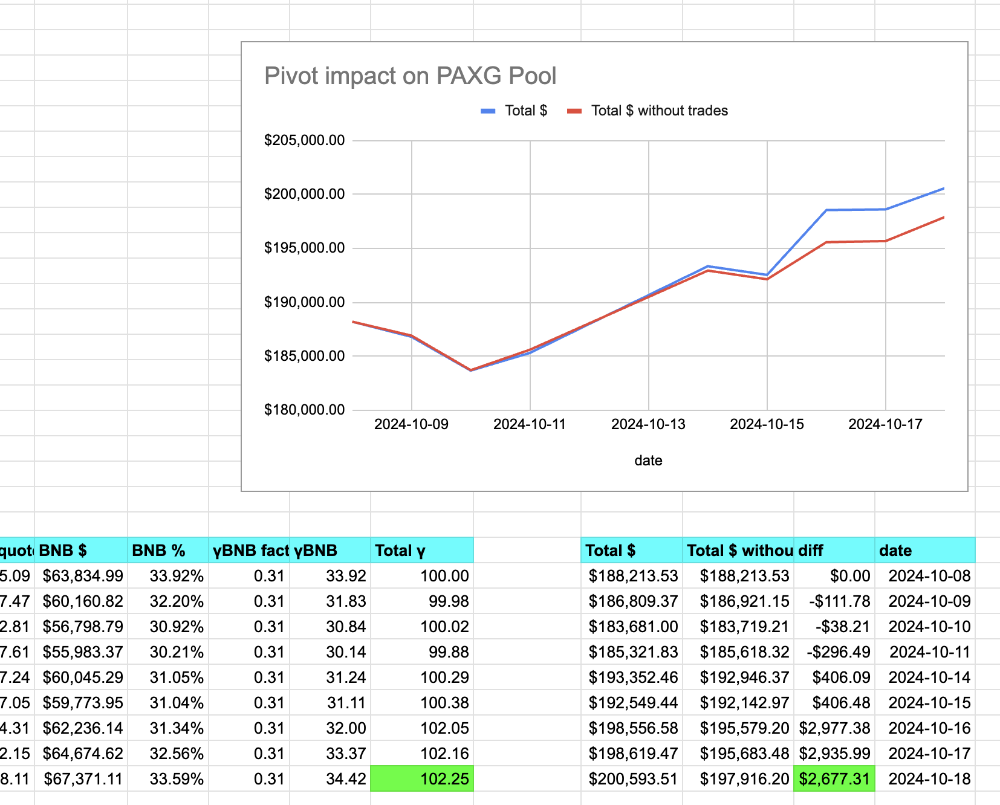

# BTC/ETH pivot pool

2024-10-18 (yesterday) first up, BTC/ETH. ./dawn recommends we sell BTC for ETH. The charts confirm this.

Do I sell BTC for ETH? Yes. Even though there's already an open pivot with nearly the same δ? Yes. Even though selling BTC (going up) for ETH (going down relative to BTC) devalues the BTC+ETH pivot pool? YES! YES! YES!

Why?

For two tokens of value, this is EXACTLY the bargain-sale the pivot-arbiteur looks for. ETH/BTC has been trending down for more than a year. But will that always be the case? If the answer is 'yes,' then ETH has no future. Does ETH have no future? No. It's a token of value, so, eventually, it'll turn around, as it did in that huge banana-spike (circled)

With open pivots (and: a lot of them), the portfolio value being down isn't a problem. 

It's scary while it's happening, but this is all par for the course. When the pivots close, what happens is that the tokens in the pool monotonically grow.

This is why we have the protocol. It does its thing, emotionallessly, and we do our thing, which is 1) don't panic and 2) monitor, measure, and evaluate.

# PAXG pivot pool

For the PAXG pivot-pool, ./dawn has the round-robin of recommendations. 

Let's take each in turn. 

## BTC -> BNB

First, ./dawn recommends BTC -> BNB. No close pivots are above 10% ROI (pink), so we open a new BTC on BNB pivot (green).

## BTC -> PAXG

Second, ./dawn recommends BTC -> PAXG. As I mention above, slippage is bad for a close pivot (red ... so I think we just have to abandon that pivot as a lesson learned), but an open pivot actually is advantage us in the swap to PAXG. 

## BNB -> PAXG

Third, ./dawn recommends buy PAXG with BNB (which is: BNB -> PAXG), so we open a BNB on PAXG pivot with slight slippage on uniswap.

# Report

No close pivots yesterday, so we run the reports. PAXG pivot pool is up, dollar-wise, over the reference no-trade and is up γ-wise (token-apportionment). 

In short: pivot arbitrage works (even with some slippage on uniswap).
