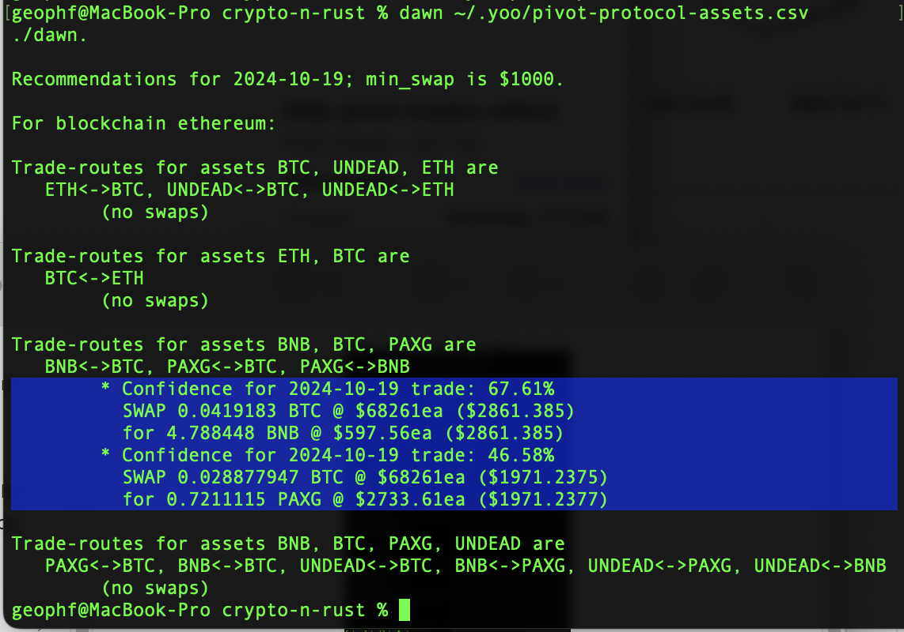
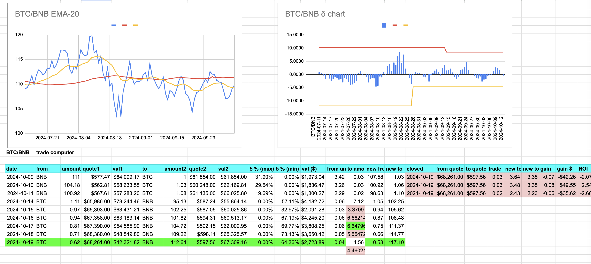
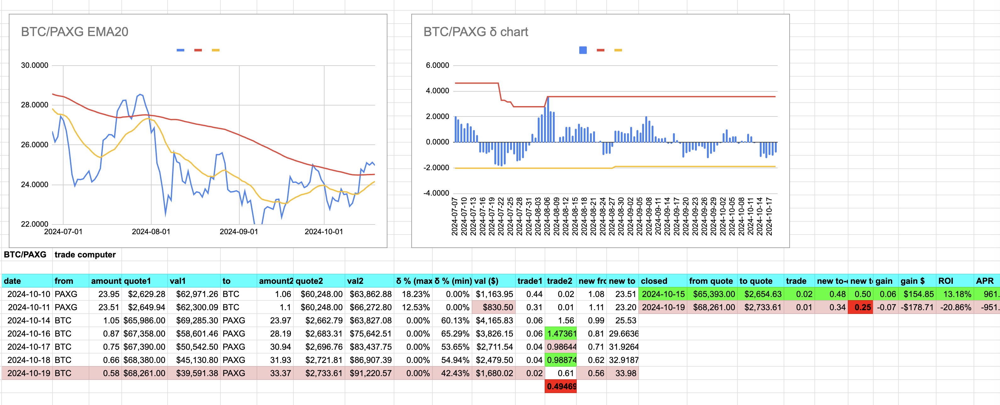

# PAXG pivot pool

2024-10-19 (now yesterday). ./dawn, today, doesn't have a BTC/ETH swap recommendation, but has 2 PAXG recommendations. 

Let's look at each in turn.

## BTC -> BNB

First, BTC -> BNB, we're closing the gap here, but ./dawn recommends this trade with 64% δ confidence, so I place this trade with slight slippage on uniswap.

## BTC -> PAXG

However, the next ./dawn call: BTC -> PAXG, we do not do. It's not because the call is faulty: the swap is. On uniswap we'd slip 20%, which makes this swap a 'no' for me.

