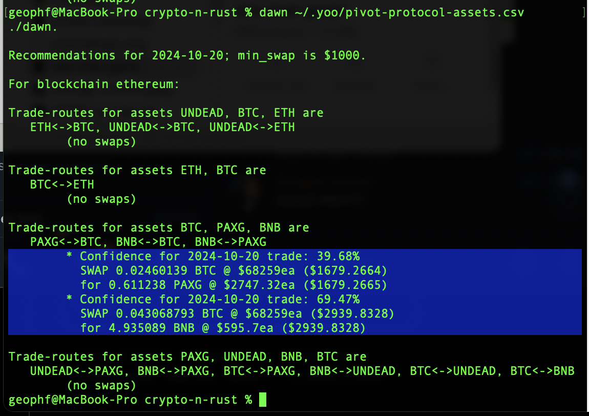
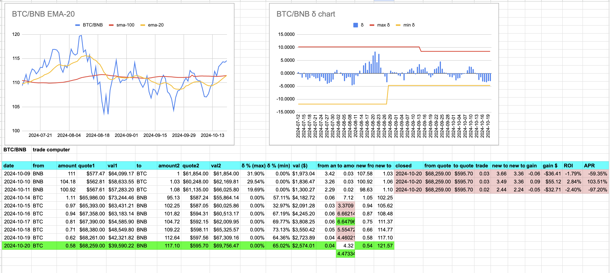
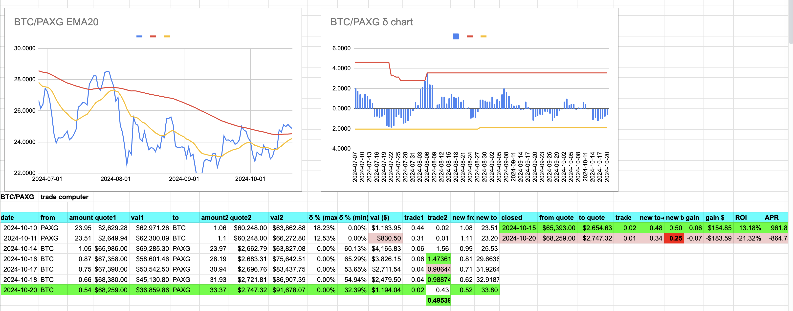
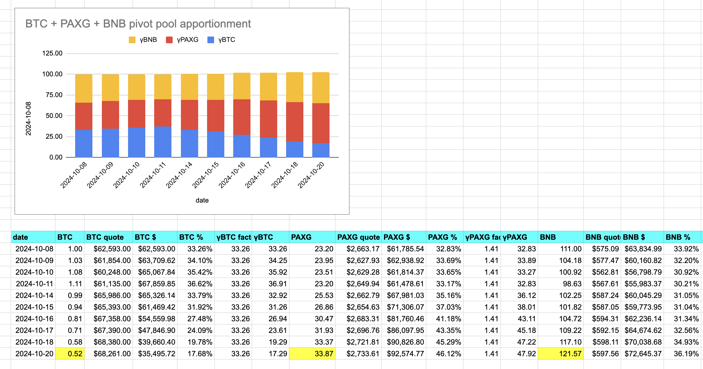

# PAXG pivot pool

2024-10-20: ./dawn recommends two trades on the PAXG pivot pool.

First, ./dawn recommends BTC -> BNB. No close pivot is above 10% ROI (pink) so we open a new BTC on BNB pivot (green).  

Slippage actually favors us on the uniswap trade, so that's 2+gud. 

Second, ./dawn recommends BTC -> PAXG. No good close pivot (good = ROI > 10%), so we open a new BTC on PAXG pivot, ... again: slippage favors us on uniswap. 

(Unlike yesterday, where slippage was 20% against us... yikes!)

No close pivots, so we run the reports.For the PAXG pivot pool, you see a bias now against γBTC (as BTC is 'expensive' vs BNB and PAXG), ...

... and also quite a gain in the pool, using pivots vs not trading at all.
