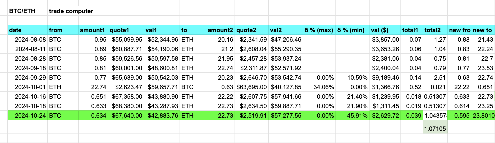
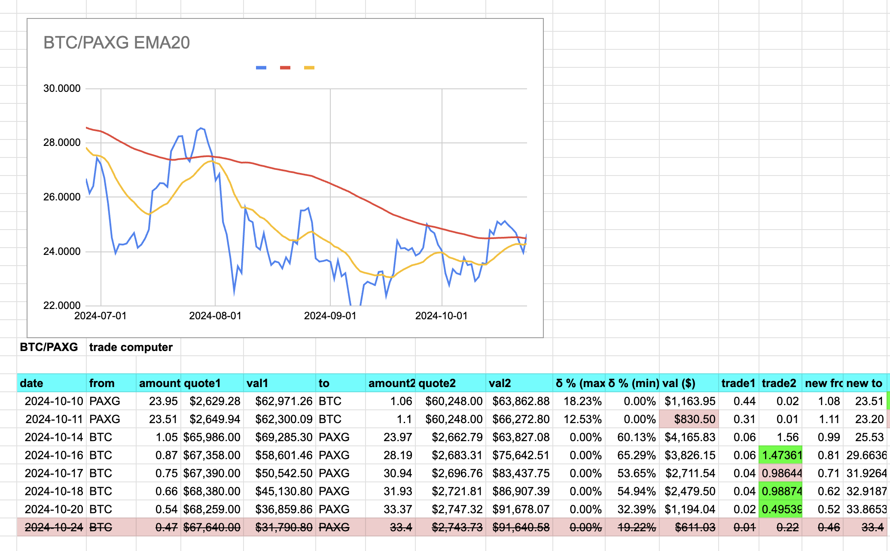
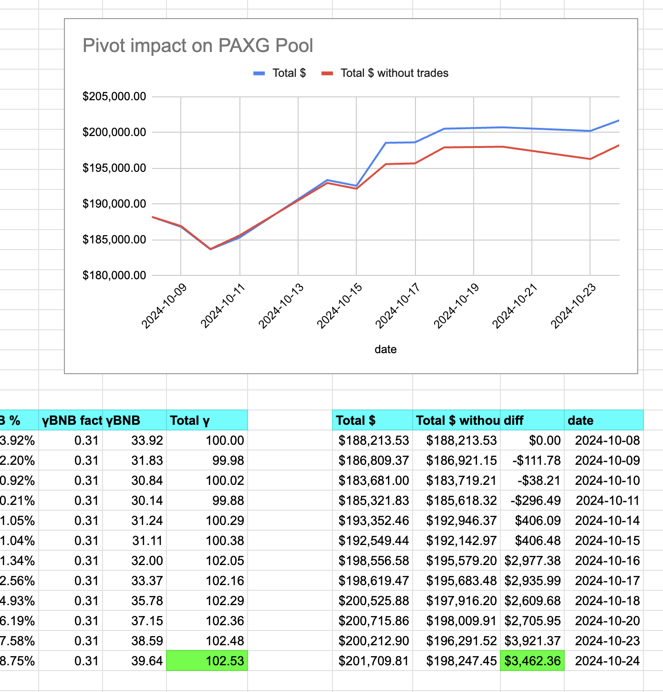

2024-10-24: ./dawn has two sets of recommendations for the BTC+ETH pivot pool and for the PAXG pivot pool.

# BTC+ETH pivot pool

For the BTC+ETH pivot pool, ./dawn recommends BTC -> ETH. The charts bear this out. The close pivot is below 10% ROI (pink) so we open a new BTC on ETH pivot. (green)

# PAXG pivot pool

For the PAXG pivot pool, ./dawn has two recommendations. Let's take each in turn.

## BTC -> BNB

For the BTC -> BNB swap, no close pivot is above 10%, but, please note, ... we're getting closer to a good close pivot here! (pink), 

...so we open a BTC on BNB pivot (green), with a significant gain on the swap from Uniswap. 

## BTC -> PAXG

For the BTC -> PAXG ./dawn recommendation, ./dusk would veto this call, as the trade is below `min_swap` for an open-pivot and below 10% ROI for a close-pivot.

# Status

As there are no close-pivots, this concludes today's activities. Here is the status of the pivot pools.

# `./otto`

PLEASE RECALL that ./otto is going through all the $UNDEAD reserves for all the pivot- and echo-pools, swapping $UNDEAD for the pivot assets on a daily cadence.

This means, currently, ./otto is scanning 4 pools:

* BTC+ETH pivot pool
* BTC+ETH echo pool
* BTC+PAXG+BNB pivot pool
* BTC+PAXG+BNB echo pool

converting $1k of $UNDEAD into each asset. That is 10 swaps of $1k of $UNDEAD to each asset, daily.

