2024-10-25: ./dawn has pivot-recommendations for both the BTC+ETH pivot pool and the BTC+PAXG+BNB pivot pool.

# BTC+ETH pivot pool

For the BTC+ETH pivot pool, ./dawn recommends a 0.0227 BTC -> ETH swap. The charts support this. 

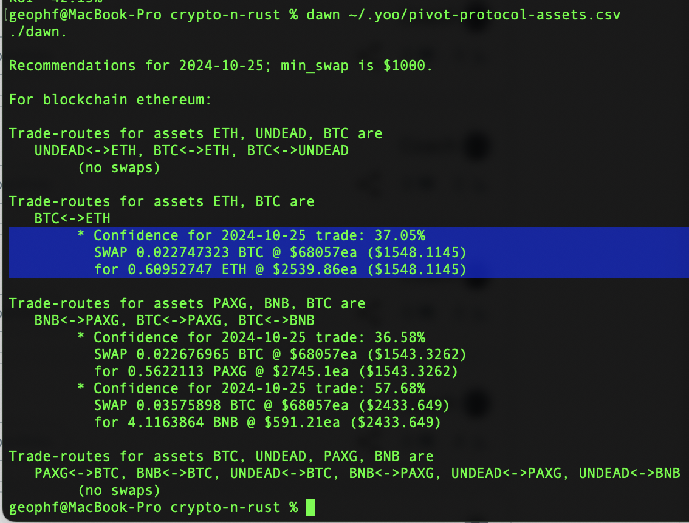
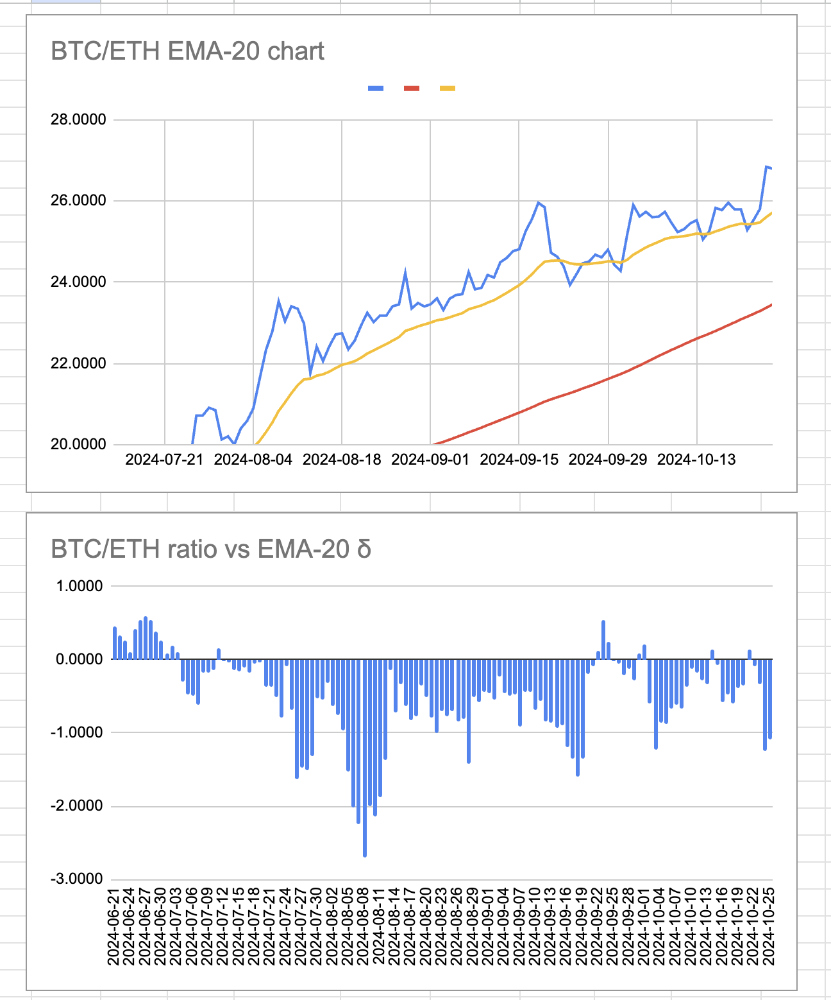

./dusk rejects the close-pivot as it's "only" 111% APR gain (7% ROI) (pink), so it opens a new BTC-on-ETH pivot (cyan). Note that uniswap's swap is favorable to us, giving us MORE ETH than calculated (green cell). 

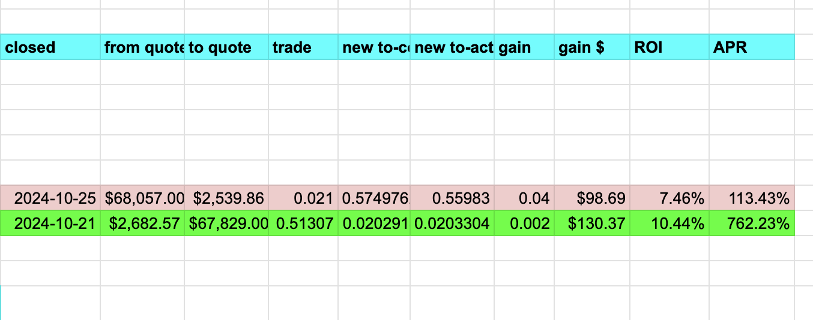
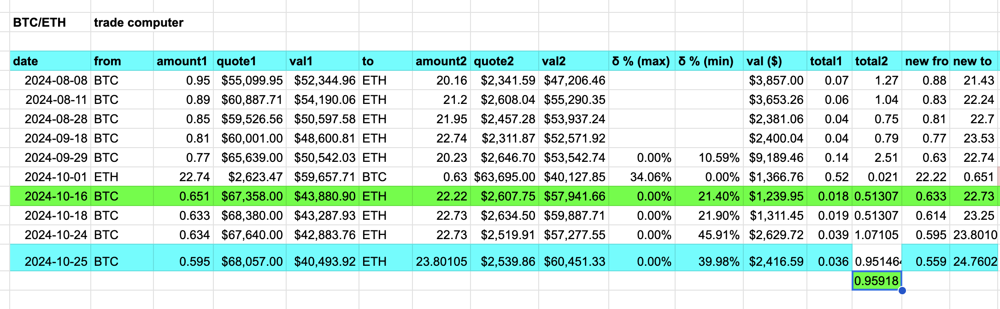

BTC+ETH pivot pool after open-pivot trade.

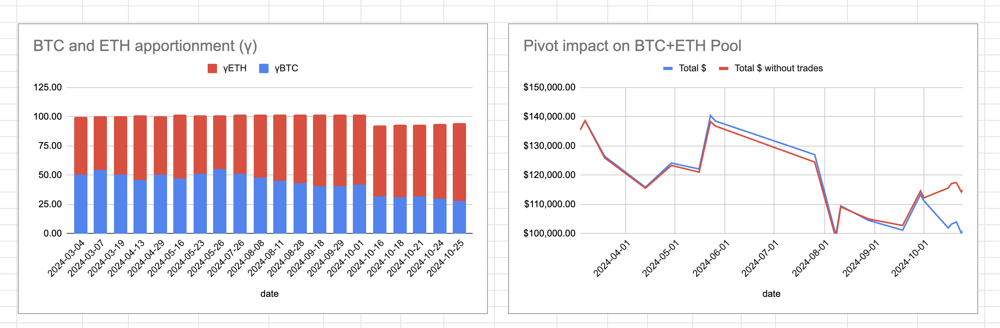
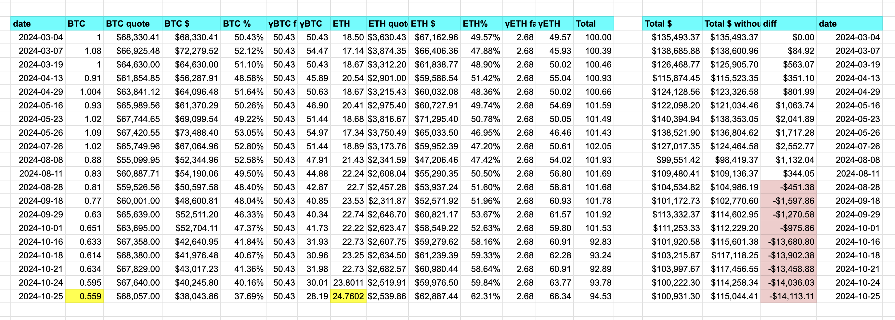

# BTC+PAXG+BNB pivot pool

./dawn has 2 recommendations for the PAXG pivot pool. Let's take each in turn.

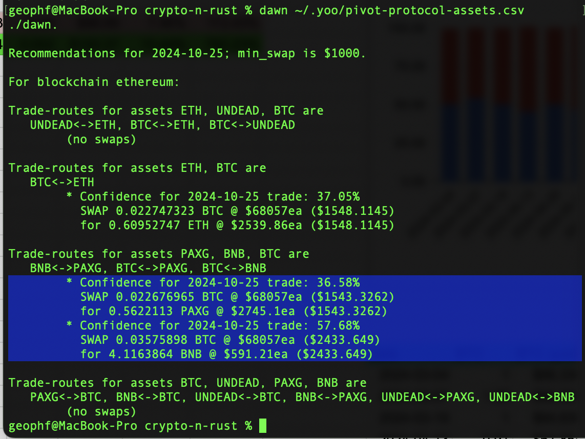

## BTC -> PAXG

First, BTC -> PAXG. The δ is smallish, so ./dusk vetos a close pivot (negative ROI) and also vetos an open pivot (swap < min_swap)

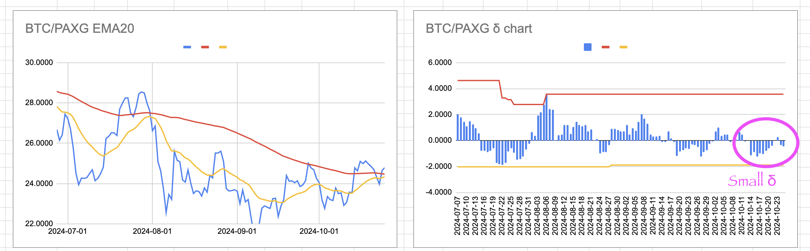
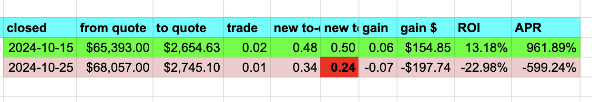
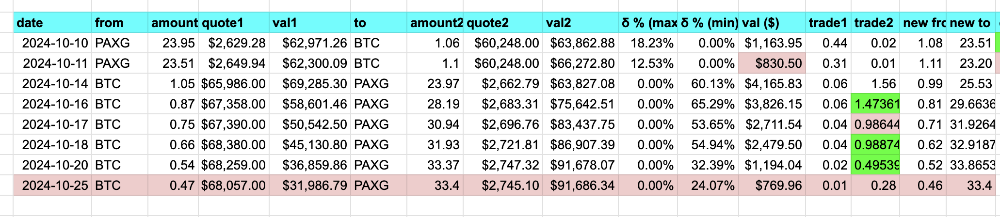

## BTC -> BNB
Second, BTC -> BNB. ./dusk does not close any open pivots, so we open a BTC-on-BNB pivot ... the swap is against us this time, both on uniswap and on pancakeswap.

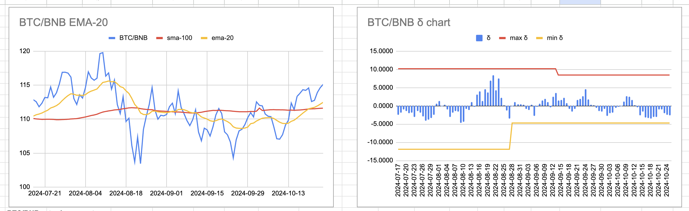
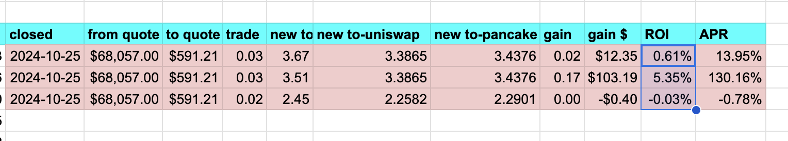
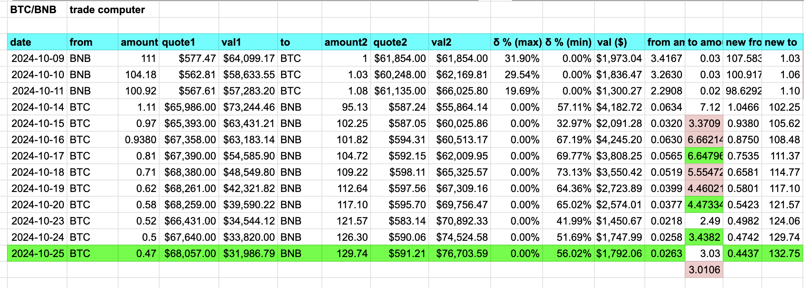

# The Pivot Advantage

The BTC+PAXG+BNB pivot pool with the pivot-advantage. Opening pivots puts pivots in the pipeline, closing pivots captures the pivot-gains.

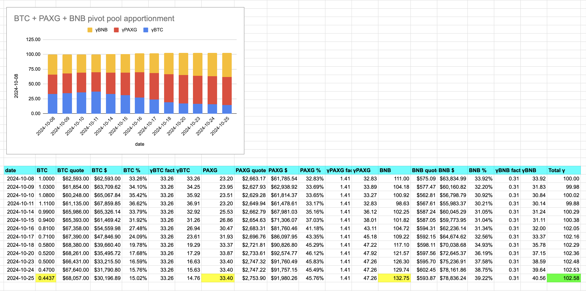
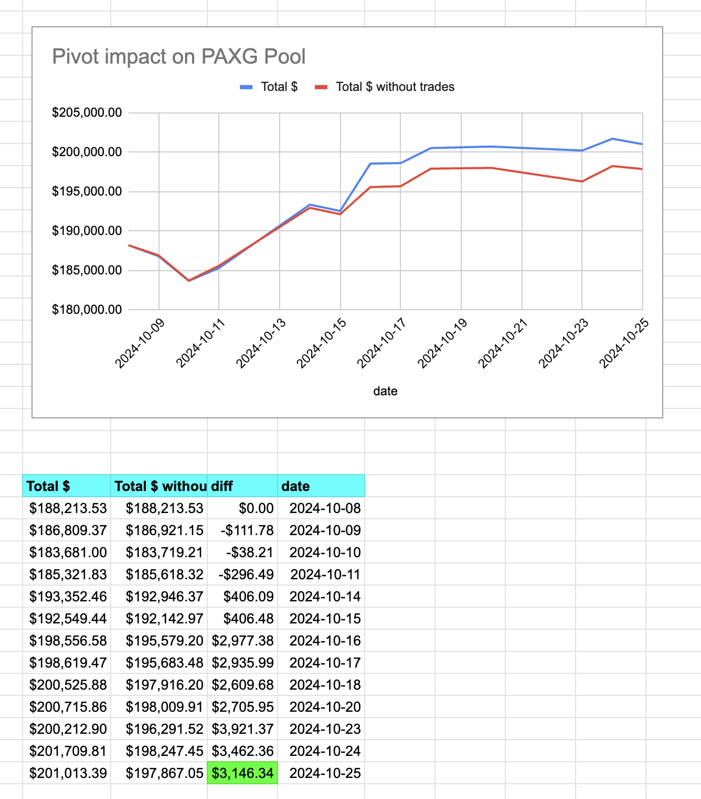

