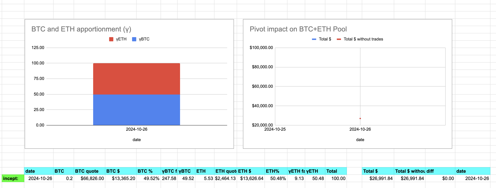

2024-10-26: ./dawn recommendations with the newly reformed pivot pools. ./dawn has recommendations for both the BTC+ETH pivot pool and the BTC+PAXG+BNB pivot pool. I'll deal with each, in turn, ... after my walk. 

# BTC+ETH pivot pool

BTC/ETH. Before we get to the recommendation, we (re)set the pool, 
[computing the γ-factors as per the whitepaper](https://github.com/pivoteur/biz/tree/main?tab=readme-ov-file#4-asset-apportionment--measuring-performance-of-pivot-arbitrage).

