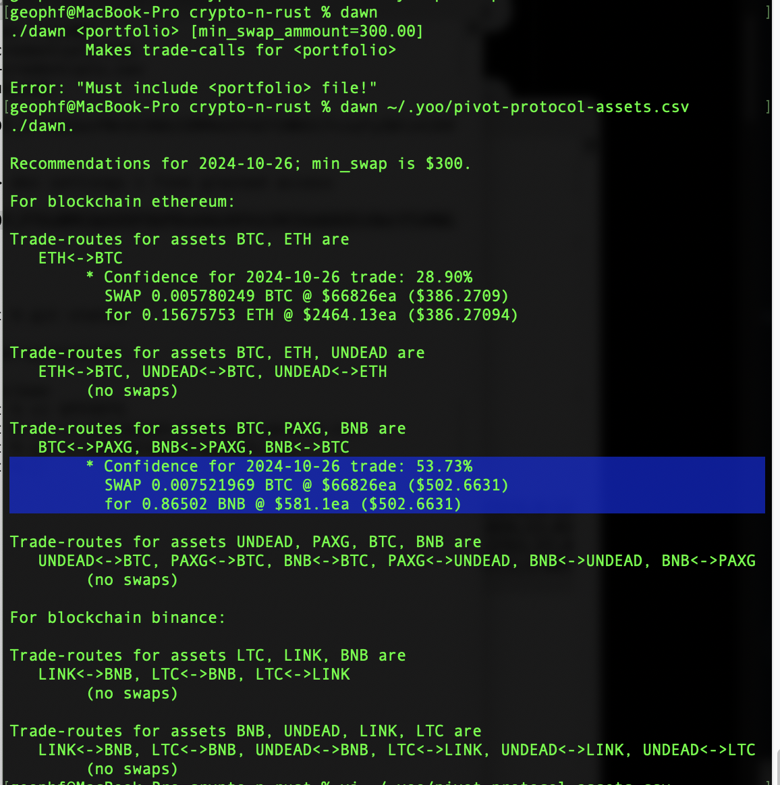
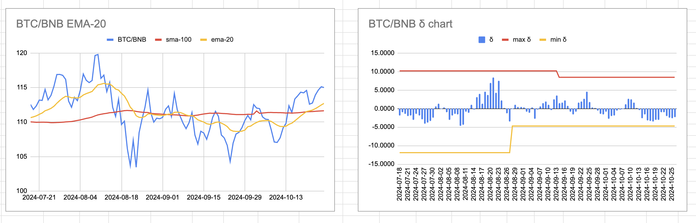
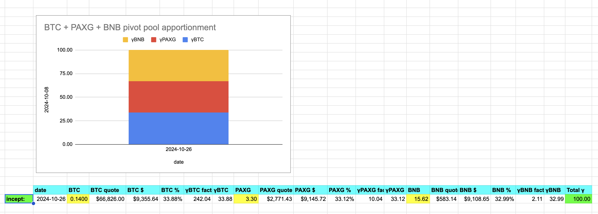
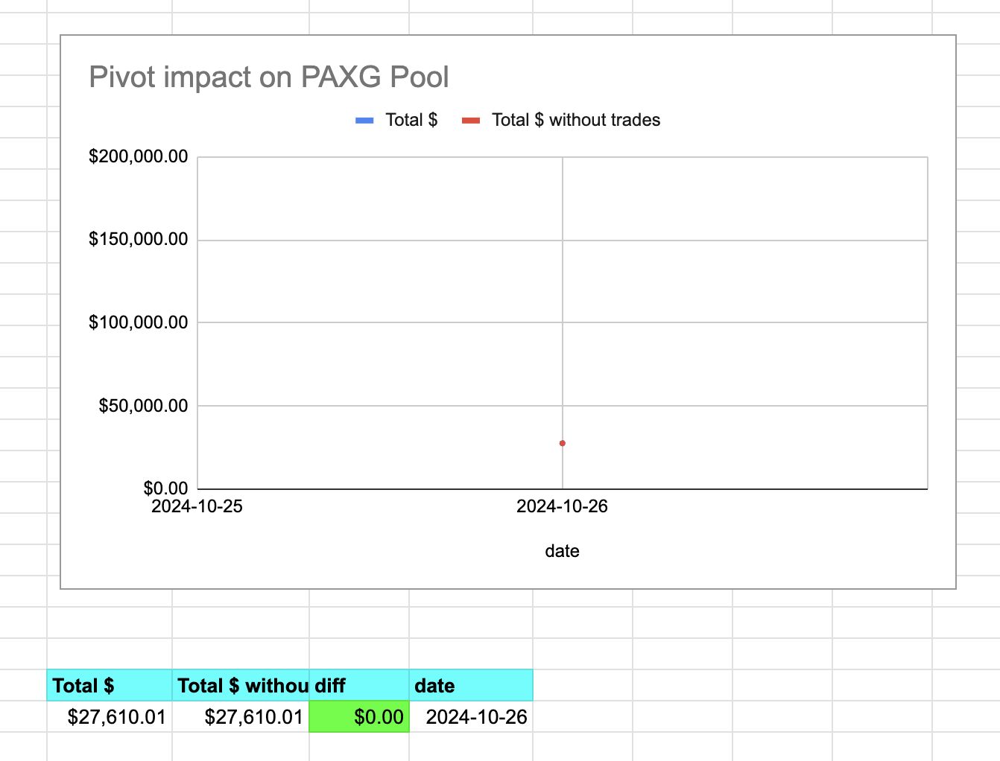
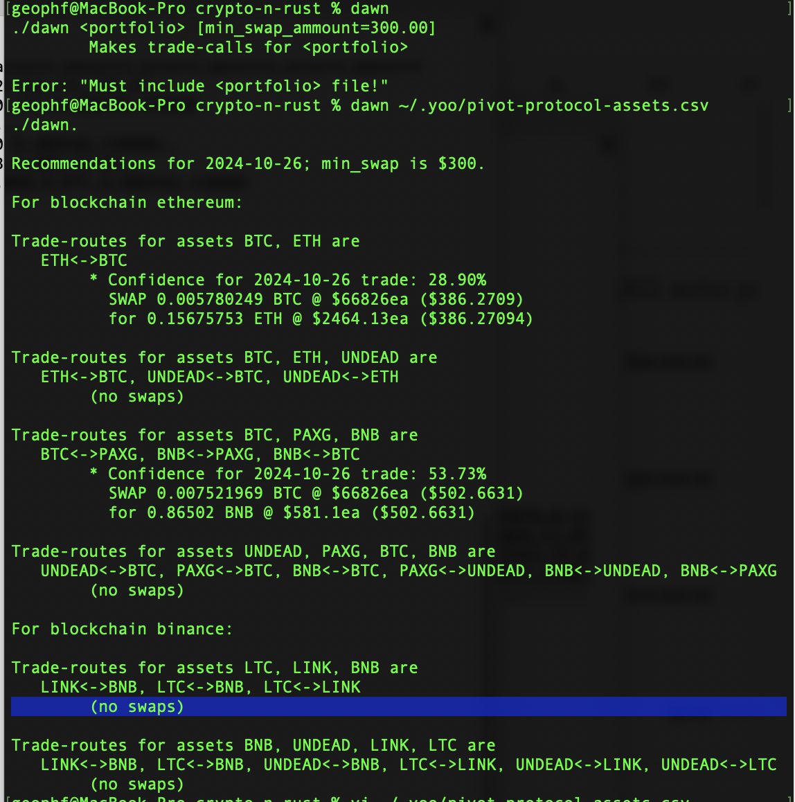
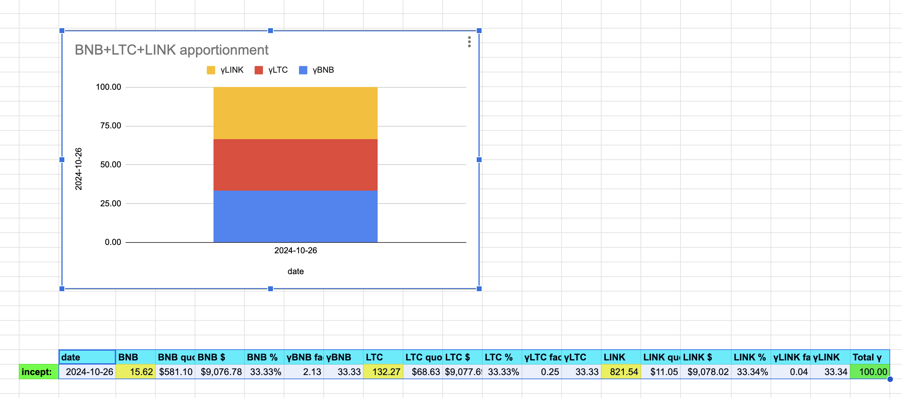

2024-10-26: ./dawn recommendations with the newly reformed pivot pools. ./dawn has recommendations for both the BTC+ETH pivot pool and the BTC+PAXG+BNB pivot pool. I'll deal with each, in turn, ... after my walk. 

n.b. the Binance pivot pool is newly established and inlined, ... just. like. that.

# BTC+ETH pivot pool

BTC/ETH. Before we get to the recommendation, we (re)set the pool, 
[computing the γ-factors as per the whitepaper](https://github.com/pivoteur/biz/tree/main?tab=readme-ov-file#4-asset-apportionment--measuring-performance-of-pivot-arbitrage).

Continuing on the 2024-10-26 recommendations: ./dawn recommends BTC -> ETH. The charts support this.

I am not going to go through the computations for simulated trades, because I am transitioning to actual trades with actual funds on the actual blockchain.

Going forward: everything's real.

... when the funds and pools are established.

# BTC+PAXG+BNB pivot pool

For the PAXG pivot pool, ./dawn recommends a 0.007 BTC -> BNB swap, 

... which is $500, not $1000, which used to be `min_swap`. ./dawn now takes into account the new pool's (smaller) size.

The BTC/BNB chart supports this swap.

Now, let's (re)set the BTC+PAXG+BNB pivot pool to the new starting amounts.

> The (re)set PAXG pivot pool with (re)calculated γ-factors.

n.b.: The apportionments (above) and the trade-gains are part of the protocol-reportage that would be part of the pivot-pool's, echo-pool's, and treasury's UX.

# BNB+LTC+LINK pivot pool

./dawn has no recommended swaps for the BNB+LTC+LINK pivot pool today (yesterday). 

Let's establish that pivot pool.

> The BNB+LTC+LINK pivot pool established with γ-factors calculated.

n.b.: for each pivot pool, there is an echo pool. Each echo pool starts with a set of $UNDEAD as seed funding, then ./dist feeds assets from the gains of pivot pools as pivots there are closed.
