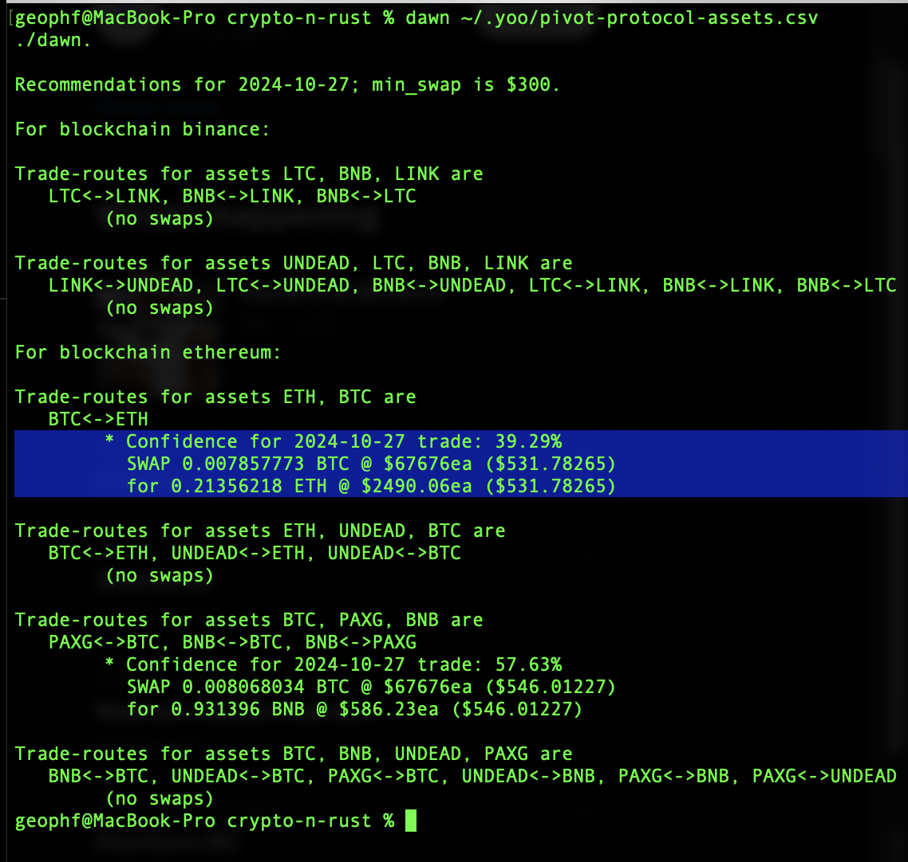
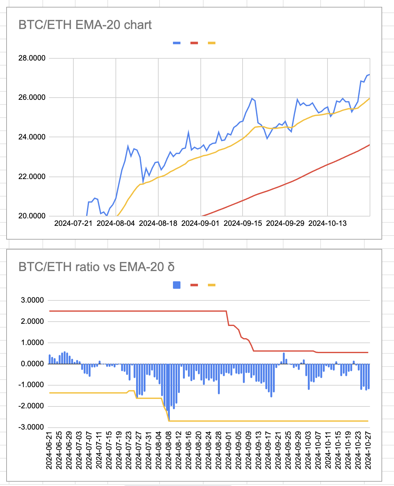
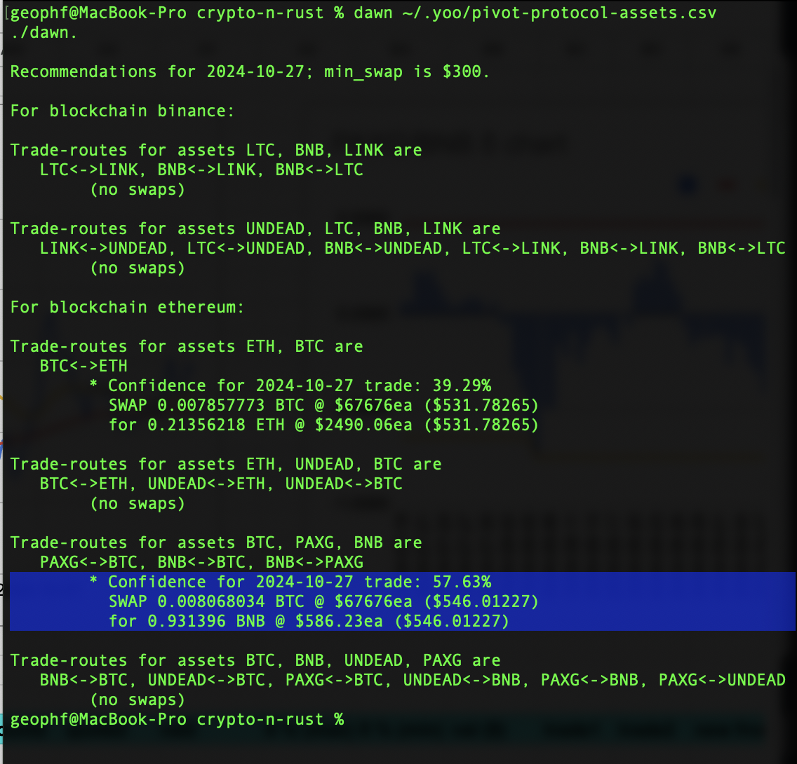
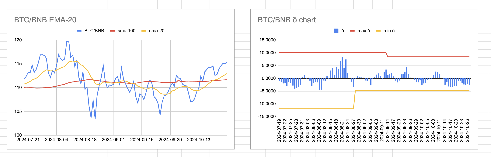

2024-10-27: ./dawn has BTC+ETH and BTC+PAXG+BNB pivot pool swap recommentations.

# BTC+ETH pivot pool

Let's start with BTC+ETH.

./dawn recommends 0.008 BTC -> ETH. The charts support this trade.

For the PAXG pivot pool, ./dawn recommends 0.008 BTC -> BNB swap. The charts support this trade. 

