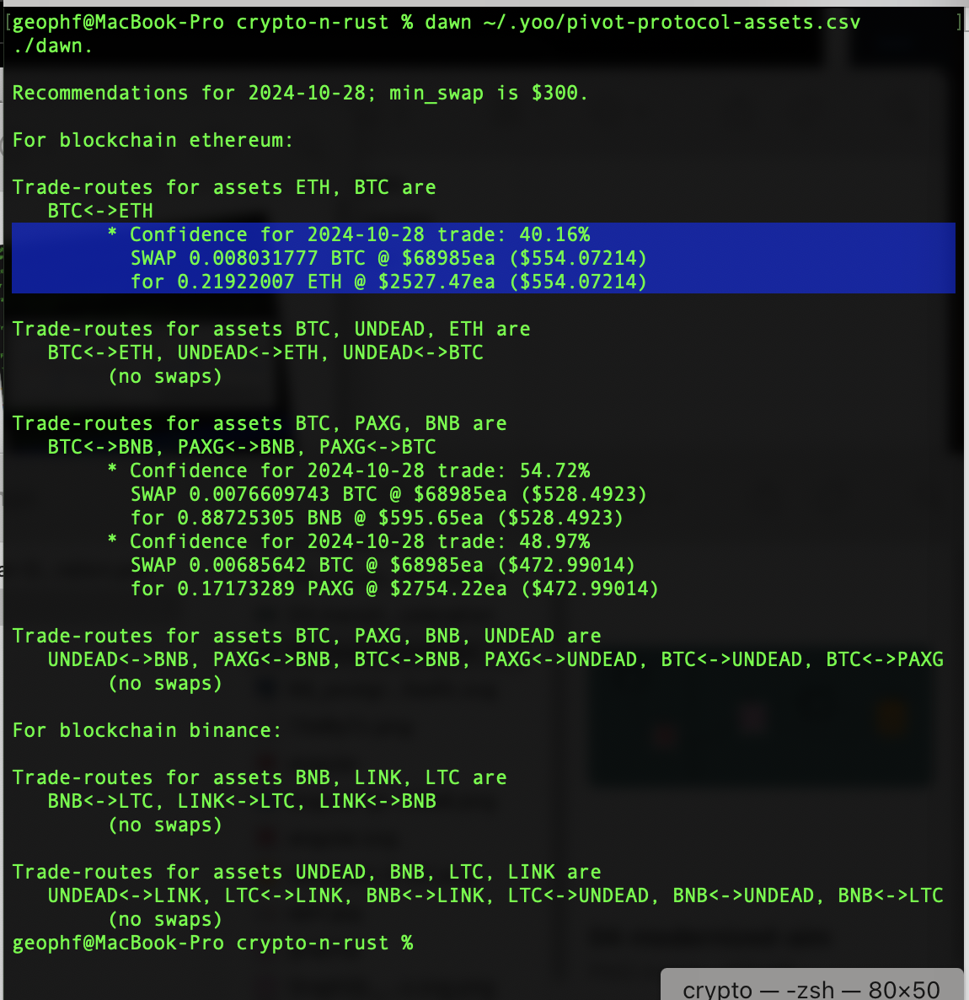
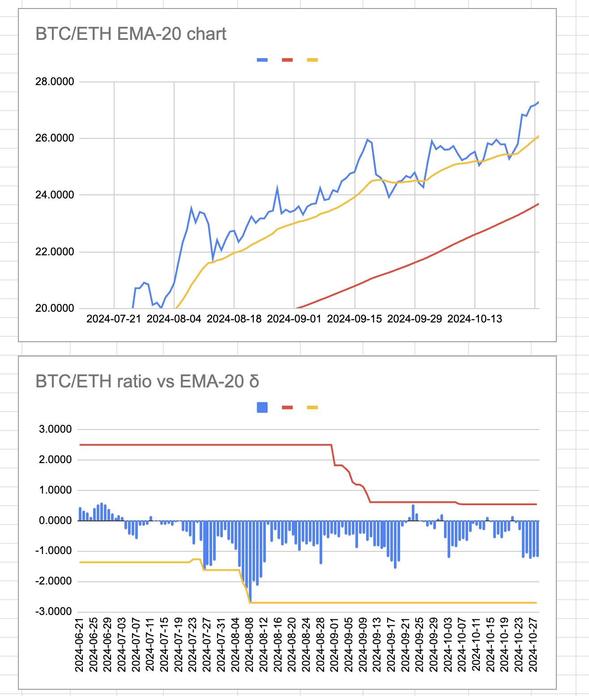
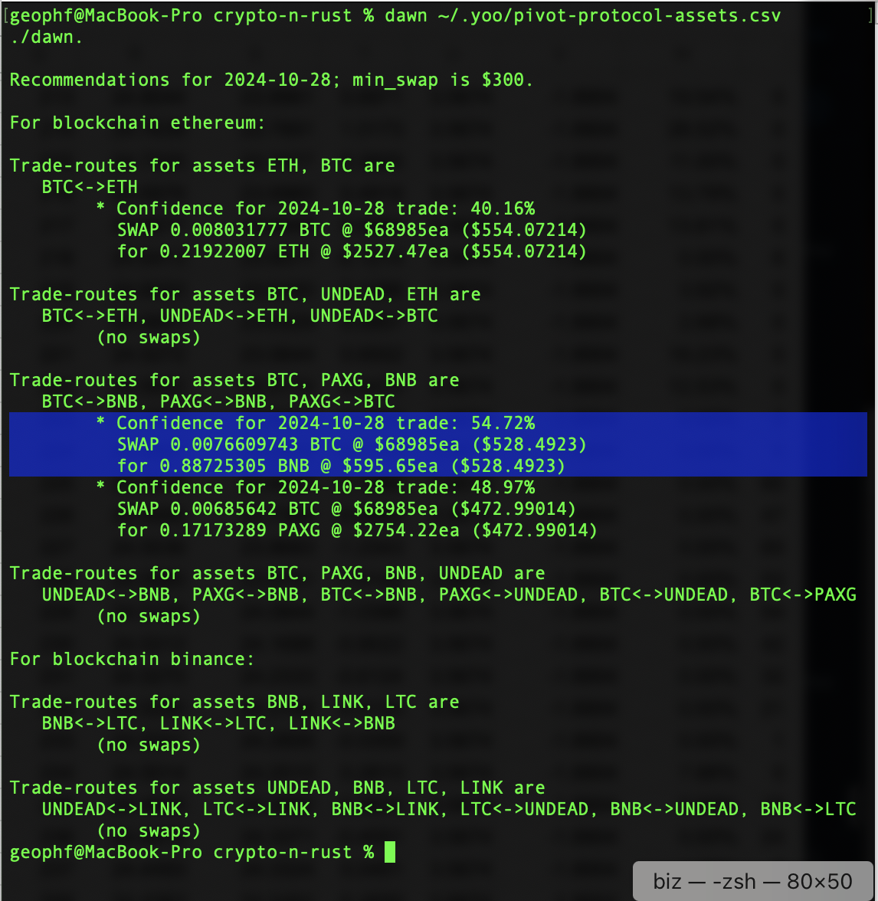
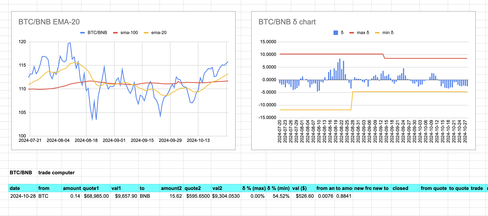
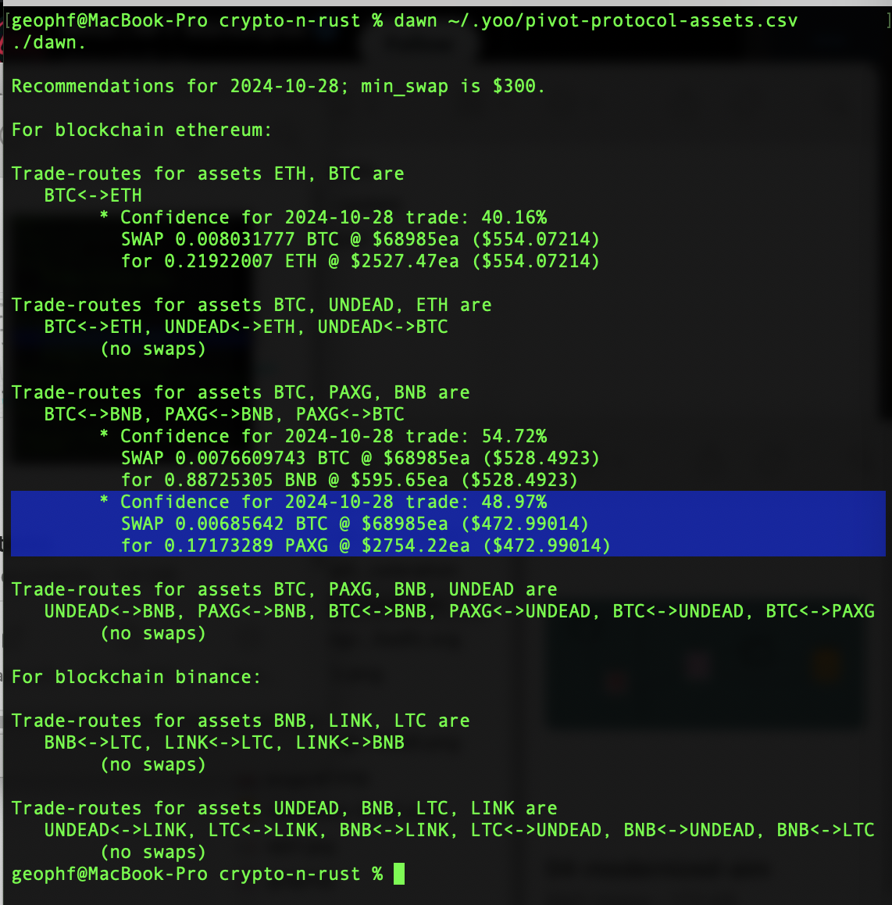
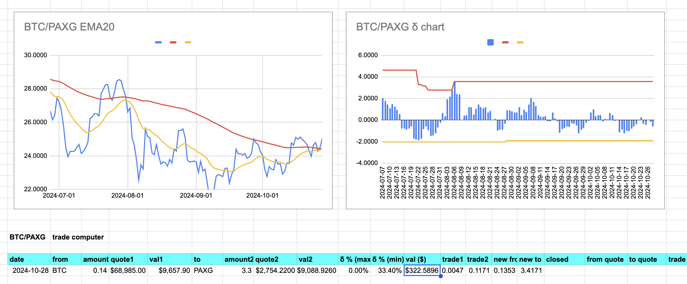

2024-10-28: ./dawn has recommendations for BTC+ETH and BTC+PAXG+BNB pivot pools.

# BTC+ETH pivot pool

Let's do BTC+ETH first. ./dawn recommends swapping 0.008 BTC -> ETH. The (runaway) BTC/ETH chart confirms this. 

Please note that I will commence trading when liquidity is provided to these pivot pools. In this way we will see open and close pivots in real-time.

# BTC+PAXG+BNB pivot pool

## BTC -> BNB

For the PAXG pivot pool, ./dawn recommends 0.0076 BTC -> BNB. The chart bears this out. 

## BTC -> PAXG

./dawn recommends 0.0047 BTC -> PAXG swap. The charts confirm this. fin.

