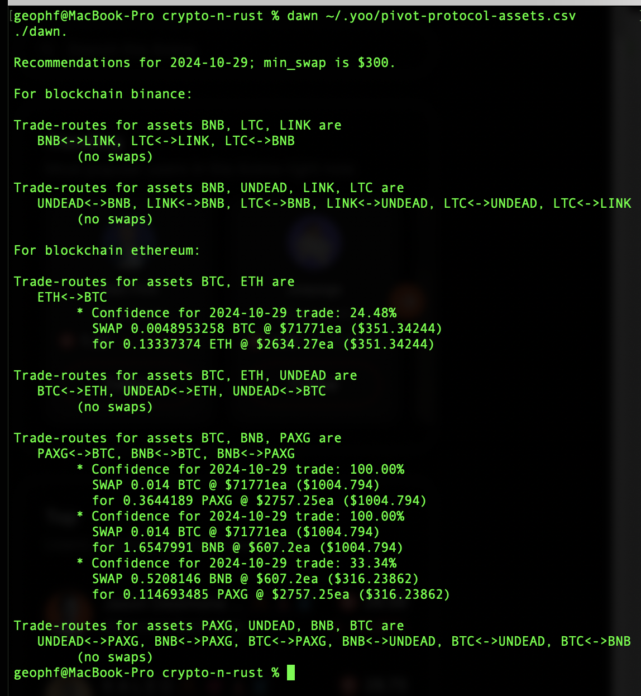

2024-10-29: ./dawn has some JUICY recommendations (that's a technical term) in the wake of BTC's ZIPping pass $70k.

I've reformulated how I'm going to fund these pivot pools, so instead of trade analyses today, I'm moving assets, once liquidity is freed and received, to begin the process of BUIDL'n these pools.

HOWEVER, I don't have a happy place to trade PAXG, ... yet. So, I'm looking where to do that, and putting some thought into that.
