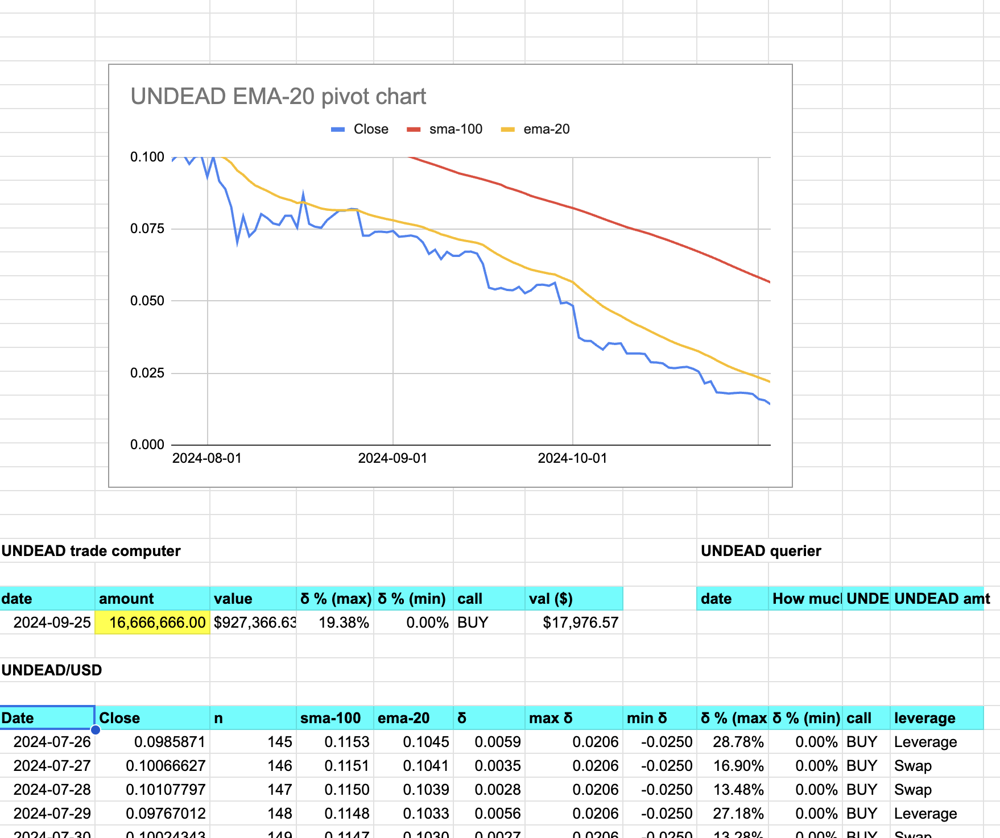
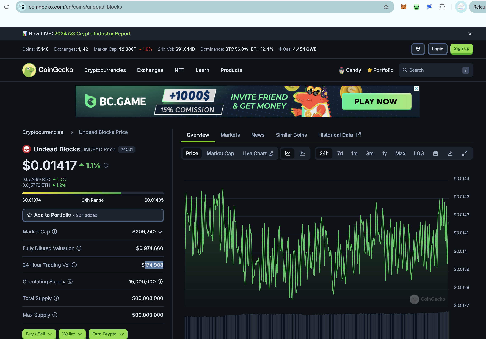
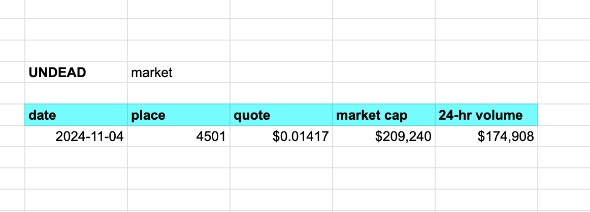
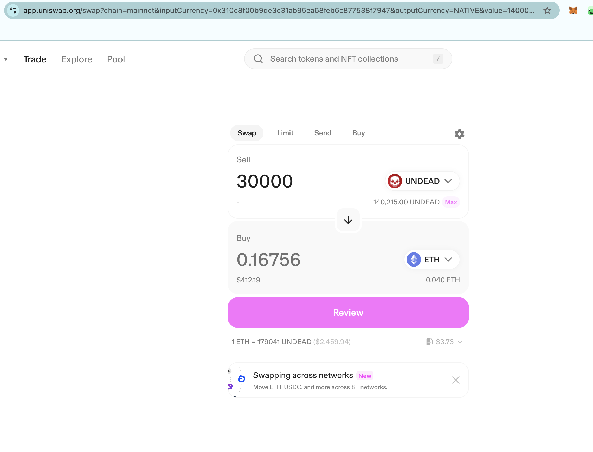
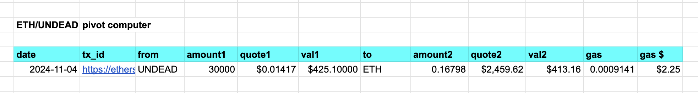

# Technical

2024-11-03: set up 4 wallets, or: 2 pairs of wallets on Ethereum mainnet.

* treasury, and treasury-inv
* echo pool, and echo pool-inv

The -inv wallets are where investors stake their $UNDEAD for the respective pool or treasury.

The treasury is the store for pivot-gains. The echo-pool is going through a major revision from the whitepaper. As ETH-UNDEAD is strongest on mainnet, all gains going to the echo-pool (only one now), will be converted to $ETH first, and pivots there with be between ETH and UNDEAD.

The structure of wallets are in the [whitepaper](https://github.com/pivoteur/biz/tree/main?tab=readme-ov-file#6-investing-liquidity).

The treasury and echo pool purposes are described in [subsections 2 and 3](https://github.com/pivoteur/biz/tree/main?tab=readme-ov-file#2-the-echo-pools).

# Business

It's time for me to activate (manually) pivots on the echo pool, that will create volume and start to move the price of $UNDEAD.

If you've been following $UNDEAD's price, 

... as I have, it's time for the pivot protocol to start to put positive price pressure on $UNDEAD, SO! I'm going to start measuring price, 24-hour volume, and market cap of $UNDEAD and report that out.

That way, you can see how the pivot protocol contributes to $UNDEAD's health.

As per the [whitepaper](https://github.com/pivoteur/biz/tree/main?tab=readme-ov-file#2-the-echo-pools), the echo pool exists to create liquidity for the protocol AND to create demand and buy-pressure for $UNDEAD. To that end, I'm going to start pivoting $UNDEAD against $ETH, and vice versa, on the echo-pool wallet.

---

I've began tracking $UNDEAD place, price, market cap and 24-hour volume independently. This will find a home, eventually, on the protocol-page.

We'll see how my pivot-trades start to affect this market. Please remember there'll be a ramp up period for the protocol.

For example, today's volume is $175k, and my trades are going to start at $200, ... that's not even 1% of total daily volume.

---

So, my opening shot is to open up an UNDEAD-on-ETH pivot with 30k $UNDEAD (~$425). 

I plan on trading, every day, both ways, to build both $ETH and $UNDEAD liquidity and, eventually, strengthen $UNDEAD's price. 

This is the first real, albeit manual, open pivot trade of the pivot protocol. We are operational and engaged in the marketplace. 🥳
