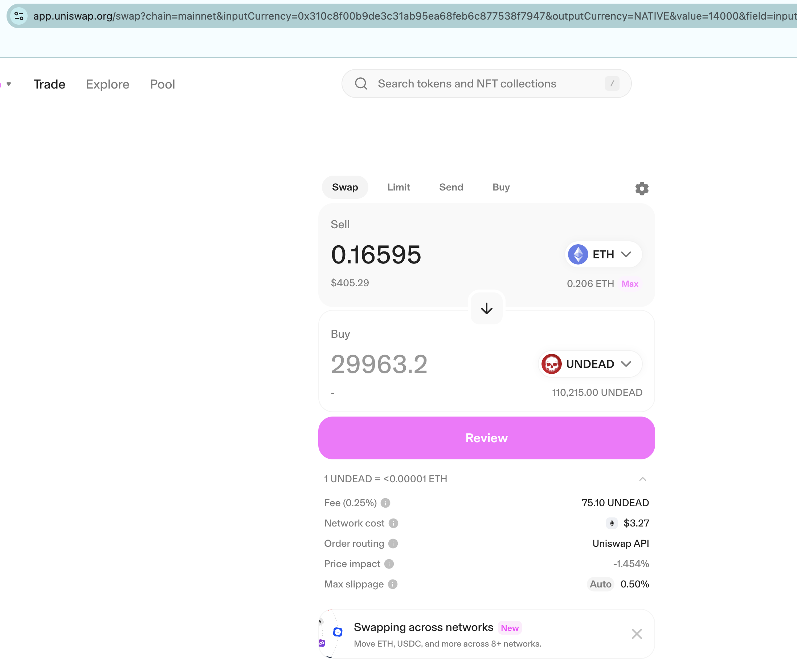

# $UNDEAD

Holy cow! Did I start an avalanche??? Somebody's buying $UNDEAD??? 

This trade yesterday of 30k $UNDEAD got me 0.16 $ETH, earlier it got up to 0.17 $ETH, and now it's 0.19 $ETH! This is nowhere near where it used to be, but now the $UNDEAD price is going up for a change. THIS IS EXCITING!

# Close pivot?

I've simplified the 'echo pools' to a singular 'echo pool': ETH+UNDEAD, as the only blockchain that has enough UNDEAD liquidity is on Ethereum. I opened a 30k $UNDEAD pivot yesterday, and the price-changes would suggest I close the pivot today, getting back 30.595k $UNDEAD, according to the asset-prices.

However, uniswap says different, giving back only 29.9k $UNDEAD.

So, uniswap-slippage vetoes the pivot-close today.

# Open pivot

However, that does not stop me from [opening a new UNDEAD-on-ETH pivot[(https://etherscan.io/tx/0x0a5d4f91b591f86d8415170a1396317c5c80b76416bd66a360d40a7116062537). 

I record the open pivot into the spreadsheet.

When the markets favor a close with ROI > 10%, I'll close one of these pivots. 
