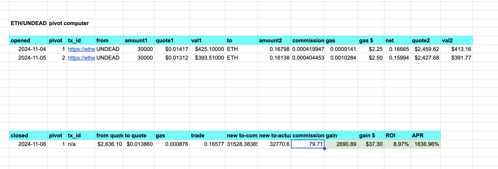
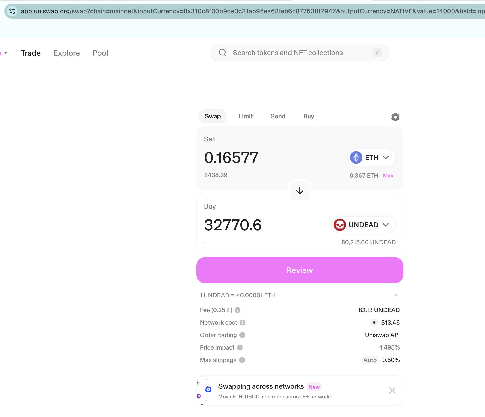

2024-11-05

Brah! 😤 I ALMOST closed a pivot this morning, netting nearly 3k $UNDEAD-gain, BUYING $UNDEAD with $ETH, and APR'ing (is that a word?) 1.6k%???

But the gas-fees on Uniswap are THIRTEEN DOLLARSSSS??? right now.

So. I'll wait and check fees again tonight, when, usually, they're 'ONLY' around $2-$3.

'ONLY'???

This is a really strong business-case to get $UNDEAD on, say Binance / pancakeswap. We could use some of my $UNDEAD, and I can supply corresponding $ETH or $BNB?

Trades on Binance / pancakeswap are less than 1 penny a trade. Just a reminder.

The good news is: 

* pivot arbitrage for the echo pool will work
* we can buy $UNDEAD with $ETH, thanks to the echo pool, creating buy-pressure for $UNDEAD

* Pivot arbitrage is the long-game, so I'm not upset (okay: I'm a LITTLE upset) that I can't execute this trade now. But that's fine. Not trading today is not the end of the world, because the EMA-20 indictor is a trending-line, so the trend will continue tomorrow, or it won't, but trend reversals happen all the time* on a chart, so I can trend, or reverse-trend, trade today, tomorrow, the next day, onto forever.

* 'all the time on a chart' meaning: the process here is to trade profitably and on a once-per-day-per-pool basis.

Okay. Cheerio! I'm feeling very good, seeing the pivot arbitrage working in real time.
