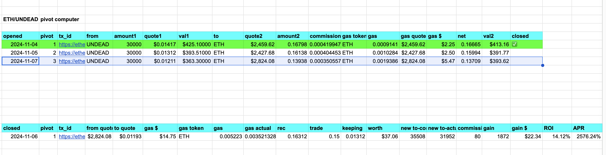

# First live echo pivot concluded

2024-11-06 GOOD NEWS! The pivot protocol completed its first REAL pivot in the Echo pool, live! [tx_id](https://etherscan.io/tx/0x4320234fa57fc8216d3a45b0c92ba37d36900cd3b9a3bb0737aec199c2774eee) 

* net ROI: 14.25%, APR: 2601.15%. 
* net gains: 1872 $UNDEAD and 0.011 $ETH. 

So, you see, we gained BOTH $UNDEAD AND $ETH from this first completed pivot. 

From the transaction you see gas fees were $9.94, which is ... 'less' (?) than they were during the day at $13, but come on! Gas fees of $10? I really, really hate Ethereum's gas fees. I really do.

Why? Because the eat into pivot-gains and require much greater amounts to pivot. Instead of a $400 pivot (this one) with 2.5% of that going to gas, it should've been at least a $1k pivot so gas would be less than 1%, ...

Or on nearly any other blockchain where gas would be pennies and pivots could be at $10. But you know this already. 😢

---

## Closing an $UNDEAD pivot

First live echo pivot traded.

* [opening tx](https://etherscan.io/tx/0xffebd919b062d0d38ddd8b403da6f49ce136f1915661aa150adc4f49891f249b)
* [closing tx](https://etherscan.io/tx/0x4320234fa57fc8216d3a45b0c92ba37d36900cd3b9a3bb0737aec199c2774eee)

There is a trade-off here, where I have listed three options to take (green, white, pink). Let's look at what's happening on the close pivot transaction.

1. green: We trade all the $ETH back (minus gas and commission fees) and make 34.3k $UNDEAD, minus commissions for a net gain of 4276 $UNDEAD, ROI: 14% APR 2.6k% Not bad. Not bad at all.
2. white: We trade some of the $ETH back, keeping some $ETH and some net $UNDEAD. To wit: 0.013 $ETH and 1872 $UNDEAD. Good? Bad? Better than 1?
3. pink: We trade a little less $ETH, but then we don't make back our $UNDEAD. That's not an $UNDEAD pivot, so, that's a no-go for me.

That brings us back to 1 vs 2 as the best swap to close the pivot. Which one? Both are winning, with very good returns.

But 2 is better.

Why?

We're living in an @ethereum-world, and I am $ETH-girl.

The $ETH-gain is 4 transactions (or 2 pivots). That's vital to keep us going.

Not only is 2 better because it gives us $ETH (for transactions) as well as $UNDEAD, but it's simply, materially, better.

How?

* 1/green nets $51.01 of $UNDEAD on a $400 pivot. That's great.
* 2/white nets $59.40 in combined $UNDEAD and $ETH gains. This is materially better.

## Open new pivot

Now, do I open a new $UNDEAD pivot? You bet your sweet $UNDEAD I do. Why? Let's look at the chart. 

As $ETH continues to trend up against $UNDEAD, an $UNDEAD pivot will continue to be profitable, yielding both $UNDEAD and $ETH gains.

I execute the trade on @Uniswap and record the transaction as an open pivot (the highlighted pivot, pivot #3) into my spreadsheet. 

All transactions, all dates, all amounts, all fees are recorded to compute ROIs and APRs precisely.

You also see in the close pivot row, I collapse the green/white/pink options to the close-pivot swap I settled on.

## Market Trends

Let's talk about market trends for a moment.

Should the trend (above) reverse, AND when I've generated enough $ETH to trade on @ethereum, THEN I'll open an $ETH pivot to take advantage of the 'overpriced' $ETH (with respect to $UNDEAD).

Also, closing pivots are always profitable, otherwise I don't close them. Waiting a day, a week, a month, six months, is nothing to the ROIs and APRs made with pivot-arbitrage. If closing a pivot now isn't profitable, I can wait for the trend to reverse and then the trade to become profitable. No emotional trading is necessary, and it reduces to an algorithmic-approach.

