Daily report, 2024-11-08: UNDEAD market.

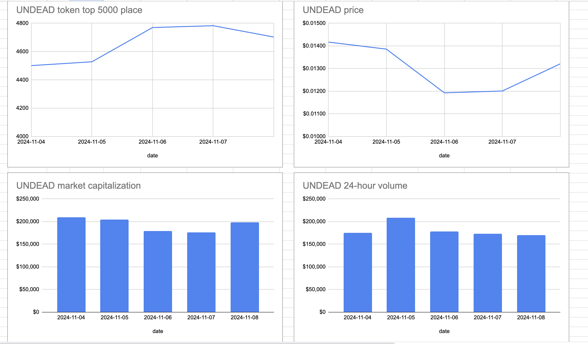

# Close pivot

I close a pivot, taking considerations discussed yesterday, and record result. ROI: 10%, APR: 1,240%

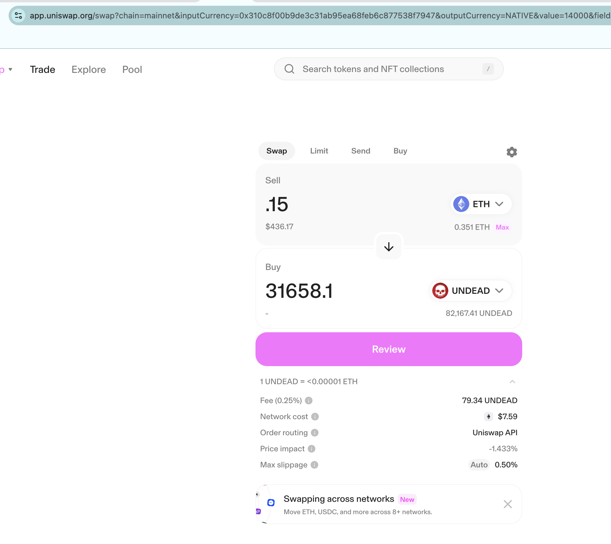
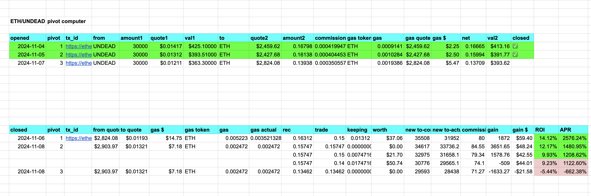

# Need multi-send

I need to multi-send multiple tokens. Do we have that already?

So, for example: the echo pool made both $ETH and $UNDEAD gains today. That needs to go to the distributor, the distributor does a look-up and sees:

20% goes to stakers
40% goes back to the echo-pool
40% goes to the treasury

of BOTH the $ETH AND the $UNDEAD sent to the distributor.

Something like [multisend](https://classic.multisender.app/)

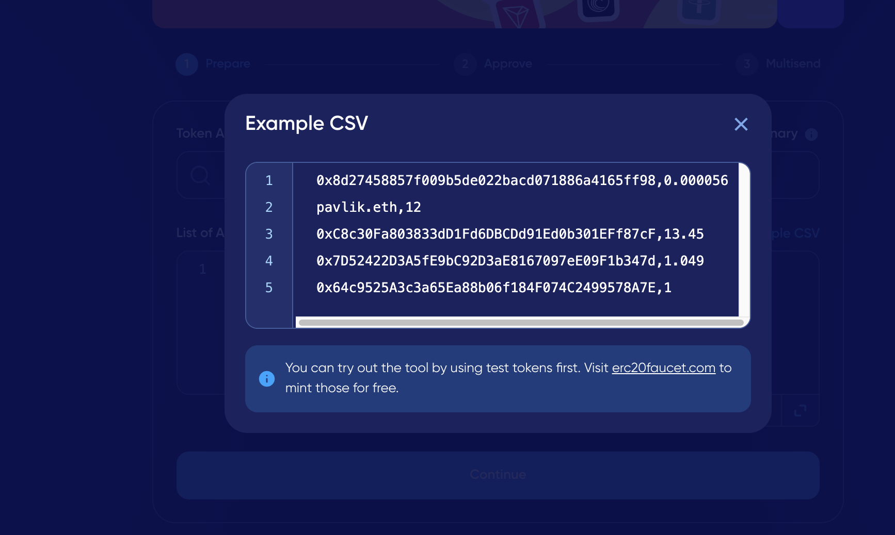

# Need stake yield dApp

I also need staking, like AAVE/granary staking, meaning: people stake their $UNDEAD into a pool or the treasury, and then they can harvest yields whenever at their expense. Something like [multidrop](https://massdrop.multisender.app/preparation/)

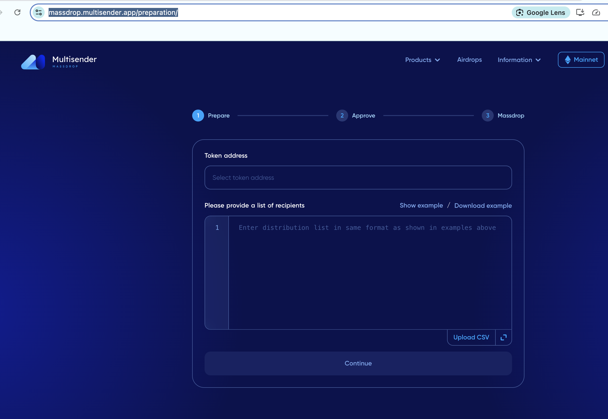

# Distributions

I was going to demonstrate distribution of gains, but, since transfer fees for $UNDEAD are currently $5 and swap fees are $14, I'm going to hold off until I have enough to transfer that the fees zero it all out.

Simulated: 

1. echo-pool sends 0.0206 $ETH and 3530 $UNDEAD to distributor addy (the gains) with 'echo-gains' as message. (2 tokens to one address)
2. distributor does a look-up of the distribution table and sends 40% to treasury, 40% back to echo-pool, and 20% to stakers add (2 tokens to 3 addresses each)
3. treasury sends 10% of ALL its gains for the day to distributor with 'treasury-gains' message (n tokens, 1 address)
4. distributor does a lookup again and sends 100% of the treasury gains to stakers addy (n tokens, 1 address)

If there is no multi-send, that's 8 + 2*n transactions. Then:

5. stakers withdraw their gains just like with Bank or granary or AAVE.

Using @multi_sender, I prep the multi-send to the treasury, the echo-pool, and the stakers addy.

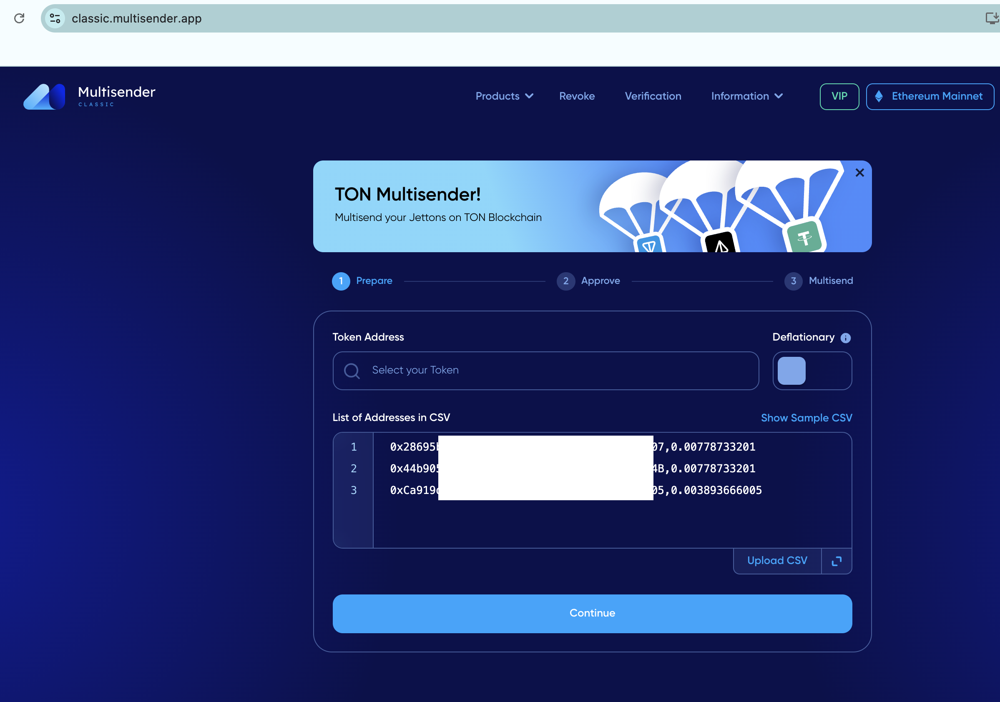

Unfortunately, I need to have 0.11 $ETH in the sending wallet, so I either need to cache sending until there's enough to send, or I do this as individual (expensive) transactions.

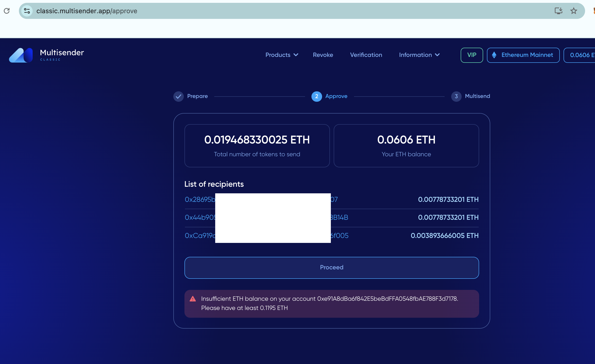

So, I do do the transfers as 3 [individual](https://etherscan.io/tx/0x87a9c89b658e513e0c132d84ee66d061461046bc23e6fa5d244620c3b99c5e07) [$ETH](https://etherscan.io/tx/0x7a7693aea77fd280d9ff3f170d299e060fe8e365e031a2a3ddebe0fef7f84526) [transactions](https://etherscan.io/tx/0x0ca0cda1e6858f42c788ca970ee2848d64d3e3af0c0479885b7b28413a4479ea ) from the distributor addy: 

Let's not forget, the treasury has made a gain, so it distributes to the distributor, which then distributes that gain to stakers. But, since 10% of 40% of $60 of $ETH gained is $2, we'll hold off distributing this gain of $2 to all stakers until we accumulate enough so that the gas fee doesn't wipe out that gain.

Do I trade $UNDEAD for $ETH opening a new echo-pool pivot? You betcha! 

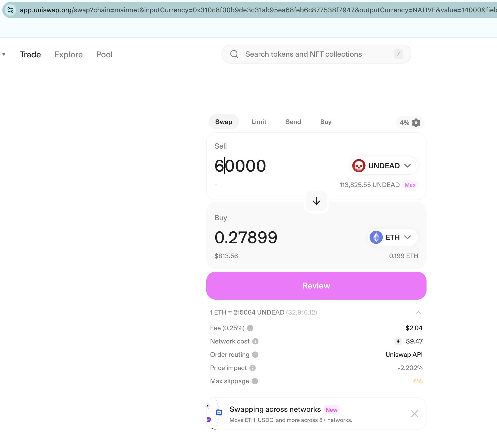
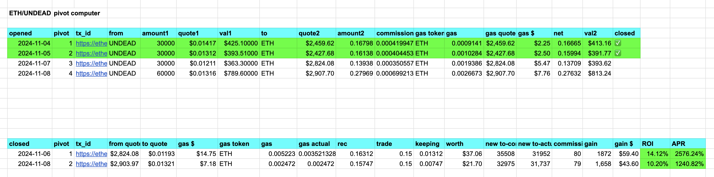

The more assets engaged in pivots, the better.

After we get going: when the stakers receives funds (tagged from whence they came), they see how much goes to each staker based upon:

1. amount invested $UNDEAD and
2. time invested $AMP

That computes an amount per investor. The remaining amount is returned to the source pool.

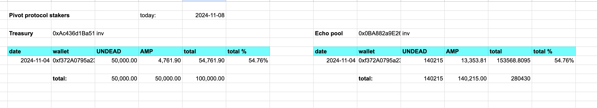

This incentivizes investor longevity.

# Reports

First reports: protocol assets, apportionment and growth over time.

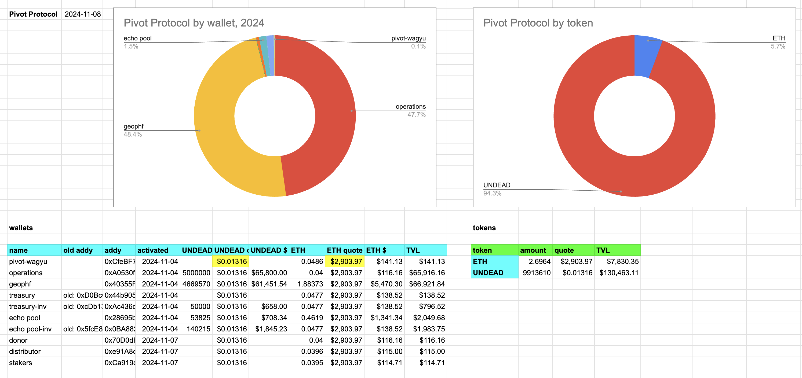
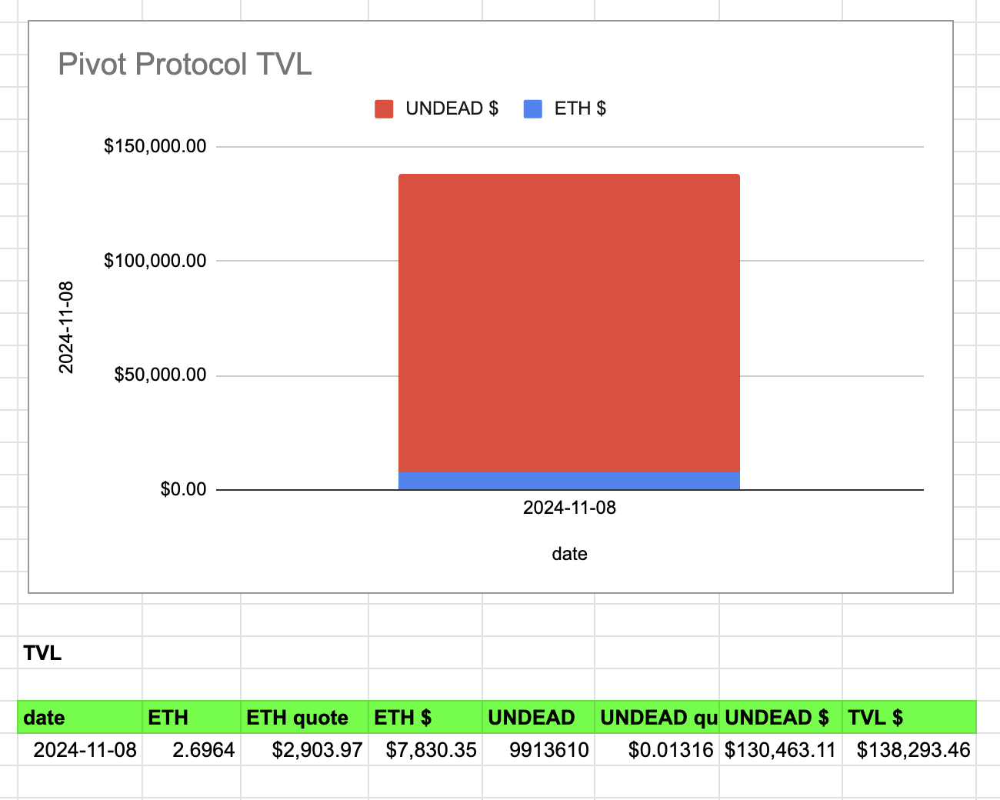

Next, reports by pool. Here're the echo pool reports. Each pool will have reports like this, showing their composition and efficacy of pivot arbitrage in the pool.

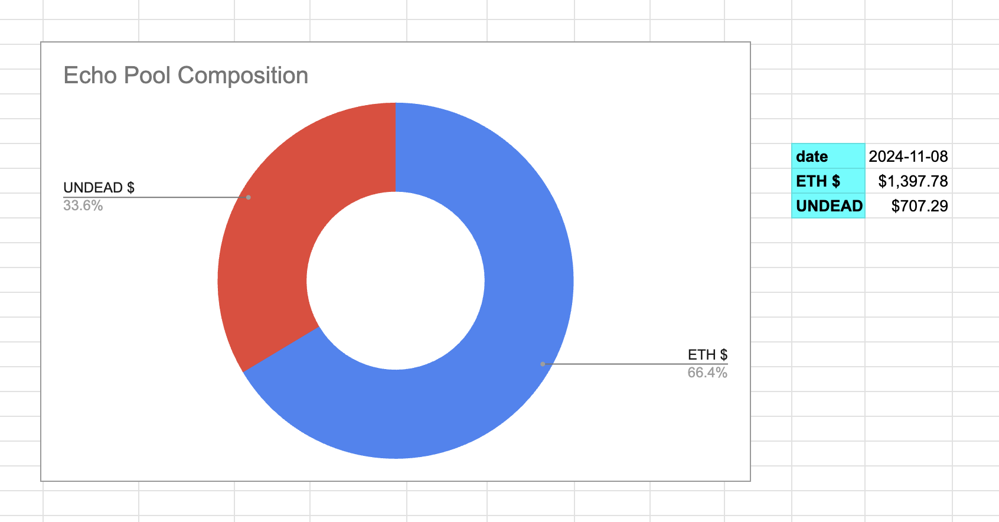
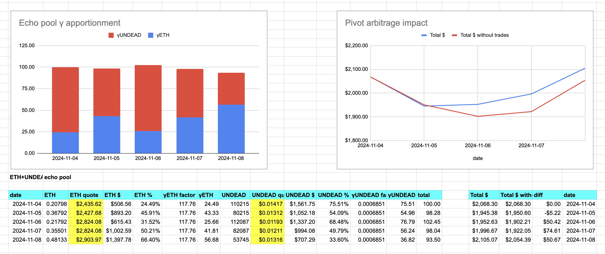
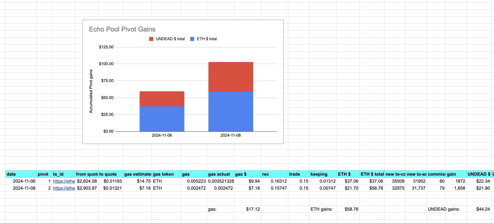

Next, we have treasury accumulation/growth and composition. 

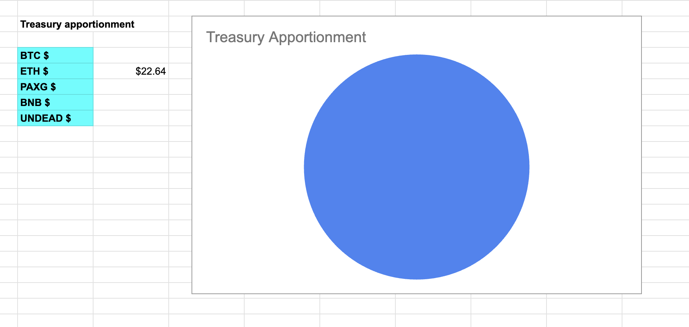
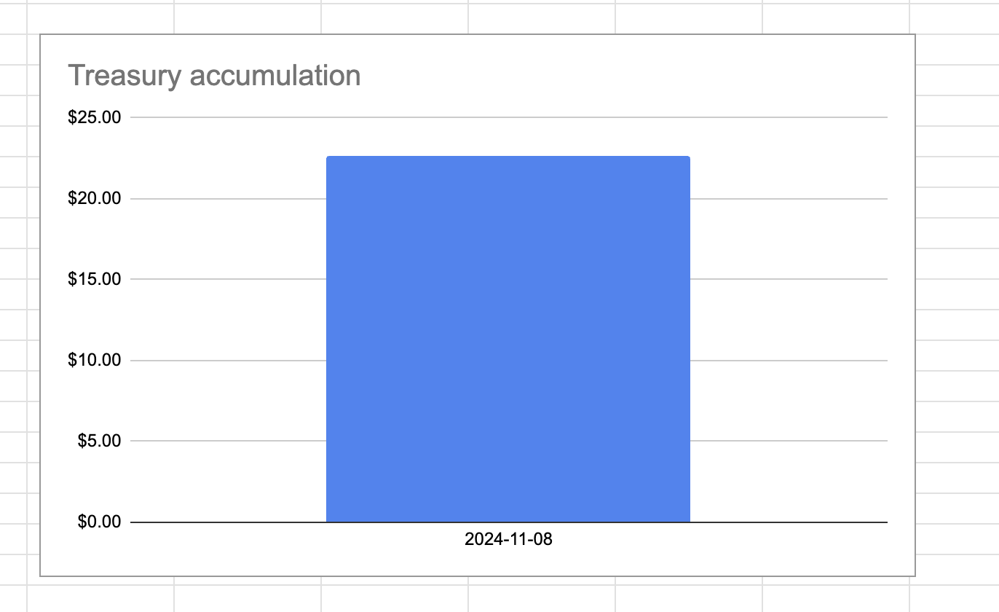

Finally, we show distributions to stakers. 

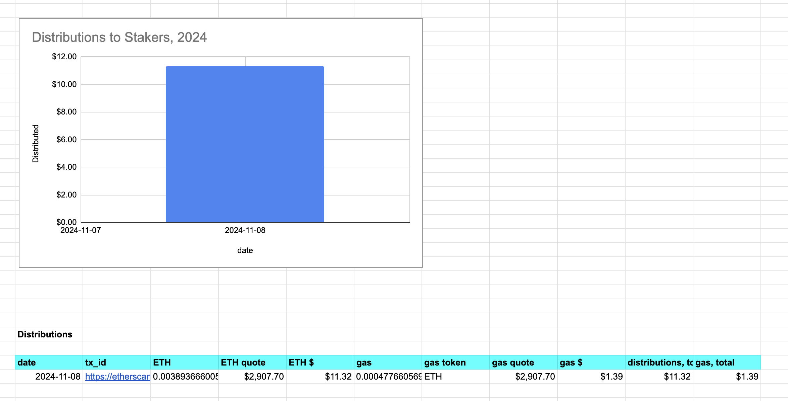

