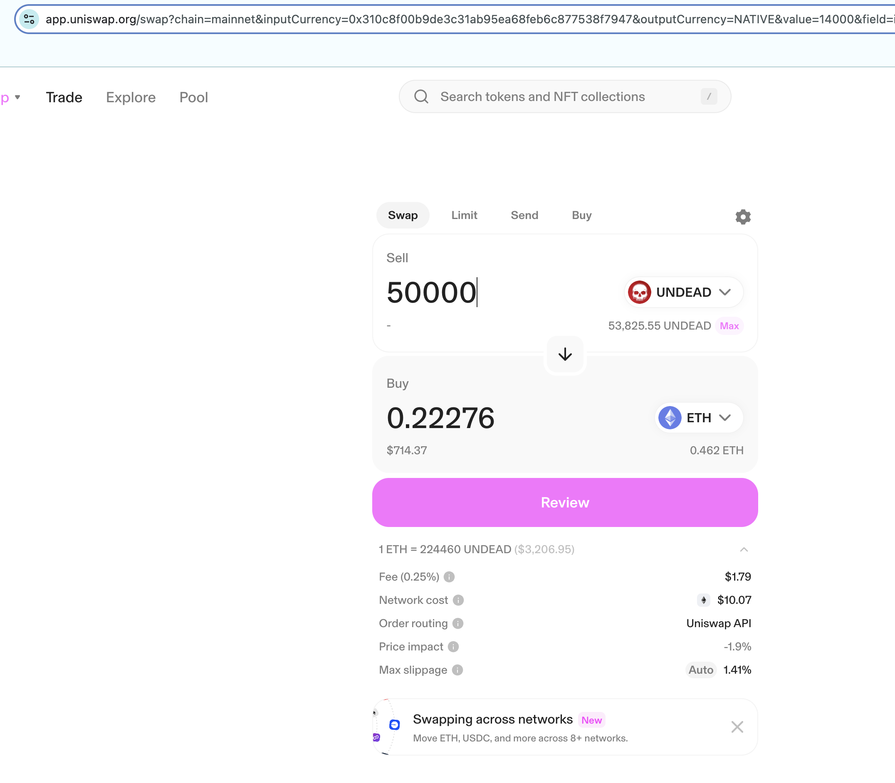
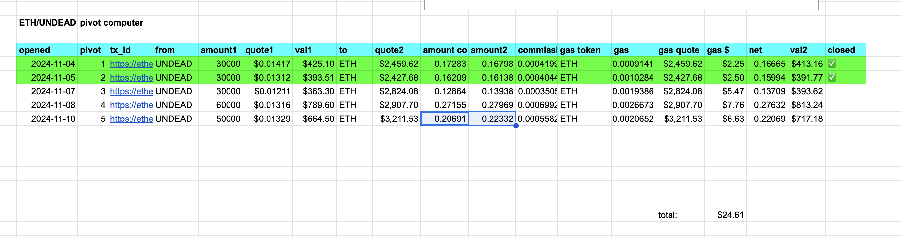

The last two days there were no good close pivots (ETH -> UNDEAD), so today I open a new UNDEAD-on-ETH pivot.

Note that the computed swap os 50k $UNDEAD -> 0.207 $ETH, but I actually got 0.22 $ETH from the swap, which is a slip to my advantage.

I'll take that slip ;) 

---

In the meanwhile, I've been busy on two fronts:

1. I'm working on a 'Donor HOWTO'-youtube that will show people how to donate. To that end, I have a donor-wallet (already), and I've created an ETH-BTC pool wallet and an ETH-BTC inv wallet.
2. When people donate, they get an equivalent amount of $UNDEAD which they can invest. Where to invest, though? To that end, I'm creating a site that shows the pivot pools (so far only ETH-BTC), the echo pool, and the treasury: their compositions and wallet address to where they can invest their $UNDEAD. I'm doing all this in AWS. 

I'll also need to create, I just now realized, an ETH-BTC reserve wallet to manage $UNDEAD that's invested which needs to be (slowly/daily) converted to $ETH and $BTC (instead of $UNDEAD from donated $ETH or $BTC). ... update: done. ✅

And that's what I'm working on.

# Business

New article up: [HOWTO fund new pivot pools](../../../../articles/funding-pools.md)

The unsaid part of this article, or the business-impact, is this: a very small pivot-pool (market cap of $10,000) will have 1.4M $UNDEAD TVL when fully vested.

With 500M $UNDEAD in total, that means demand for $UNDEAD will go up with each pivot pool created, ... when investors get the value of investing into these pivot pools.

Both pivot pools and $UNDEAD, then, will become more in demand as this realization hits.

---

# ANNOUNCEMENT!

Some j-random investor [donated 1 ETH to the donor addy](https://etherscan.io/tx/0x82e5ef04ecb2ac4be117ffc6f2310a1eeb714fdf0ae1bb84bca756e25f0d0532), which I moved to the ETH-BTC pivot pool. 🎉

No telling who this person could possibly be (...it me). I am sending an equivalent amount of $UNDEAD to this investor. LET'S SEE IF THEY STAKE THE UNDEAD INTO THE PIVOT POOL! (hint: 'they' will.)

---

# 💥ANNOUNCEMENT! 💥

We have our first investor (the same wallet as the donor), staking $UNDEAD into the [ETH-BTC pivot pool](https://etherscan.io/tx/0x0fa812412c1c04027400d403377cffcad35879645b7157990790083fe6f2d8dd), the [Echo pool](https://etherscan.io/tx/0xe859c75f33772fd93de58357cb42a14daa092b7e71e0f56f1eae1bd23264ac3a), and the [Treasury](https://etherscan.io/tx/0x68fc732b4e95726a3f5d4b71a0649ca348f85a9db85fa91a53b0f2f52dbfacbf). YAY! 
