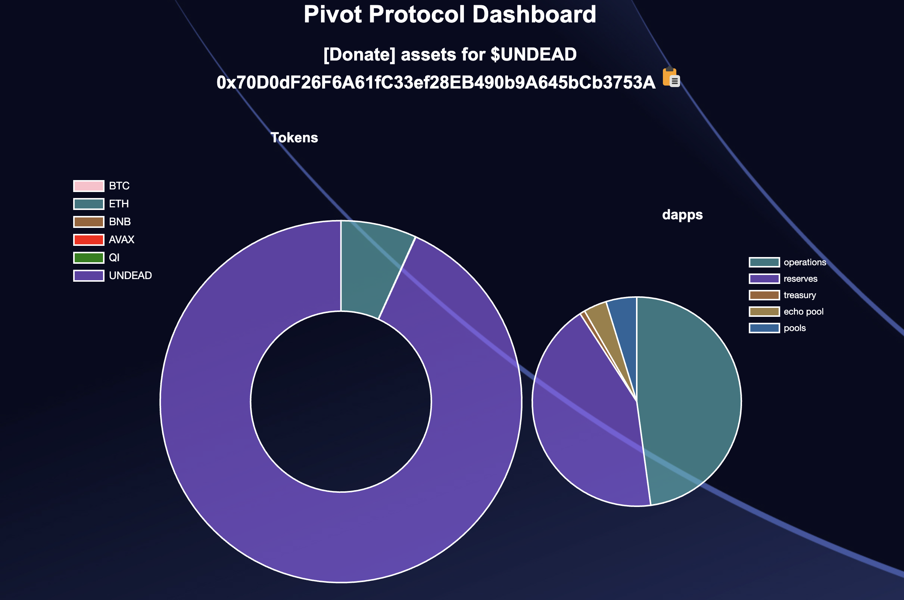
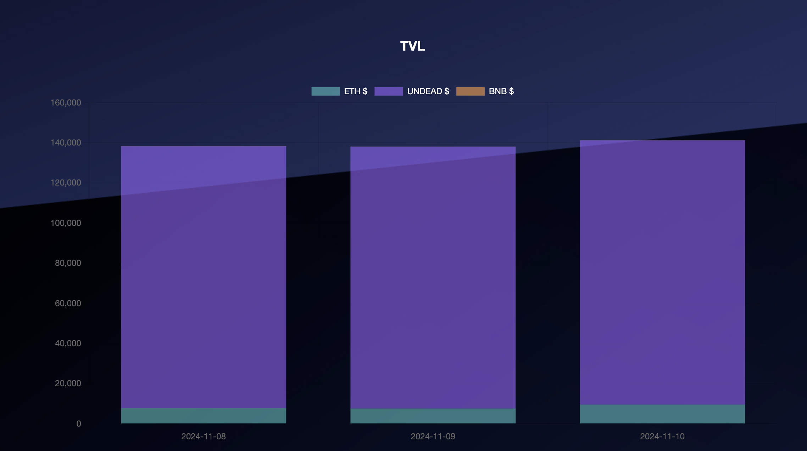
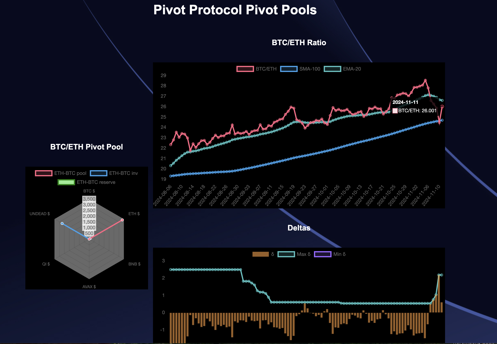
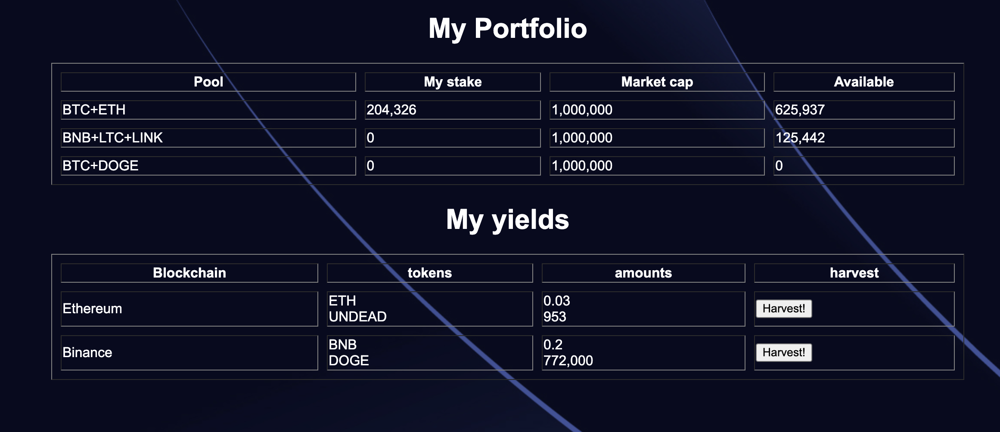

# Ethereum Gas Fees

Gas fees. I just saw $81 for gas fees for an ETH -> UNDEAD swap on uniswap. This is untenable if I'm doing 10 trades a day and up to 30 transfers. Thoughts, anyone? Fees last night around 10 pm were $13. I thought that was high (because it is), but $81?

To this end, all pivot pools will be off chain (Binance or Avalanche for $AVAX and QI). The echo pool is on-chain, unfortunately, until $UNDEAD is well-established elsewhere.

# Pivot Protocol website LIVE!

The [pivot technologies site](https://pivoteur.github.io/) is live! 

Click on the 'pools'-slice of the dapps-chart to go to the 
[BTC+ETH pivot pool](https://pivoteur.github.io/pools.html).

['My Portfolio'](https://pivoteur.github.io/portfolio.html) has no linkages, so you must go there manually. It's 100% non-functional mockup, anyway. 

Lots of pieces missing here, but there's also enough to direct donors here with a youtube-pitch I'm making, first one for Ethereum. Second one for Binance. Third one for Avalanche.

What's missing, as discussed, are the 'pools' page showing all the pools (since we only have BTC+ETH, that's not a major pain-point for me rn), the Treasury page and the Echo pool page. Those will be coming up when I code and post them.
