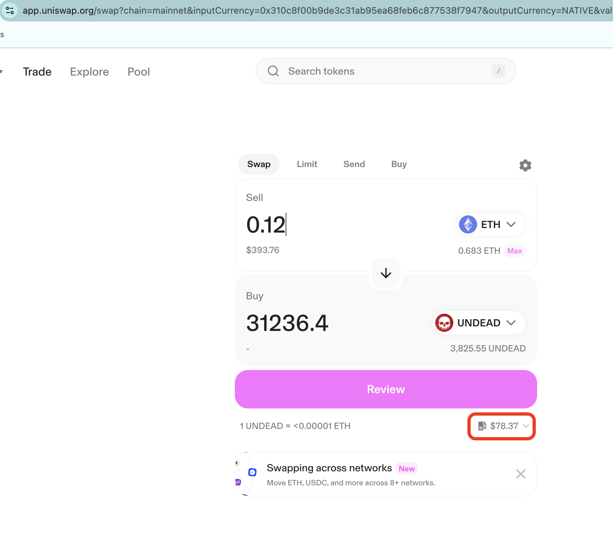

Gas fees. I just saw $81 for gas fees for an ETH -> UNDEAD swap on uniswap. This is untenable if I'm doing 10 trades a day and up to 30 transfers. Thoughts, anyone? Fees last night around 10 pm were $13. I thought that was high (because it is), but $81?

To this end, all pivot pools will be off chain (Binance or Avalanche for $AVAX and QI). The echo pool is on-chain, unfortunately, until $UNDEAD is well-established elsewhere.
