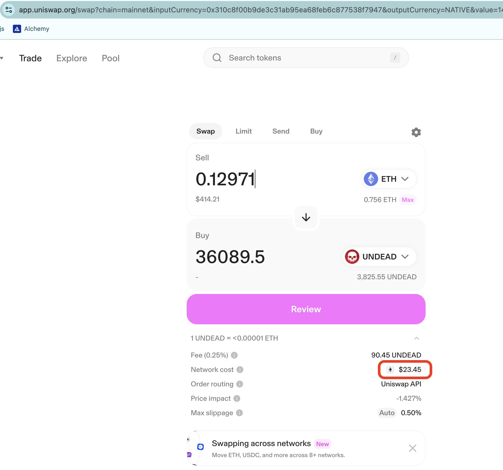
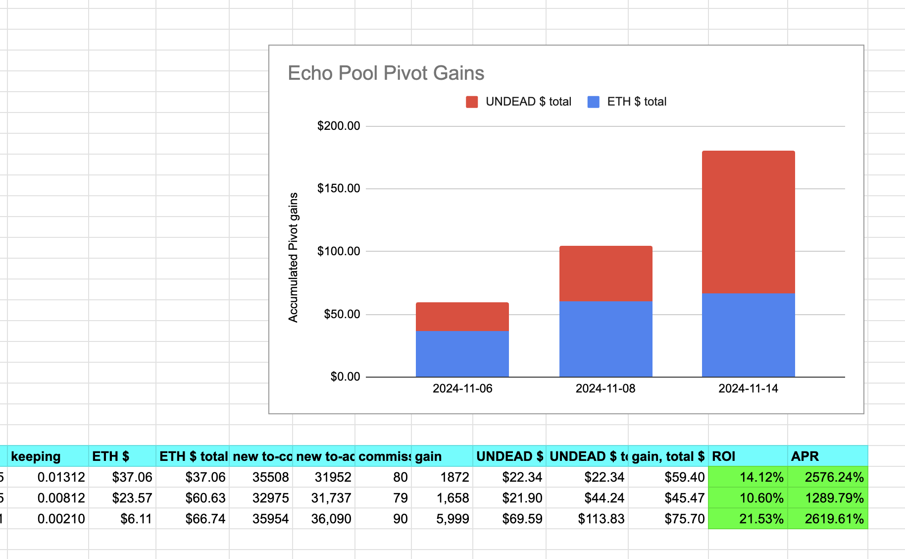
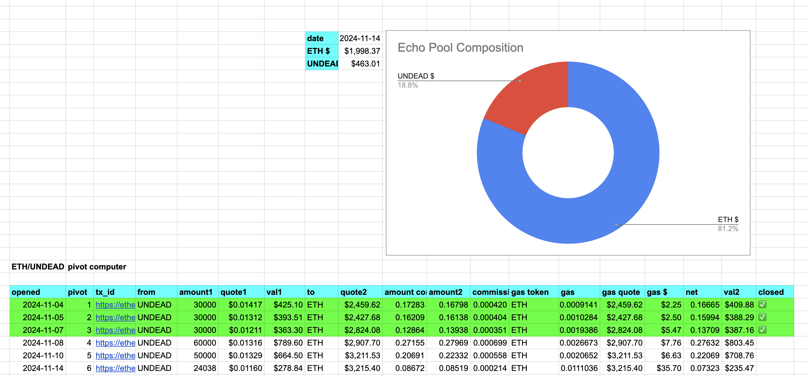
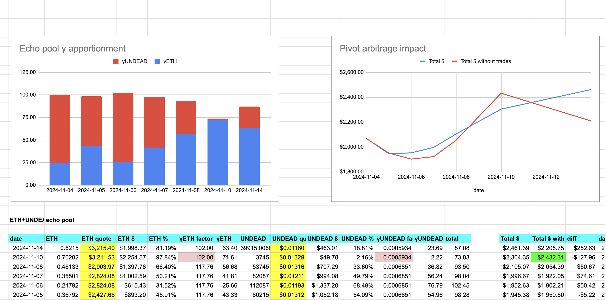
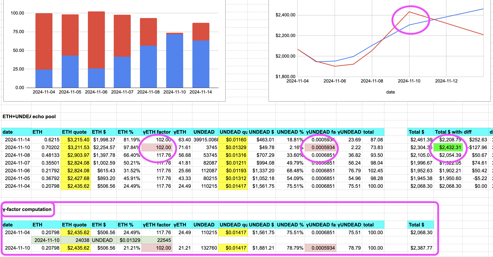

# 3rd Close Pivot

This morning at zero-dark-thirty (4:30 am), I closed the 3rd echo pivot, with a ROI of 20%+ and an APR of 2,600%. Wow!

Charts show Echo pool composition and pivot efficacy. 

What is interesting here about today's report, besides the 20% ROI / 2.6k% APR, is that there was an infusion of $UNDEAD into the Echo pool from an investment, requiring the γ-factors for each token be recomputed (bottom table).

Recomputing γs requires a separate article, to be published by yours, truly.
