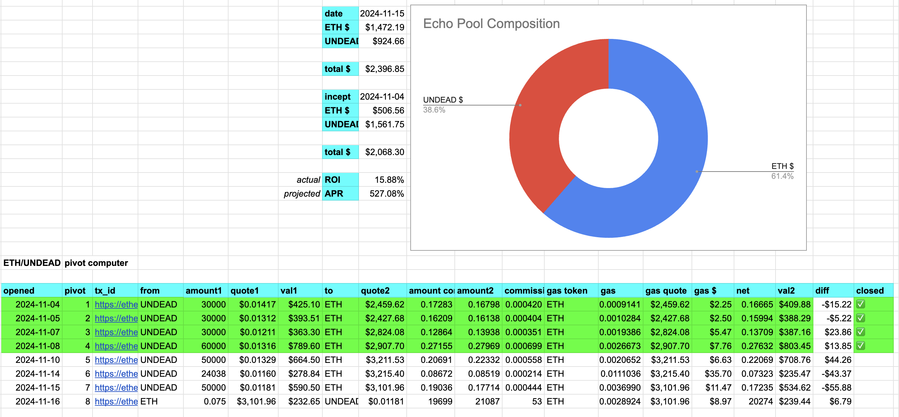
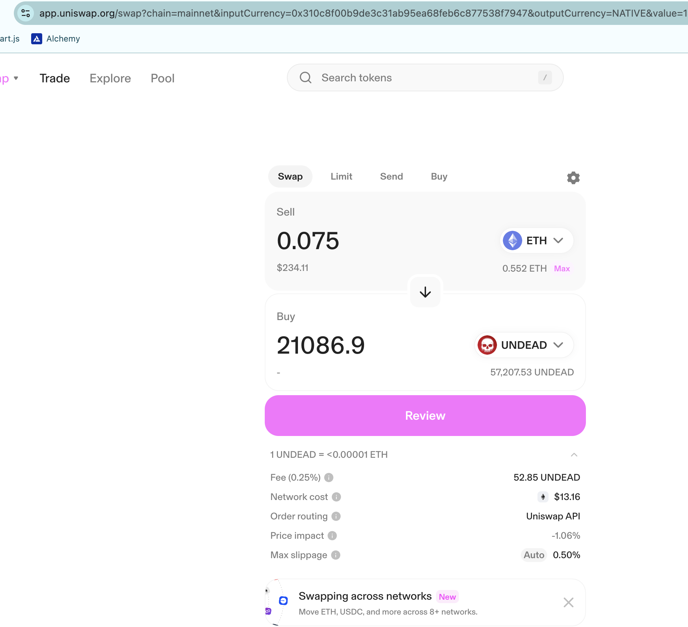

Does anybody want to see what 23% ROI looks like? Because I surely do, too!

Here's what 23% ROI / 1,233 APR looks like on the echo pool's 4th pivot close.

# Measuring Protocol Success

Now, I've also measured gains of the echo pool, itself, but dollar-wise, which is dependent upon price-movement of the tokens, 

... so what is the true measure of the success of pivot arbitrage?

1. The first you've seen: the accumulated $ETH and $UNDEAD net gains from the pivot arbitrage (OT).

2. Next is the γ-apportionment of tokens, which accurately measures gains of both $ETH and $UNDEAD, independent of their USD-value. 

3. Next is the value of the pool WITH pivot arbitrage verse the value of the pool WITHOUT pivot arbitrage, given all pivots are closed.

4. Finally, there is one more pair of measures of the protocol's success:

a. Distributions to the Treasury and

b. Distributions, as real yields, to investors.

The protocols has distributed $ETH so far to both.

# Open new pivots

Okay, so we've closed an $UNDEAD pivot --^, let's open a new one, and, now that we've accumulated some $ETH from pivot-gains, let's also open a new $ETH pivot. We now have pivots open for both $UNDEAD and for $ETH in the Echo pool.

# Donor

We have a new donor! My daughter is saving for a car, so, on her behalf (and for the purpose of making a 'donate'-video), I donated $300 worth of $ETH to the Pivot Protocol.
