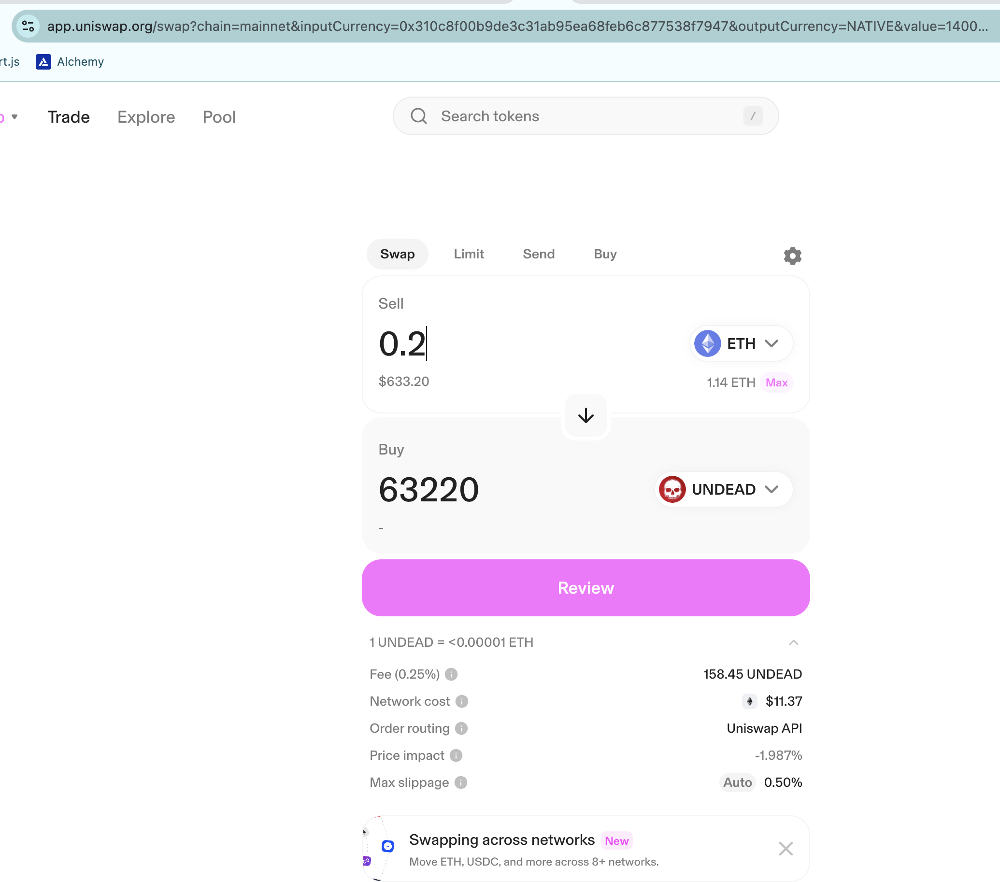

The [Pivot protocol site](https://pivoteur.github.io/) is now data-driven:
see bottom of page where TVL chart is up-to-date.

> TODO: add Treasury (with stake button), Echo pool (with stake button), and charting pool's performance.

Oh, and I closed my 5th echo pivot, earning 13k $UNDEAD and some $ETH for a 33% ROI / 2k% APR. 

It's just not fair: it's like pivot arbitrage has given me a cheat-code. 😅
