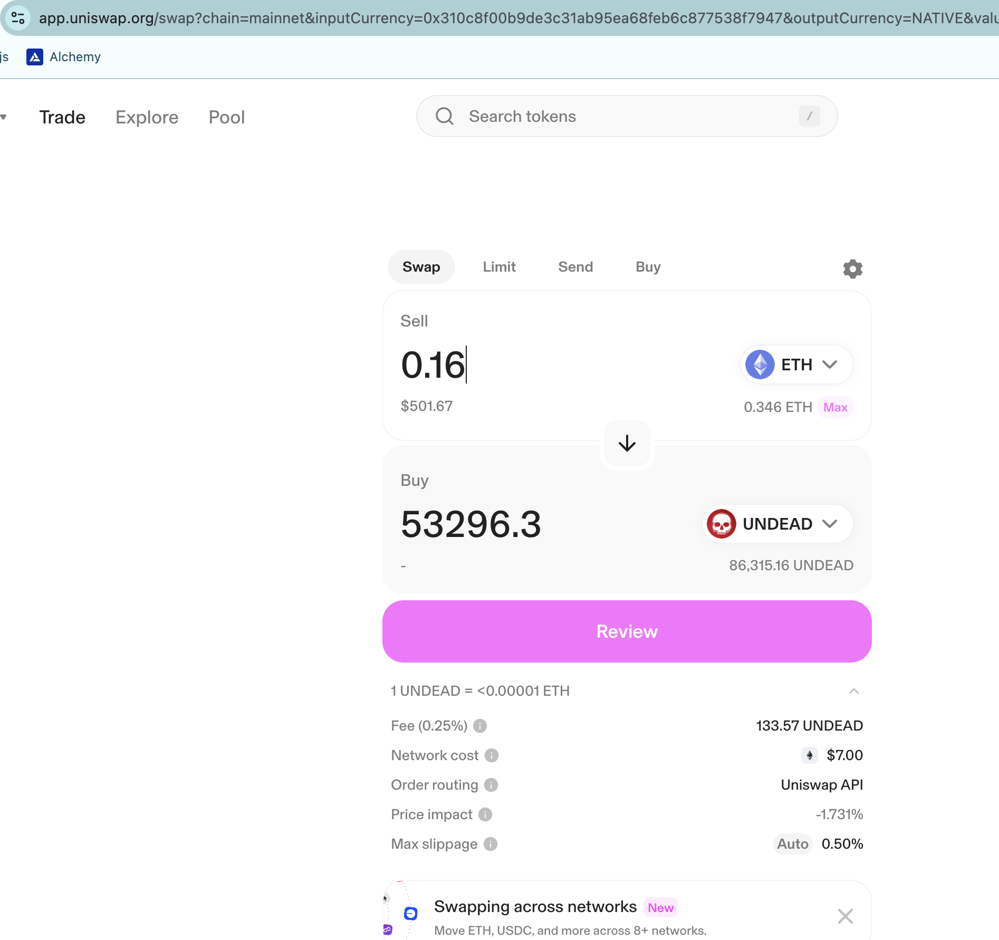
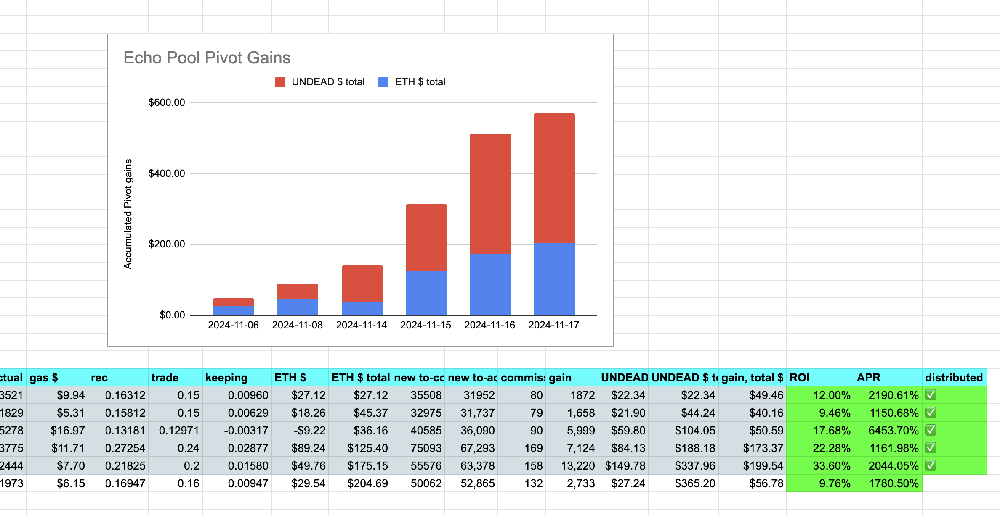
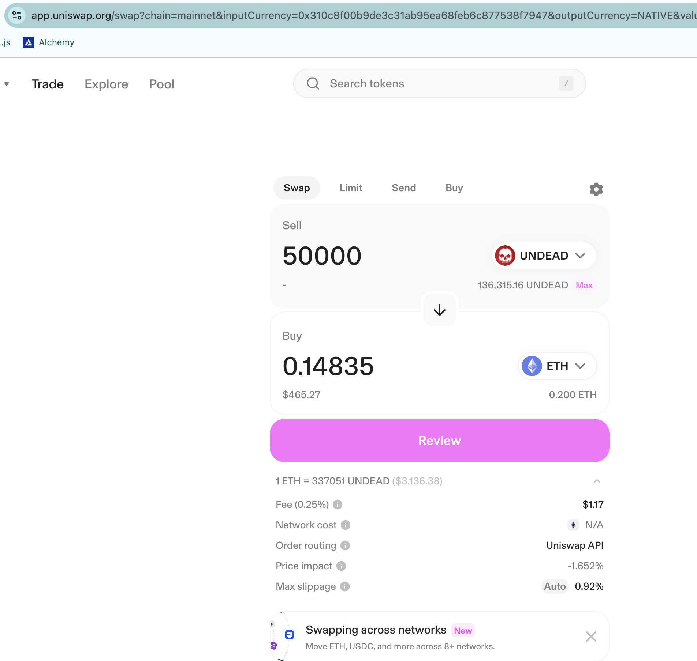
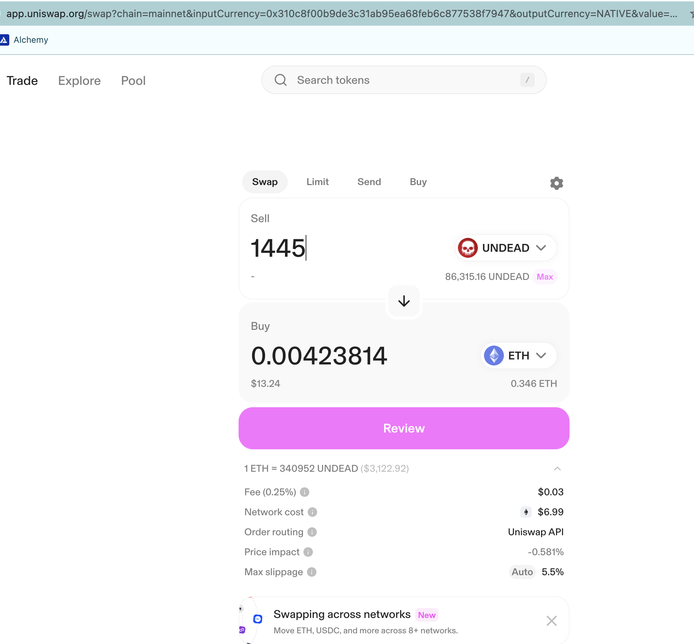
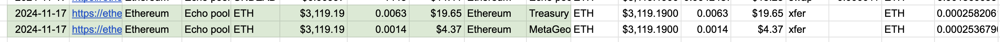

# Echo pool pivot

2024-11-17: Another day; another echo pivot. 9% ROI (10% without gas fees) / 1.7k% APR. BOOM! 🌟

I open a new echo pivot, because of course! 

# Distributions

Based upon the article about [pre-computing distributions](../../../../articles/distributions.md), we precompute what goes where, to wit:

* 1,288 $UNDEAD and 0.0045 $ETH stay on the echo pool
* 1,445 $UNDEAD is converted to $ETH

then that $ETH is split between the treasury and the stakers' pool

* 0.00239 $ETH to treasury
* 0.00029 $ETH to stakers' pool

These amounts must be added to the $ETH allocated to these addresses (see cited article, op. sit.), so the totals become:

* 0.0039 $ETH + 0.0024 $ETH, or 0.0063 $ETH to the treasury
* 0.0011 $ETH + 0.0002 $ETH, or 0.0014 $ETH to stakers

for a total of 0.0077 $ETH (~$23) distributed.

Distributions: DONE! ✅
