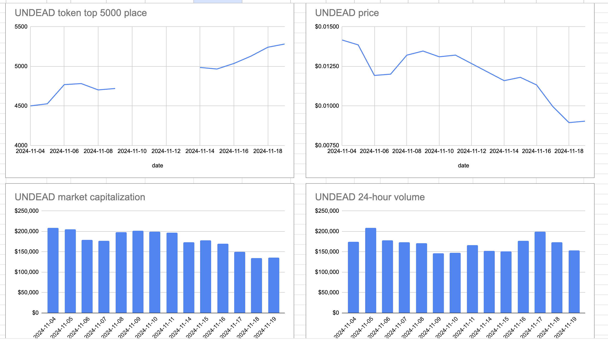
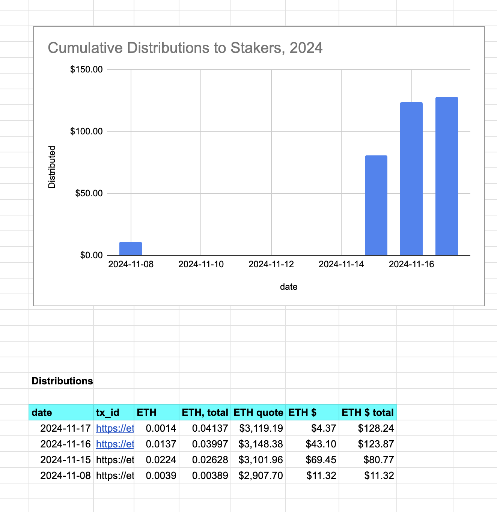

Did a meh-echo-pivot. That is to say, I created a pivot to absorb the (small amount of) reserve, and the gain here was 'meh,' but I pivoted just to get this meh-ness off the books.

Petty of me? Sure. Will the automated system be so petty? No, it'd keep this 'forever' on the books, or at least until there's a 10% ROI.

But, meh. Tiny pivot gone. I feel good, knowing I'm more meh than an automated system: two birds with one stone, I say!

(And I did make a little bit of $ETH and $UNDEAD in the pivot, so there's that.)

I'm not going to distribute these meh-gains until another pivot makes distribution, and their pre-calculations, viable.

I open a new echo pivot. 

# Pivot Protocol site

The [Pivot Protocol is live](https://pivoteur.github.io/#) and has had a major UX overhaul. 

There are two more pieces of data that I'd like to get 'somewhere.'

The attached files are 1) the performance metrics of the $UNDEAD token over time and 2) payouts to stakers.

Now, 1) can go onto the undead blocks page or it can be part of the pivot protocol dashboard. Kyle, Ken, Delroy: thoughts on this?
For 2) we definitely want this part of the protocol. I think this goes onto the dashboard.

Also, the treasury is now live on the protocol (then select 'treasury'), and I am in the process of revamping the echo pool app and the pools app, along the lines of presenting the pool's performance as their front pages. This needs some work. A first draft will be ready by tomorrow morning, US ET.

Kyle, can I get today's meeting transcription? I didn't see it my email inbox.
